# GRUPO-3

<p align="center">
  
</p>

<div align="center">

# UNIVERSIDAD PERUANA DE CIENCIAS APLICADAS

### FACULTAD DE INGENIERÍA
### CARRERA DE INGENIERÍA DE SOFTWARE

<br>

# INFORME DE PROYECTO

## Nombre del proyecto
### TechnoLoad

<br>

**Curso:**  
Aplicaciones Web

**Sección:**  
8093
<br>

### Integrantes


NICOLAS TANTALEAN GRANDA | U202410728 |

WILMER SEBASTIAN GUTIERREZ LIZARBE | U202412044 |

MATHIAS ALEJANDRO CASTILLO GUEVARA | U202410783 |

EDGARD DANIEL DIAZ CARUZO | U202323911 |


<br>

**Docente:**  
Efrain Ricardo Bautista Ubillus

<br>

**Ciclo:**  
2026-2

<br>

**Lima, Perú**  
**2026**

</div>

---

# ÍNDICE

## Capítulo I: Introducción
- [1.1. Startup Profile](#11-startup-profile)
  - [1.1.1. Descripción de la Startup](#111-descripción-de-la-startup)
  - [1.1.2. Perfiles de integrantes del equipo](#112-perfiles-de-integrantes-del-equipo)
- [1.2. Solution Profile](#12-solution-profile)
  - [1.2.1. Antecedentes y problemática](#121-antecedentes-y-problemática)
  - [1.2.2. Lean UX Process](#122-lean-ux-process)
    - [1.2.2.1. Lean UX Problem Statements](#1221-lean-ux-problem-statements)
    - [1.2.2.2. Lean UX Assumptions](#1222-lean-ux-assumptions)
    - [1.2.2.3. Lean UX Hypothesis Statements](#1223-lean-ux-hypothesis-statements)
    - [1.2.2.4. Lean UX Canvas](#1224-lean-ux-canvas)
- [1.3. Segmentos objetivo](#13-segmentos-objetivo)

## Capítulo II: Requirements Elicitation & Analysis
- [2.1. Competidores](#21-competidores)
  - [2.1.1. Análisis competitivo](#211-competitive-analysis-landscape)
  - [2.1.2. Estrategias y tácticas frente a competidores](#212-estrategias-y-tácticas-frente-a-competidores)
- [2.2. Entrevistas](#22-entrevistas)
  - [2.2.1. Diseño de entrevistas](#221-diseño-de-entrevistas)
  - [2.2.2. Registro de entrevistas](#222-registro-de-entrevistas)
  - [2.2.3. Análisis de entrevistas](#223-análisis-de-entrevistas)
- [2.3. Needfinding](#23-needfinding)
  - [2.3.1. User Personas](#231-user-personas)
  - [2.3.2. User Task Matrix](#232-user-task-matrix)
  - [2.3.3. User Journey Mapping](#233-user-journey-mapping)
  - [2.3.4. Empathy Mapping](#234-empathy-mapping)
  - [2.3.5. Big Picture Event Storming](#235-big-picture-event-storming)
- [2.4. Ubiquitous Language](#24-ubiquitous-language)

## Capítulo III: Requirements Specification
- [3.1. User Stories](#31-user-stories)
- [3.2. Impact Mapping](#32-impact-mapping)
- [3.3. Product Backlog](#33-product-backlog)

## Capítulo IV: Product Design
- [4.1. Style Guidelines](#41-style-guidelines)
  - [4.1.1. General Style Guidelines](#411-general-style-guidelines)
  - [4.1.2. Web Style Guidelines](#412-web-style-guidelines)
- [4.2. Information Architecture](#42-information-architecture)
  - [4.2.1. Organization Systems](#421-organization-systems)
  - [4.2.2. Labeling Systems](#422-labeling-systems)
  - [4.2.3. SEO Tags and Meta Tags](#423-seo-tags-and-meta-tags)
  - [4.2.4. Searching Systems](#424-searching-systems)
  - [4.2.5. Navigation Systems](#425-navigation-systems)
- [4.3. Landing Page UI Design](#43-landing-page-ui-design)
  - [4.3.1. Landing Page Wireframes](#431-landing-page-wireframes)
  - [4.3.2. Landing Page Mock-ups](#432-landing-page-mock-ups)
- [4.4. Web Applications UX/UI Design](#44-web-applications-uxui-design)
  - [4.4.1. Web Applications Wireframes](#441-web-applications-wireframes)
  - [4.4.2. Web Applications Wireflow Diagrams](#442-web-applications-wireflow-diagrams)
  - [4.4.3. Web Applications Mock-ups](#443-web-applications-mock-ups)
  - [4.4.4. Web Applications User Flow Diagrams](#444-web-applications-user-flow-diagrams)
- [4.5. Web Applications Prototyping](#45-web-applications-prototyping)
- [4.6. Domain-Driven Software Architecture](#46-domain-driven-software-architecture)
  - [4.6.1. Design-Level Event Storming](#461-design-level-event-storming)
  - [4.6.2. Software Architecture Context Diagram](#462-software-architecture-context-diagram)
  - [4.6.3. Software Architecture Container Diagram](#463-software-architecture-container-diagram)
  - [4.6.4. Software Architecture Components Diagrams](#464-software-architecture-components-diagrams)
- [4.7. Software Object-Oriented Design](#47-software-object-oriented-design)
  - [4.7.1. Class Diagrams](#471-class-diagrams)
- [4.8. Database Design](#48-database-design)
  - [4.8.1. Database Diagrams](#481-database-diagrams)
  - [4.8.2. Script DDL](#482-script-ddl)

## Capítulo V: Product Implementation, Validation & Deployment _(pendiente de redactar)_
- 5.1. Software Configuration Management
  - 5.1.1. Software Development Environment Configuration
  - 5.1.2. Source Code Management
  - 5.1.3. Source Code Style Guide & Conventions
  - 5.1.4. Software Deployment Configuration
- 5.2. Landing Page, Services & Applications Implementation
- 5.3. Validation Interviews
- 5.4. Video About-the-Product
# Capítulo I: Introducción

## 1.1. Startup Profile

### 1.1.1. Descripción de la Startup
Somos una compañía recién creada llamada **"TechnoLoad"** que tiene una misión en mente: **optimizar la gestión operativa y reducir los costos de mantenimiento e inoperatividad en empresas de alquiler de maquinaria pesada y transporte de carga.**

Por esta razón, nos reunimos y trabajamos con cooperación, eficiencia y responsabilidad para crear nuestra solución tecnológica **"TechnoLoad"**. Los integrantes que conforman este equipo son:

### 1.1.2. Perfiles de integrantes del equipo

|                                         Foto                                         | Descripción del Integrante |
|:------------------------------------------------------------------------------------:| :--- |
|  | Mi nombre es Wilmer Sebastian Gutierrez Lizarbe con el código de estudiante u202412044, estoy cursando el quinto ciclo en la carrera de Ingeniería de Software. Tengo conocimientos que pueden aportar al proyecto, tales como: codificación en Python, JavaScript, C++, gestión de bases de datos relacionales y no relacionales como SQL Server, MongoDB y Firebase, así como el diseño de arquitectura web. Las habilidades que puedo aportar a mi equipo son responsabilidad, liderazgo técnico y compromiso para entregar un producto de software funcional y de alta calidad. |
|                        | Mi nombre es Edgard Daniel Diaz Caruzo con código de estudiante u202323911 estoy en la carrera de Ingeniería de Software y voy en mi 5to ciclo de la carrera, una de mis cualidades es la responsabilidad y la puntualidad. Mi objetivo es apoyar en cualquier cosa a mis compañeros. |
|             | Mi nombre es NICOLAS TANTALEAN GRANDA con código de estudiante U202410728, soy estudiante de la carrera de Ingeniería de Software. Entre mis conocimientos se encuentran desarrollo web y algoritmos. Como miembro del equipo, aportaré dedicación y colaboración constante para lograr un proyecto sólido. |
|              | Mi nombre es MATHIAS ALEJANDRO CASTILLO GUEVARA con código de estudiante U202410783, soy estudiante de la carrera de Ingeniería de Software. Entre mis conocimientos se encuentran bases de datos y desarrollo de software. Como miembro del equipo, aportaré dedicación y colaboración constante. |te. |


## 1.2. Solution Profile

TechnoLoad es una completa plataforma web desarrollada por nuestra startup, diseñada para atender tanto a empresas de alquiler de maquinaria pesada como a empresas de transporte y logística de carga. Ofrece un modelo de suscripción SaaS que brinda a los administradores de flota y coordinadores logísticos acceso a un control centralizado de mantenimiento preventivo, seguimiento telemetrado de uso por horómetros/kilometraje y asignación optimizada de rutas. TechnoLoad tiene como objetivo revolucionar la gestión de flotas integrando tecnología con soluciones operativas personalizadas de manera fluida.

**Características Principales:**

* **Gestión de Mantenimiento Preventivo:** TechnoLoad utiliza algoritmos basados en horómetros y kilometraje para generar alertas y planes de mantenimiento preventivo adaptados a las especificaciones de cada máquina o vehículo, asegurando máxima disponibilidad operativa.
* **Asignación y Optimización de Rutas:** TechnoLoad conecta a los coordinadores logísticos con la flota disponible, permitiendo programar despachos de carga en tiempo real, optimizando consumos de combustible y reduciendo tiempos muertos.
* **Monitoreo Telemetrado de Flota:** TechnoLoad ofrece un dashboard interactivo donde los usuarios pueden visualizar el estado operativo (Disponible, En Tránsito, En Mantenimiento) de cada activo de la empresa.
* **Seguimiento de Rendimiento y Costos:** TechnoLoad permite realizar un seguimiento continuo del desempeño de la flota mediante informes detallados, monitoreando métricas clave como costos de mantenimiento, horas de uso y rentabilidad por unidad.

### 1.2.1. Antecedentes y problemática

Esta sección presenta los objetivos, la justificación y el alcance del proyecto, junto con el análisis de antecedentes y problemática aplicando la técnica 5W+2H.

#### Objetivos, justificación y alcance

**Objetivo general.** Desarrollar una plataforma SaaS que centralice la gestión de activos, lecturas de uso, mantenimiento preventivo y disponibilidad operativa para organizaciones de maquinaria pesada y transporte de carga.

**Objetivos específicos.** La solución debe permitir registrar activos y sus estados, capturar horómetro o kilometraje con trazabilidad, programar y controlar órdenes de mantenimiento, consultar alertas y asignar únicamente unidades disponibles a una operación.

**Justificación.** La información fragmentada en hojas de cálculo, llamadas y mensajes produce mantenimiento reactivo, decisiones tardías y períodos de inoperatividad costosos. TechnoLoad convierte registros dispersos en información operativa auditable, oportuna y accesible desde una interfaz web.

**Alcance.** El MVP comprende gestión de activos, lecturas, órdenes de mantenimiento, alertas, consulta de disponibilidad y asignación de unidades. Quedan fuera del alcance inicial la telemetría en tiempo real, la optimización automática de rutas, la facturación y la integración productiva con proveedores IoT; estas capacidades se consideran extensiones futuras.

#### Uso de la técnica The 5 W's y 2 H's

Presentación del modelo de las preguntas 5Ws y 2Hs con la que se analizaron los antecedentes y la problemática que abarca nuestro proyecto.

| LAS 5W y 2H | Pregunta | Descripción |
| :---: | :--- | :--- |
| **Who?** | ¿Quién es afectado? | Administradores de flota, coordinadores logísticos y gerentes de operaciones en empresas de alquiler de maquinaria pesada y transporte de carga por carretera. |
| **What?** | ¿Cuál es el problema? | Las elevadas pérdidas financieras y la baja rentabilidad causadas por paradas no programadas de maquinaria en obra y sobrecostos por ineficiencias logísticas. De acuerdo con estudios del sector transporte en Lima Metropolitana, existe una alta correlación entre la mala gestión de costos operativos y la reducción directa del margen de utilidad en empresas de transporte y servicios. |
| **When?** | ¿Cuándo sucede el problema? | El problema ocurre continuamente durante la ejecución de proyectos de construcción/minería y el despacho diario de carga, manifestándose en el momento exacto en que un equipo sufre una avería por falta de mantenimiento preventivo oportuno o cuando una unidad de transporte permanece inactiva por falta de coordinación. |
| **Where?** | ¿Dónde surge el problema? | El problema surge en las áreas de operaciones y logística de las empresas ubicadas en hubs comerciales e industriales del Perú (como Lima, Callao, Arequipa, entre otros), afectando tanto los centros de control como los puntos de trabajo en obra y rutas interprovinciales. |
| **Why?** | ¿Cuál es la causa del problema? | La falta de herramientas digitales centralizadas que permitan llevar un control riguroso e inteligible de los horómetros/kilometraje de la flota, así como la desarticulación entre la asignación de pedidos y la disponibilidad real de las unidades. |
| **How?** | ¿Qué llevó a la persona a esta situación? | Los métodos tradicionales basados en hojas de cálculo manuales o registros en papel impiden la visibilidad en tiempo real de los activos. TechnoLoad facilitará el control centralizado en línea a través de un dashboard inteligente y alertas automatizadas que permitirán a los usuarios coordinar mantenimientos y despachos eficientemente mediante suscripción mensual. |
| **How Much?** | ¿Cuál es la cantidad, duración o intensidad del evento? | Las paradas no planificadas de maquinaria provocan sobrecostos de mantenimiento correctivo de hasta un 32% más elevados comparados con esquemas preventivos, pudiendo representar hasta un 94% de tiempo fuera de servicio innecesario según estudios locales de confiabilidad. |

### 1.2.2. Lean UX Process

#### 1.2.2.1. Lean UX Problem Statements

"En un contexto de creciente exigencia por la eficiencia operativa y reducción de costos en los sectores de construcción, minería y transporte, se hace evidente la necesidad de una aplicación web de gestión de flotas que facilite la supervisión en tiempo real, el control preventivo de mantenimientos y la asignación optimizada de rutas. Dicha aplicación web debe proporcionar una experiencia clara y centralizada para cada empresa, adaptándose a la diversidad de activos de su flota."

Como grupo, nos comprometeremos a resolver este desafío mediante una colaboración estrecha con los administradores de flota y coordinadores logísticos. Nos enfocaremos en comprender profundamente las necesidades y expectativas de nuestros usuarios, utilizando esta información para diseñar y desarrollar una solución innovadora que satisfaga sus requerimientos de manera integral.

#### 1.2.2.2. Lean UX Assumptions

**Business Assumptions**

* **Pienso que mis clientes necesitan** un control automático e integral de sus flotas para evitar paradas no programadas y reducir costos de mantenimiento.
* **Estas demandas pueden ser satisfechas mediante** una plataforma en línea SaaS que centralice la información de horómetros, programe mantenimientos preventivos y optimice la asignación de rutas de transporte.
* **Los primeros clientes serán** aquellos gerentes de operaciones y administradores de flota que ya buscan activamente digitalizar sus procesos para mejorar la rentabilidad de sus equipos.
* **La principal necesidad que los clientes tienen de mi servicio es** contar con alertas oportunas de mantenimiento y visibilidad completa del estado operativo de sus unidades en tiempo real.
* **Obtendré la mayor parte de mis clientes mediante** estrategias de marketing B2B dirigidas a empresas del sector construcción, minería y logística, así como alianzas comerciales con gremios de transporte.
* **Generaré ingresos mediante** un modelo de suscripción mensual o anual ajustado según la cantidad de unidades o máquinas registradas en la plataforma.
* **El principal problema que puede afectar a mi producto es** la resistencia al cambio o la falta de hábito del personal operativo para ingresar lecturas de uso de manera constante.
* **Abordaremos esta situación mediante** una interfaz sumamente intuitiva, responsive y la integración progresiva de automatización para simplificar el registro de datos.

**User Assumptions**

* Los usuarios están buscando una solución integral que no solo les permita controlar mantenimientos, sino también gestionar despachos y rutas desde un mismo lugar.
* Los usuarios valoran altamente la conveniencia y accesibilidad de una plataforma en línea, prefiriendo la flexibilidad de acceder a los datos de la flota desde cualquier dispositivo con conexión a internet.
* Los usuarios están dispuestos a invertir en una plataforma SaaS que les proporcione información en tiempo real para tomar decisiones rápidas que eviten pérdidas económicas en obra.
* Los usuarios esperan que las alertas de mantenimiento sean altamente configurables según los límites de horómetros o kilometraje específicos de cada tipo de máquina o vehículo.
* Los usuarios valoran la seguridad y confiabilidad en una plataforma de gestión, buscando garantías de que la información operativa y financiera de sus flotas se trate de manera segura y confidencial.

#### 1.2.2.3. Lean UX Hypothesis Statements

Siguiendo el template exigido por el enunciado, cada Hypothesis Statement se redacta en inglés a partir de una Feature Assumption, indicando el business outcome que se busca lograr, las personas involucradas, el beneficio esperado y la funcionalidad o solución que lo habilita.

* **Hypothesis 1**
  We believe we will achieve *higher long-term platform retention among fleet operators*
  If *heavy machinery fleet managers and logistics coordinators*
  Attain *convenient, flexible online access to preventive maintenance control and route assignment*
  With *a centralized SaaS fleet management platform*.

* **Hypothesis 2**
  We believe we will achieve *a reduction in unplanned equipment downtime and increased customer satisfaction*
  If *fleet managers*
  Attain *configurable preventive maintenance alerts based on horometer and mileage readings*
  With *an automated maintenance alerting module*.

* **Hypothesis 3**
  We believe we will achieve *greater user trust and a lower subscription cancellation rate*
  If *fleet managers and logistics coordinators*
  Attain *confidence that their operational and telemetry data is secure and confidential*
  With *data security and privacy safeguards built into the platform*.

* **Hypothesis 4**
  We believe we will achieve *higher usage frequency, more accurate data entry, and better system adoption*
  If *fleet administrators*
  Attain *a clear, intuitive dashboard that shows the status of their equipment at a glance*
  With *an intuitive, easy-to-use TechnoLoad user interface*.

#### 1.2.2.4. Lean UX Canvas

| Business problem | Solution ideas | Business outcomes |
| :--- | :--- | :--- |
| Muchas empresas de alquiler de maquinaria pesada y transporte de carga están experimentando pérdidas económicas y baja rentabilidad debido a paradas no programadas por falta de mantenimiento preventivo y sobrecostos por ineficiencias en la asignación de rutas logísticas. | -Aplicación web SaaS para gestión centralizada de flotas.<br>-Módulo de alertas automáticas de mantenimiento preventivo según lecturas de horómetros y kilometraje.<br>-Plataforma de asignación y seguimiento de rutas de carga en tiempo real.<br>-Dashboard interactivo con reportes de costos operativos y rentabilidad por unidad. | -Reducción en los tiempos de inoperatividad no planificada de la flota.<br>-Disminución en los costos de mantenimiento correctivo de emergencia.<br>-Aumento en la eficiencia de despachos y tiempos de entrega de carga.<br>-Mayor retención de clientes y adopción continua de la plataforma a largo plazo. |
| **Users and customers** | **User benefits** | **Hypotheses** |
| -Administradores de flota de maquinaria pesada que buscan evitar averías graves en obra.<br>-Coordinadores logísticos de transporte de carga que necesitan optimizar rutas y uso de unidades.<br>-Gerentes de operaciones de empresas de alquiler y transporte que requieren reducir sobrecostos operativos. | -Los usuarios buscan un control total y en tiempo real del estado operativo de sus activos.<br>-Quieren prevenir fallas mecánicas antes de que ocurran mediante alertas oportunas.<br>-Desean una experiencia de gestión más rápida, centralizada y conveniente desde cualquier dispositivo. | -"We believe that a 20% reduction in unplanned fleet downtime will be achieved if heavy machinery fleet managers attain automated preventive maintenance alerts with our horometer tracking module."<br><br>-"We believe that a 15% reduction in operational routing costs will be achieved if logistics coordinators attain real-time unit availability and dispatch tracking with our route assignment module." |
| **What's the most important thing we need to learn first?** | | **What's the least amount of work we need to do to learn the next most important thing?** |
| -Riskiest Assumption for Hypothesis 1: Fleet managers will consistently log horometer and mileage readings manually before automated IoT sensors are integrated. | | -Experiment 1: Deploy a functional web prototype with manual horometer logging to a test group of 3 fleet managers and track daily data entry frequency and user engagement over 2 weeks. |
| -Riskiest Assumption for Hypothesis 2: Logistics coordinators will actively use an online platform to assign routes instead of traditional spreadsheets or phone calls. | | -Experiment 2: Launch an interactive prototype for route assignment with 2 transport companies and measure order processing time and system adoption rate compared to their traditional methods. |

### 1.3. Segmentos objetivo

TechnoLoad está dirigido principalmente a empresas que necesitan mejorar la gestión de sus activos, reducir costos operativos y evitar periodos de inactividad ocasionados por fallas o una deficiente planificación del mantenimiento.

Los segmentos objetivo principales son los siguientes:

| Segmento objetivo | Descripción | Principales necesidades | Cómo ayuda TechnoLoad |
|---|---|---|---|
| **Empresas de alquiler de maquinaria pesada** | Empresas dedicadas al alquiler y gestión de maquinaria como excavadoras, cargadores frontales, retroexcavadoras, grúas y otros equipos utilizados en sectores como construcción y minería. | Controlar las horas de funcionamiento de cada máquina, programar mantenimientos preventivos, reducir fallas inesperadas y aumentar la disponibilidad de los equipos. | TechnoLoad permite registrar la maquinaria, controlar los horómetros, gestionar el historial de mantenimiento y generar alertas sobre próximos servicios. |
| **Empresas de transporte y logística de carga** | Empresas que realizan operaciones de transporte de mercancías mediante camiones y otros vehículos de carga. | Controlar el kilometraje, conocer la disponibilidad de los vehículos, reducir tiempos muertos y mejorar la organización de las operaciones logísticas. | TechnoLoad permite visualizar el estado de los vehículos, controlar el kilometraje, gestionar mantenimientos y conocer la disponibilidad de cada unidad. |

#### Principales usuarios de la plataforma

| Segmento objetivo | Usuario | Descripción | Necesidades principales |
|---|---|---|---|
| **Empresas de alquiler de maquinaria pesada** | **Administrador de maquinaria o flota** | Responsable de supervisar las máquinas y equipos pertenecientes a la empresa. | Conocer el estado de cada máquina, controlar las horas de uso, revisar mantenimientos y evitar paradas no programadas. |
| **Empresas de alquiler de maquinaria pesada** | **Gerente de operaciones** | Responsable de supervisar el rendimiento y disponibilidad general de la maquinaria. | Analizar costos, disponibilidad, historial de mantenimiento y rendimiento de los equipos para tomar decisiones. |
| **Empresas de transporte y logística de carga** | **Coordinador logístico** | Responsable de organizar los servicios de transporte y coordinar la asignación de vehículos. | Conocer qué unidades están disponibles, en operación o en mantenimiento para organizar los despachos. |
| **Empresas de transporte y logística de carga** | **Administrador de flota** | Responsable de supervisar los vehículos pertenecientes a la empresa. | Controlar el kilometraje, el estado operativo y los mantenimientos de cada vehículo. |

# Capítulo II: Requirements Elicitation & Analysis

Este capítulo documenta la obtención, análisis y validación de necesidades de los usuarios. La evidencia proviene del análisis competitivo, entrevistas y técnicas de needfinding; cada hallazgo se traduce posteriormente en requisitos verificables.

### 2.1 Competidores

### 2.1.1. Competitive Analysis Landscape

| *Competitive Analysis Landscape* | *Descripción* |
|---|---|
| *¿Por qué llevar a cabo este análisis?* | Llevar a cabo este análisis nos brindará información crítica que nos permitirá tomar decisiones más informadas y estratégicas para el desarrollo, comercialización y crecimiento de nuestra aplicación. |

| *Aspecto* | *TechnoLoad* | *Samsara* | *Geotab* | *Fracttal* |
|---|---|---|---|---|
| *Logo* | Logo de TechnoLoad | Logo de Samsara | Logo de Geotab | Logo de Fracttal |
| *Perfil - Overview* | Plataforma web SaaS para gestionar maquinaria pesada y vehículos de carga. | Plataforma de operaciones conectadas para gestionar flotas y activos. | Plataforma de gestión de flotas y telemática. | Plataforma especializada en gestión de mantenimiento y activos. |
| *Ventaja competitiva* | Integra mantenimiento, control de activos y gestión operativa en una sola plataforma. | Integración de telemetría y monitoreo de operaciones. | Análisis de datos y gestión avanzada de flotas. | Especialización en mantenimiento de activos. |
| *¿Qué valor ofrece a los clientes?* | Reduce tiempos de inactividad y mejora el control de maquinaria y vehículos. | Mejora la seguridad, visibilidad y eficiencia operativa. | Facilita decisiones mediante datos de los vehículos. | Optimiza los procesos de mantenimiento. |
| *Perfil de Marketing - Mercado objetivo* | Empresas de alquiler de maquinaria pesada y empresas de transporte y logística de carga en Perú. | Empresas con flotas que requieren monitoreo avanzado. | Empresas con flotas que necesitan telemática y análisis de datos. | Empresas que necesitan gestionar el mantenimiento de sus activos. |
| *Perfil de Marketing - Estrategias de marketing* | Marketing digital B2B, demostraciones, contacto directo y alianzas estratégicas. | Marketing B2B, demostraciones y ventas empresariales. | Marketing B2B, alianzas comerciales y demostraciones. | Marketing digital, contenido especializado y demostraciones. |
| *Perfil de Producto - Productos & Servicios* | Mantenimiento preventivo, horómetros, kilometraje, dashboard, alertas y disponibilidad. | Gestión de flotas, telemetría, seguridad y monitoreo de activos. | Gestión de flotas, telemática, seguimiento y análisis de datos. | Mantenimiento preventivo y correctivo, activos y órdenes de trabajo. |
| *Perfil de Producto - Precios & Costos* | Suscripción SaaS mensual o anual según cantidad de activos. | Según soluciones y dispositivos contratados. | Según soluciones de telemática y servicios contratados. | Suscripción según las necesidades de la empresa. |
| *Perfil de Producto - Canales de distribución (Web y/o Móvil)* | Plataforma web responsive para computadoras, tablets y celulares. | Plataforma web, aplicación móvil y dispositivos de telemetría. | Plataforma web, aplicaciones móviles y dispositivos telemáticos. | Plataforma web. |
| *SWOT - Fortalezas* | Plataforma integral, sencilla, escalable y enfocada en el mercado peruano. | Plataforma consolidada y amplio monitoreo. | Experiencia, análisis de datos y presencia internacional. | Especialización en mantenimiento. |
| *SWOT - Debilidades* | Startup nueva y con menor reconocimiento frente a competidores internacionales. | Dependencia de hardware y mayores costos. | Puede presentar mayor complejidad para algunos usuarios. | Menor enfoque en logística y rutas. |
| *SWOT - Oportunidades* | Digitalización de empresas, crecimiento de PYMES, reducción de costos e IoT. | Crecimiento de vehículos conectados e IoT. | Crecimiento de la telemática. | Mayor digitalización del mantenimiento. |
| *SWOT - Amenazas* | Competidores internacionales, resistencia al cambio y problemas de conectividad. | Competencia de plataformas de telemática. | Competidores económicos y nuevas tecnologías. | Plataformas integrales y soluciones propias. | |

---
#### 2.1.2. Estrategias y tácticas frente a competidores
Para afrontar las fortalezas y debilidades identificadas en nuestros competidores, así como aprovechar las oportunidades y responder a las amenazas presentes en el mercado, TechnoLoad plantea las siguientes estrategias y tácticas preliminares:

*1. Diferenciación mediante una plataforma integral:*

*Estrategia:* Aprovechar la oportunidad de integrar diferentes procesos de gestión en una sola plataforma para diferenciarnos de soluciones que se encuentran más especializadas en un solo aspecto.

*Táctica:* Integrar en TechnoLoad la gestión del mantenimiento preventivo, horómetro, kilometraje, disponibilidad de activos y seguimiento de las operaciones, permitiendo que las empresas puedan centralizar su información.

*2. Competir mediante una solución accesible para empresas peruanas:*

*Estrategia:* Aprovechar el crecimiento de la digitalización de las pequeñas y medianas empresas para ofrecer una alternativa frente a competidores internacionales con soluciones más complejas.

*Táctica:* Desarrollar un modelo SaaS con planes escalables según la cantidad de maquinaria y vehículos registrados, buscando que empresas de diferentes tamaños puedan acceder a la plataforma.

*3. Aprovechar la debilidad de la complejidad de algunas soluciones existentes:*

*Estrategia:* Diferenciarnos mediante una experiencia de usuario sencilla e intuitiva.

*Táctica:* Diseñar una interfaz fácil de utilizar, con información organizada, dashboards y alertas claras que permitan a los administradores y coordinadores consultar rápidamente el estado de sus activos.

*4. Responder a la fortaleza tecnológica de los competidores:*

*Estrategia:* Incorporar progresivamente nuevas tecnologías que permitan mejorar las capacidades de TechnoLoad y mantener una propuesta competitiva.

*Táctica:* Considerar futuras integraciones con tecnologías IoT y sistemas de telemetría para obtener información más precisa sobre el uso, ubicación y estado de los vehículos y maquinaria.

*5. Aprovechar la necesidad de reducir costos operativos:*

*Estrategia:* Posicionar TechnoLoad como una herramienta que ayude a reducir costos ocasionados por mantenimientos no planificados y tiempos de inactividad.

*Táctica:* Implementar alertas de mantenimiento basadas en el horómetro y kilometraje, permitiendo programar mantenimientos preventivos antes de que ocurran fallas que puedan afectar las operaciones.

*6. Responder a la amenaza de competidores consolidados:*

*Estrategia:* Diferenciar TechnoLoad mediante una atención más cercana y una adaptación a las necesidades específicas de los clientes.

*Táctica:* Ofrecer demostraciones de la plataforma, soporte personalizado y recopilación continua de comentarios de los usuarios para mejorar las funcionalidades según las necesidades del mercado peruano.

*7. Enfrentar la resistencia al cambio tecnológico:*

*Estrategia:* Facilitar la adopción de la plataforma por parte de empresas que todavía utilizan métodos manuales para gestionar sus activos.

*Táctica:* Mostrar mediante demostraciones y casos prácticos cómo TechnoLoad puede centralizar información, reducir tareas manuales y facilitar el control de maquinaria y vehículos.

*8. Aprovechar las oportunidades de crecimiento del mercado:*

*Estrategia:* Expandir progresivamente TechnoLoad hacia nuevas empresas y sectores relacionados con la gestión de activos y transporte.

*Táctica:* Iniciar con empresas de alquiler de maquinaria pesada y empresas de transporte y logística de carga, y posteriormente incorporar nuevas funcionalidades y segmentos de acuerdo con las necesidades identificadas en el mercado.

### 2.2. Entrevistas
### 2.2.1 Diseño de entrevistas

Para la recolección de requerimientos se diseñaron guías de entrevista breves y estructuradas de 8 preguntas clave por segmento objetivo. Estas combinan datos demográficos/tecnológicos para el perfilamiento de arquetipos (User Personas) con preguntas profundas sobre la problemática operativa y de negocio.

#### **Segmento 1: Propietarios y administradores de empresas de alquiler de maquinaria pesada**

1. ¿Cuál es su nombre, edad, cargo, dispositivos y aplicaciones que utiliza a diario para administrar su negocio? *(Complementaria)*
2. ¿Qué marcas de maquinaria prefiere en su flota y qué fuentes o indicadores consulta antes de tomar decisiones de inversión u operatividad? *(Complementaria)*
3. ¿Cómo gestiona actualmente el inventario, la disponibilidad en obra y la programación de mantenimientos preventivos de su maquinaria pesada? *(Principal)*
4. ¿Qué sucede cuando un equipo sufre una avería inesperada en plena obra y cómo gestiona los costos por inoperatividad y las penalizaciones contractuales? *(Principal)*
5. ¿Cómo realiza el seguimiento y la conciliación de horómetros de uso trabajados para el cobro del servicio de alquiler a sus clientes? *(Principal)*
6. ¿Cuáles son sus principales objetivos o prioridades dentro de su trabajo diario al mando de la flota? *(Complementaria)*
7. ¿Qué situaciones relacionadas con el control de horómetros, averías o gestión de clientes le generan mayor frustración? *(Complementaria)*
8. ¿Qué aplicaciones, páginas web o herramientas digitales utiliza con mayor frecuencia para trabajar y comunicarse con el personal de campo? *(Complementaria)*

---

#### **Segmento 2: Coordinadores logísticos y responsables de flotas de transporte de carga**

1. ¿Cuál es su nombre, edad, cargo, nivel educativo y qué dispositivos o navegadores utiliza habitualmente en su centro de control? *(Complementaria)*
2. ¿A través de qué canales o herramientas del sector gestiona la programación de fletes y la comunicación con los conductores? *(Complementaria)*
3. ¿Cómo monitorea en tiempo real la disponibilidad de sus camiones y la eficiencia en la asignación de rutas de transporte de carga? *(Principal)*
4. ¿Ha experimentado tiempos muertos o retrasos en las entregas por paradas no planificadas o fallas mecánicas en ruta? ¿Cómo afectó esto a sus costos operativos? *(Principal)*
5. ¿De qué manera valida los límites de kilometraje/mantenimiento de sus unidades y qué exige en una plataforma digital para optimizar el despacho de cargas? *(Principal)*
6. ¿Cuáles son sus principales objetivos y métricas de éxito (KPIs) dentro de su trabajo diario de coordinación logística? *(Complementaria)*
7. ¿Qué situaciones relacionadas con la desorganización de rutas, retrasos o falta de visibilidad de las unidades le generan mayor frustración? *(Complementaria)*
8. ¿Qué aplicaciones, páginas web o herramientas de software utiliza con mayor frecuencia para el seguimiento y reporte de sus operaciones? *(Complementaria)*

---

### 2.2.2 Registro de entrevistas
En esta sección se presentan las entrevistas realizadas a representantes de los segmentos objetivo de TechnoLoad.. Cada entrevista permite recopilar información sobre sus experiencias, necesidades, problemas y hábitos relacionados con la gestión y alquiler de maquinaria. Los resultados obtenidos servirán como base para el análisis de entrevistas y la construcción de los artefactos de Needfinding.
#### Segmento 1: Propietarios y administradores de pequeñas empresas de alquiler de maquinaria

##### Entrevista 1

- **Nombre y apellidos:** José Ramírez
- **Edad:** 27
- **Distrito:** Comas
- **Ocupacion:** Director de una pequeña empresa dedicada al alquiler de maquinaria
- **Timing en el video:**

**Captura de la entrevista:**


**Resumen de la entrevista:**

José Ramírez dirige una pequeña empresa dedicada al alquiler de maquinaria y utiliza principalmente un teléfono Android y una laptop con navegador Chrome para realizar sus actividades laborales. Para coordinar con clientes y trabajadores utiliza principalmente WhatsApp y llamadas telefónicas, mientras que Excel le permite llevar algunos registros relacionados con el negocio.

Para encontrar proveedores de maquinaria, suele recurrir a recomendaciones de otros contratistas y contactos del sector. También utiliza WhatsApp, Google, Facebook y páginas web de empresas para comparar diferentes alternativas antes de tomar una decisión.

Uno de los principales problemas que identifica en el proceso de alquiler es la falta de transparencia en las tarifas, debido a que algunos precios pueden variar dependiendo del tiempo de uso o del costo del transporte. Asimismo, ha experimentado situaciones en las que una máquina supuestamente disponible finalmente se encontraba alquilada o en mantenimiento.

Respecto a las fallas mecánicas, indicó que en una ocasión una avería provocó aproximadamente un día de retraso en una obra. La espera por la llegada del técnico ocasionó que parte del personal permaneciera inactivo y que el cronograma se viera afectado, incrementando los costos de la operación.

El control de las horas trabajadas se realiza en coordinación con el operador y el encargado de la obra. En una futura plataforma digital, considera importante poder consultar claramente las horas registradas, el precio del alquiler, la disponibilidad y el estado de la maquinaria, además de recibir un comprobante de la reserva.

Sus principales prioridades son garantizar la disponibilidad de la maquinaria, reducir retrasos y mantener un adecuado control de costos. Entre sus principales frustraciones se encuentran la falta de información clara, las fallas inesperadas de los equipos y las demoras en las entregas.

##### Entrevista 2

- **Nombre y apellidos:** Carlos Stephano Mendoza
- **Edad:** 52 años
- **Ocupación:** Encargado de operaciones en un pequeño negocio de alquiler de maquinaria
- **Distrito:** San Juan de Lurigancho
- **Timing en el video:**

**Captura de la entrevista:**


**Resumen de la entrevista:**

Stephano Mendoza se desempeña como encargado de operaciones en un pequeño negocio dedicado al alquiler de maquinaria. Para realizar sus actividades utiliza principalmente un teléfono celular y una computadora de escritorio. Su navegador habitual es Google Chrome y emplea WhatsApp para coordinar con clientes y trabajadores.

Para seleccionar proveedores, generalmente recurre a empresas o personas con las que ya ha trabajado anteriormente o que han sido recomendadas por otros empresarios del sector. También realiza búsquedas mediante Google y consulta grupos de Facebook relacionados con construcción y maquinaria.

Entre los problemas que encuentra durante el proceso de alquiler destaca la falta de claridad en los precios, debido a que algunas cotizaciones no incluyen inicialmente costos adicionales como transporte o combustible. También ha experimentado situaciones en las que una máquina aparecía como disponible, pero ya había sido reservada por otro cliente.

Las fallas mecánicas representan otra dificultad frecuente. Cuando una máquina presenta una avería, debe esperar la llegada de un técnico y, en caso de que la reparación tome demasiado tiempo, buscar un equipo alternativo. Esto puede ocasionar pérdidas de tiempo, gastos adicionales de transporte y problemas en el cumplimiento de los compromisos asumidos con los clientes.

Para validar las horas trabajadas, compara la información del horómetro de la máquina con el reporte entregado por el operador. En una plataforma digital de alquiler considera importante poder consultar el historial de uso de la maquinaria, el precio por hora, las fechas disponibles y recibir una confirmación formal de la reserva.

Sus principales prioridades son mantener las máquinas operativas, cumplir con los plazos acordados con los clientes y reducir los tiempos muertos. Sus mayores frustraciones están relacionadas con cambios de último momento, máquinas que dejan de estar disponibles pese a haber sido coordinadas previamente y problemas en el registro de los mantenimientos.

Entre las herramientas digitales que utiliza con mayor frecuencia se encuentran WhatsApp, Excel, Gmail, Google Maps, páginas web de proveedores y Facebook Marketplace.
Segmento 2: Contratistas independientes y responsables de obras de construcción
Entrevista 1

##### Entrevista 3

- **Nombre y apellidos:** Andrea López
- **Edad:** 30 años
- **Ocupación:** Administradora de una empresa familiar de alquiler de maquinaria
- **Distrito:** Surco
- **Timing en el video:**

**Captura de la entrevista:**


**Resumen de la entrevista:**

Andrea López, administradora de 30 años de una pequeña empresa familiar dedicada al alquiler de maquinaria, señala que actualmente la gestión del negocio se realiza principalmente mediante WhatsApp y hojas de cálculo de Excel. Esta forma de trabajo genera dificultades para mantener actualizada la información sobre disponibilidad, reservas y mantenimiento de los equipos.

Uno de los principales problemas identificados es el cruce de fechas de alquiler, provocado por la falta de actualización o comunicación entre las personas encargadas. También menciona situaciones en las que se ofrece una máquina que posteriormente resulta estar en mantenimiento. Para Andrea, sería especialmente útil contar con una plataforma que centralice la información del negocio y permita consultar rápidamente el estado de cada equipo.

La entrevistada considera indispensable disponer de un calendario de disponibilidad y valora que la plataforma pueda utilizarse fácilmente desde un teléfono móvil. Asimismo, destaca que una solución sencilla, clara y con pocos pasos facilitaría su adopción.

#### Segmento 2: Contratistas independientes y responsables de obras de construcción

##### Entrevista 1

- **Nombre y apellidos:** Harold Angello
- **Edad:** 41 años
- **Ocupación:** Ingeniero civil y propietario de una pequeña constructora
- **Obras supervisadas:** Entre 2 y 3 obras simultáneamente
- **Dispositivos y navegador:** iPhone en obra; laptop con Google Chrome en oficina.

**Captura de la entrevista:**


**Resumen de la entrevista:**

Harold Angello es ingeniero civil y dirige una pequeña constructora. Supervisa entre dos y tres obras de forma simultánea. En campo utiliza principalmente su iPhone, mientras que en la oficina revisa cotizaciones y correos desde una laptop con Google Chrome.

Para buscar maquinaria, primero contacta a proveedores de confianza. Cuando requiere equipos nuevos o especializados, realiza búsquedas en Google, revisa reseñas y solicita recomendaciones en grupos de WhatsApp de colegas ingenieros.

Su principal dificultad es la falta de disponibilidad real de las máquinas: algunos proveedores confirman equipos que luego ya fueron comprometidos con otras obras. Asimismo, las fallas mecánicas generan paradas de obra, costos por tiempos muertos y retrasos que afectan el cumplimiento de los plazos acordados con sus clientes.

Actualmente, los encargados de cada obra reportan las horas trabajadas por WhatsApp al finalizar el día. En una plataforma digital, Harold espera visualizar en un solo lugar el estado de las reservas y los equipos asignados a todas sus obras.

Sus principales prioridades son evitar que las obras se detengan por falta de maquinaria y cumplir los plazos comprometidos con sus clientes. Sus mayores frustraciones son las dobles reservas, las fallas mecánicas y la falta de visibilidad centralizada de sus equipos. Utiliza WhatsApp, Gmail, Google Calendar y Microsoft Excel como herramientas de trabajo.

##### Entrevista 2

- **Nombre y apellidos:** Renzo Huamán
- **Edad:** 38 años
- **Ocupación:** contratista independiente
- **Obras supervisadas:** Entre 2 y 3 obras simultáneamente
- **Dispositivos y navegador:** Celular y laptop con google en la oficina, ademas de exel.

**Captura de la entrevista:**


**Resumen de la entrevista:**

Renzo Huamán es un contratista de 38 años con formación en construcción civil, habituado a operar con su teléfono en obra y una laptop en oficina. Para sus tareas diarias se apoya en WhatsApp, Facebook, Google Maps y Excel, gestionando sus proyectos con el objetivo principal de evitar tiempos muertos, controlar los costos y cumplir estrictamente los cronogramas pactados con sus clientes.

Al buscar maquinaria, prioriza las recomendaciones de colegas sobre las búsquedas en internet, pero enfrenta constantes fricciones con los proveedores tradicionales. Sus mayores frustraciones radican en la falta de transparencia en las tarifas —con cargos imprevistos de flete u operador—, la falsa disponibilidad que deja la obra sin equipo, y las averías mecánicas que paralizan la jornada generando sobrecostos por mano de obra inactiva.

Para solucionar estos problemas y reemplazar el control manual que lleva en su cuaderno de obra, Renzo adoptaría una plataforma digital siempre que ofrezca precios finales transparentes por hora, garantía de disponibilidad en tiempo real y un comprobante formal que respalde cada reserva.

##### Entrevista 3

- **Nombre y apellidos:** Piero Reaño
- **Edad:** 25 años
- **Ocupación:** Contratista independiente
- **Distrito:** Surquillo
- **Timing en el video:** 20:01-25:42

**Captura de la entrevista:**


**Resumen de la entrevista:**

Piero Reaño, contratista independiente de 25 años, trabaja en proyectos de construcción y remodelación, donde utiliza principalmente excavadoras, retroexcavadoras y cargadores. Actualmente busca maquinaria mediante proveedores conocidos, recomendaciones, Google, Facebook y grupos de WhatsApp.

Entre sus principales dificultades identifica la falta de disponibilidad actualizada, los costos adicionales no informados y las fallas mecánicas que pueden generar retrasos en las obras. Además, gestiona las horas trabajadas y la asignación de maquinaria mediante WhatsApp, llamadas y Excel.

El entrevistado considera útil una plataforma que centralice la disponibilidad, reservas, costos, horas trabajadas, mantenimiento y ubicación de las máquinas. También destaca la importancia de contar con información actualizada, precios transparentes y una experiencia sencilla desde el celular.

**Video consolidado de las entrevistas:** [Ver entrevistas completas](https://upcedupe-my.sharepoint.com/:v:/g/personal/u202416147_upc_edu_pe/IQCtDKm3Mx7YSICszqpbHVACAZ5fOdZ3xGF08nsq6eXrey4?e=WBrQyq&nav=eyJyZWZlcnJhbEluZm8iOnsicmVmZXJyYWxBcHAiOiJTdHJlYW1XZWJBcHAiLCJyZWZlcnJhbFZpZXciOiJTaGFyZURpYWxvZy1MaW5rIiwicmVmZXJyYWxBcHBQbGF0Zm9ybSI6IldlYiIsInJlZmVycmFsTW9kZSI6InZpZXcifX0%3D)

### 2.2.3. Análisis de entrevistas

#### **Análisis preliminar del Segmento 1: Empresas de Alquiler de Maquinaria Pesada**
El Segmento 1 está compuesto por propietarios, administradores de flota y jefes de mantenimiento de empresas de alquiler de maquinaria pesada (excavadoras, rodillos, volquetes, etc.), quienes tienen la responsabilidad de coordinar la disponibilidad de equipos en obra, supervisar el uso de horómetros y programar servicios preventivos.

El proceso actual suele depender de herramientas independientes como llamadas telefónicas, hojas de asistencia en papel y registros manuales en hojas de cálculo. Esto provoca que la información del estado real del motor y las horas trabajadas se encuentre dispersa y desactualizada respecto a lo que sucede en el frente de trabajo.

Los principales problemas identificados son las paradas no programadas por falta de mantenimiento preventivo oportuno, la imposibilidad de verificar el horómetro real de la maquinaria a tiempo y los sobrecostos por mantenimiento correctivo de emergencia. Asimismo, existe un alto riesgo de penalizaciones contractuales cuando un equipo falla en plena ejecución del proyecto.

A partir de estas necesidades, el segmento requiere principalmente una solución que permita centralizar la telemetría y el control de mantenimiento de la flota. Las funcionalidades de mayor valor son las alertas automáticas configurables por horómetro, el dashboard de estado operativo en tiempo real (Disponible, En Obra, En Mantenimiento) y el reporte consolidado de gastos operativos.

* **Principales necesidades detectadas:** Control automático de horómetros, programación preventiva de mantenimientos, visibilidad del estado de la maquinaria en obra, centralización de datos y reportes de rentabilidad.
* **Pain points principales:** Averías mecánicas inesperadas, registros manuales en papel propensos a errores, sobrecostos en repuestos por mantenimiento correctivo y retrasos en la toma de decisiones por información desfasada.
* **Oportunidad para TechnoLoad:** Sustituir los registros manuales por un dashboard centralizado que automatice la emisión de alertas preventivas según el desgaste real de los equipos, minimizando el tiempo de inoperatividad en obra.

---

#### **Análisis preliminar del Segmento 2: Empresas de Transporte y Logística**
El Segmento 2 comprende a coordinadores logísticos, administradores de transporte y jefes de despacho encargados de gestionar flotas de transporte de carga pesada por carretera, con la responsabilidad de asignar rutas, coordinar conductores y controlar el kilometraje/mantenimiento de las unidades.

La investigación evidencia que la coordinación actual se realiza predominantemente vía WhatsApp y llamadas telefónicas, generando tiempos muertos de hasta 3 horas por unidad mientras se valida la disponibilidad de un camión para un nuevo flete o servicio.

Asimismo, la falta de visibilidad en tiempo real de la ruta y del kilometraje acumulado dificulta la detección de desgaste en neumáticos o consumo excesivo de combustible, impidiendo una planificación eficiente de las rotaciones de mantenimiento y la optimización de los costos operativos por flete.

* **Principales necesidades detectadas:** Asignación rápida de unidades y rutas, monitoreo de disponibilidad en tiempo real, seguimiento de kilometraje para mantenimientos de flota y optimización de tiempos de entrega.
* **Pain points principales:** Tiempos muertos innecesarios en la asignación de fletes, falta de visibilidad centralizada del estado de las unidades en ruta y desorganización en la programación de mantenimiento de camiones.
* **Oportunidad para TechnoLoad:** Integrar un módulo interactivo de asignación de rutas y control de kilometraje que permita a los coordinadores logísticos reducir tiempos de espera, optimizar rutas de transporte y prevenir paradas de unidades en carretera.

---

## 2.3. Needfinding

En esta sección se presentan los principales artefactos obtenidos a partir del análisis de la información recolectada durante las entrevistas y el estudio de los segmentos objetivo de **TechnoLoad**. El proceso de Needfinding permite identificar las necesidades, comportamientos, objetivos y dificultades de los usuarios, sirviendo como base para la elaboración de los User Personas, User Task Matrix, User Journey Maps y Empathy Maps.

A partir de las características objetivas y subjetivas identificadas en los dos segmentos clave (Empresas de alquiler de maquinaria pesada y Empresas de transporte y logística), se construyeron los artefactos correspondientes a cada arquetipo utilizando la herramienta UXPressia, asegurando una representación precisa del flujo de trabajo actual (*As-Is*) y del valor proyectado con la implementación de **TechnoLoad**.
#### 2.3.1. User Personas

A partir del análisis de las entrevistas se identificaron dos arquetipos principales que representan a los segmentos objetivo de TechnoLoad.

El primer User Persona representa al administrador de flota de una empresa de alquiler de maquinaria pesada, responsable de supervisar la disponibilidad, los horómetros y el mantenimiento de los equipos.

El segundo User Persona representa al coordinador logístico de una empresa de transporte de carga, responsable de organizar unidades, rutas y despachos, además de supervisar la disponibilidad de los vehículos.

A continuación se presentan las fichas elaboradas en UXPressia.

##### User Persona - Administrador de Flota de Maquinaria Pesada

##### Luis Herrera

Luis Herrera representa al administrador de una pequeña empresa dedicada al alquiler de maquinaria. Su perfil refleja las principales características, necesidades, objetivos y frustraciones identificadas en las entrevistas realizadas al segmento.


##### User Persona - Coordinador Logístico
##### Harold Angello

Harold Angello representa al contratista responsable de pequeñas obras que necesita asegurar maquinaria disponible y mantener el control operativo de sus proyectos.


#### User Persona Contratistas independientes y responsables de obras de construcción

Renzo Huamán representa al contratista independiente que supervisa varias obras y requiere información confiable sobre disponibilidad de maquinaria, tarifas transparentes y registro digital de horas trabajadas.


#### 2.3.2. User Task Matrix

La siguiente matriz compara la frecuencia e importancia de las principales tareas realizadas actualmente por los dos User Personas identificados. Las tareas consideradas corresponden a actividades que los usuarios realizan independientemente de la existencia de TechnoLoad.

| Tarea | Administrador de maquinaria - Frecuencia | Administrador de maquinaria - Importancia | Coordinador logístico - Frecuencia | Coordinador logístico - Importancia |
|---|---|---|---|---|
| Revisar disponibilidad de unidades | High | High | High | High |
| Registrar horas de uso o kilometraje | High | High | High | High |
| Coordinar mantenimiento de unidades | Medium | High | Medium | High |
| Revisar historial de mantenimiento | Medium | High | Medium | Medium |
| Coordinar asignación de unidades | Medium | Medium | High | High |
| Coordinar rutas y despachos | Low | Low | High | High |
| Revisar costos operativos | Medium | High | Medium | High |
| Comunicar incidencias operativas | High | High | High | High |

La matriz evidencia que ambos perfiles requieren conocer constantemente la disponibilidad y condición de los activos que administran. Sin embargo, el administrador de maquinaria concentra mayor esfuerzo en el seguimiento de horómetros, mantenimiento y disponibilidad de equipos, mientras que el coordinador logístico prioriza la asignación de vehículos, organización de rutas y coordinación de despachos.

Estas diferencias permiten identificar necesidades particulares para cada segmento y sirven como base para definir posteriormente las funcionalidades de TechnoLoad.

#### 2.3.3. User Journey Mapping

Se elaboraron dos User Journey Maps en su estado actual (*As-Is*), uno para cada User Persona identificado. Estos diagramas representan los procesos que realizan actualmente los usuarios antes de utilizar TechnoLoad, permitiendo identificar dificultades, puntos de contacto y oportunidades de mejora.

##### User Journey Map - Administrador de Flota de Maquinaria Pesada

El journey representa el proceso que sigue actualmente el administrador de flota para supervisar una maquinaria, verificar sus horas de funcionamiento, identificar la necesidad de mantenimiento y coordinar la intervención correspondiente.

De manera general, el proceso actual considera las siguientes etapas:

**Revisar la flota → Verificar horómetros → Identificar necesidad de mantenimiento → Coordinar mantenimiento → Registrar la intervención**

Durante este proceso pueden presentarse dificultades relacionadas con registros manuales, información desactualizada, falta de alertas preventivas y poca visibilidad del estado real de los equipos.

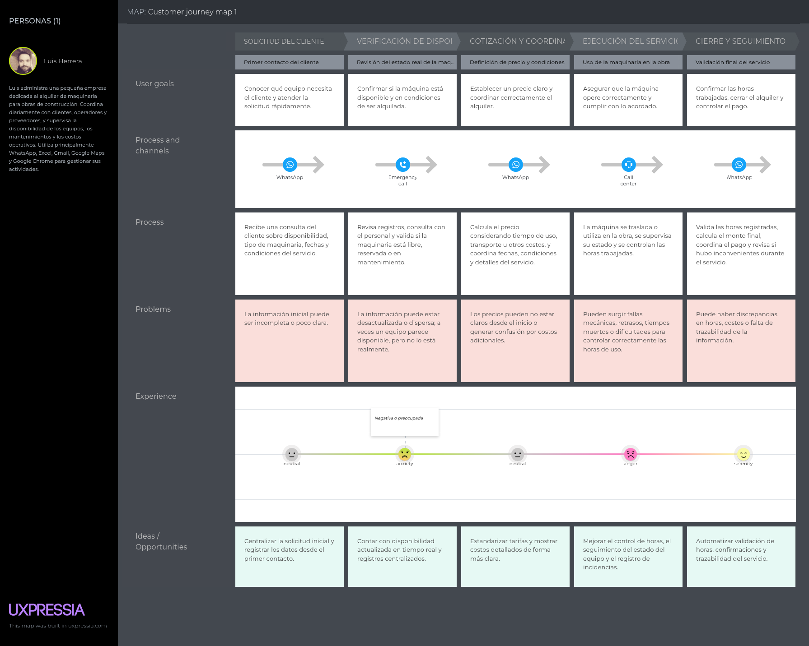


##### User Journey Map - Coordinador Logístico

El journey representa el proceso que sigue actualmente el coordinador logístico desde que recibe una solicitud de transporte hasta que logra asignar una unidad y coordinar el servicio.

De manera general, el proceso actual considera las siguientes etapas:

**Recibir solicitud de transporte → Consultar disponibilidad → Seleccionar unidad → Asignar vehículo → Coordinar ruta → Realizar seguimiento del servicio**

Los principales puntos de fricción se relacionan con la necesidad de consultar diferentes medios para conocer la disponibilidad de las unidades, la comunicación mediante llamadas o mensajería y la falta de información centralizada para tomar decisiones rápidamente.


El siguiente User Journey Map fue elaborado en la plataforma UXPressia para el User Persona Renzo Huamán. El recorrido documenta la experiencia completa en el escenario actual (*As-Is*) cuando Renzo necesita contratar una retroexcavadora para una obra de zanjado y habilitación urbana, enfrentando la falta de transparencia en costos, la informalidad en las reservas y las averías no previstas.

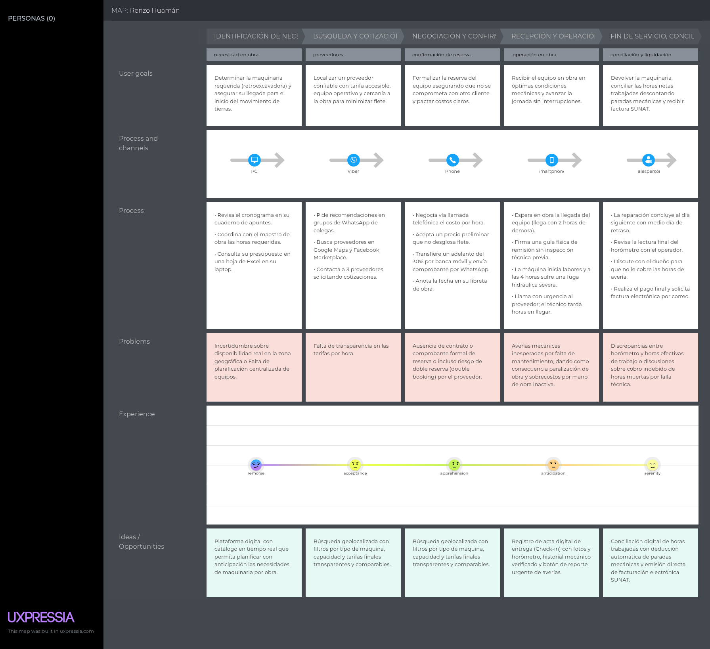

#### 2.3.4. Empathy Mapping

A continuación se presentan los Empathy Mapping de los segmentos objetivos de TechnoLoad..

### Segmento 1: Propietarios y administradores de pequeñas empresas de alquiler de maquinaria

El siguiente Empathy Map representa a Luis Herrera, User Persona del Segmento 1. El artefacto sintetiza los principales comportamientos, necesidades, frustraciones, pensamientos y expectativas identificados a partir de las entrevistas realizadas a usuarios pertenecientes a este segmento.

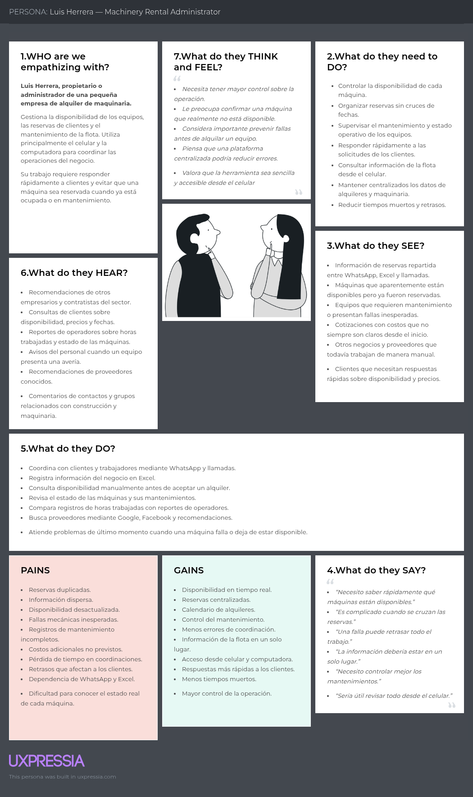

#### Segmento 2: Contratistas independientes y responsables de obras de construcción


| Cuadrante | Descripción y Hallazgos Clave |
| :--- | :--- |
| **¿Qué piensa y siente?** | Piensa en cómo coordinar la logística de sus 2 a 3 obras simultáneas sin paradas. Siente frustración por la doble reserva de equipos y ansiedad por no retrasar los plazos acordados con los clientes. |
| **¿Qué ve?** | Ve paradas de obra por averías mecánicas imprevistas, falta de transparencia en las tarifas finales y reportes diarios de horas recibidos por WhatsApp. |
| **¿Qué escucha?** | Escucha recomendaciones de proveedores en grupos de WhatsApp de ingenieros, promesas incumplidas de stock por parte de alquiladores y reclamos por retrasos en obra. |
| **¿Qué dice y hace?** | Exige visibilidad de todos sus equipos en un solo lugar centralizado. Cotiza proveedores por Google o WhatsApp y transcribe reportes de horas a hojas de Excel en su laptop. |
| **Ganancias (Gains)** | Disponibilidad garantizada en tiempo real, cumplimiento estricto de los plazos de entrega y supervisión centralizada multi-obra de alquileres y costos. |
| **Dolores (Pains)** | Doble reserva de maquinaria por proveedores poco éticos, paradas de obra por fallas mecánicas y dispersión de datos entre múltiples chats de WhatsApp y hojas de cálculo. |

A continuación se presenta el Empathy Map elaborado en UXPressia para el User Persona Renzo Huamán, contratista independiente del Segmento 2. Este artefacto sintetiza sus observaciones, sentimientos, influencias, dolores y metas en el contexto de sus actividades diarias en obra.

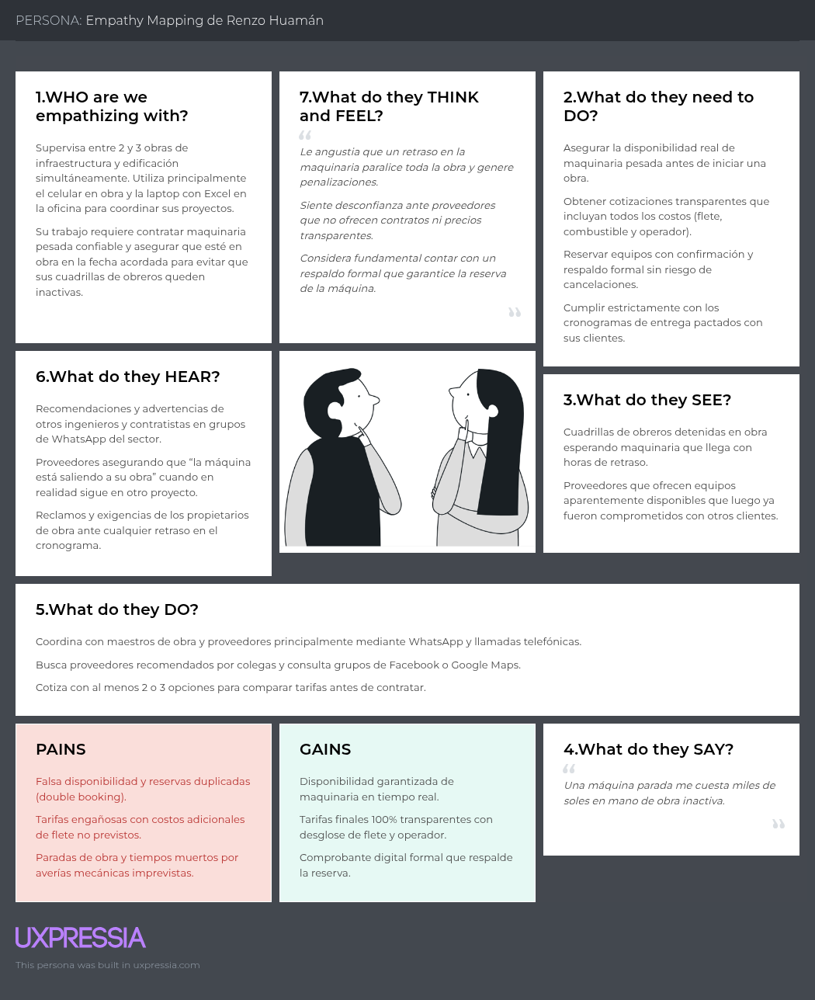

#### 2.3.5. Big Picture Event Storming

El Big Picture Event Storming permite visualizar de manera general los principales procesos del negocio de TechnoLoad, identificando actores, comandos, eventos del dominio, políticas y puntos críticos. En este proyecto se representan los flujos relacionados con la gestión de activos, el mantenimiento preventivo y la coordinación de transporte y logística, con el objetivo de comprender cómo se relacionan las principales actividades del dominio.

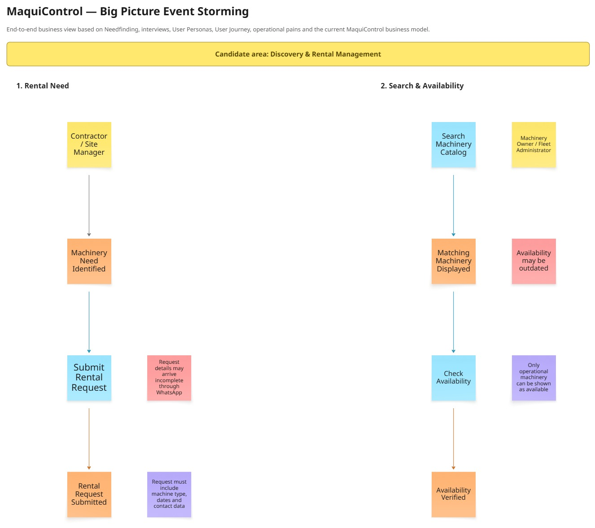
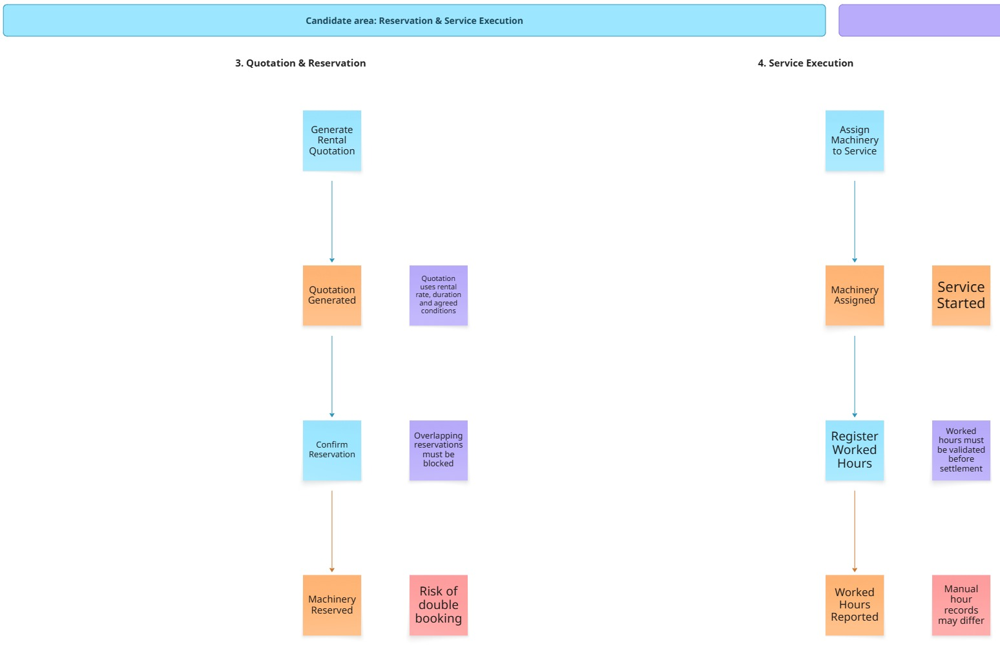


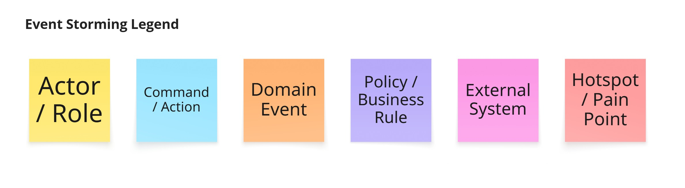
A partir del mapa se reconocen áreas de dominio candidatas como Discovery and Availability, Rental and Reservation Management, Fleet and Maintenance Management, Service Execution and Hour Control, Subscription Management, Billing and SUNAT Compliance, Operational Notifications y Dashboard and Analytics. Estas áreas todavía no representan Bounded Contexts definitivos, ya que su refinamiento se realizará posteriormente mediante Design-Level Event Storming.

### 2.4. Ubiquitous Language

En esta sección se presenta el Ubiquitous Language de TechnoLoad, compuesto por términos propios del dominio de gestión de flotas, mantenimiento de maquinaria pesada y transporte de carga. El objetivo es mantener un lenguaje común y sin ambigüedades entre los integrantes del equipo y los stakeholders involucrados en el proyecto.

Los términos se presentan en inglés debido a que serán utilizados de manera consistente durante el modelado del dominio y el desarrollo posterior de la solución.

| Term | Definition |
|---|---|
| **Fleet** | Conjunto de vehículos o maquinaria pertenecientes a una empresa y administrados como parte de sus operaciones. |
| **Heavy Machinery** | Maquinaria pesada utilizada principalmente en actividades de construcción, minería u operaciones industriales. |
| **Vehicle** | Unidad de transporte utilizada para trasladar carga entre diferentes ubicaciones. |
| **Asset** | Recurso perteneciente a una empresa que puede corresponder a una maquinaria pesada o un vehículo de transporte. |
| **Fleet Manager** | Persona responsable de supervisar el estado, disponibilidad, uso y mantenimiento de los activos de una flota. |
| **Logistics Coordinator** | Persona responsable de organizar la asignación de vehículos, rutas y despachos dentro de una operación logística. |
| **Horometer** | Dispositivo o registro utilizado para medir las horas acumuladas de funcionamiento de una maquinaria. |
| **Mileage** | Cantidad de kilómetros acumulados recorridos por un vehículo. |
| **Preventive Maintenance** | Mantenimiento planificado que se realiza antes de que ocurra una falla con el objetivo de conservar el activo en condiciones adecuadas de operación. |
| **Corrective Maintenance** | Mantenimiento realizado después de detectar una falla o avería en un activo. |
| **Maintenance Alert** | Aviso generado cuando una maquinaria o vehículo se aproxima al límite establecido para realizar un mantenimiento. |
| **Maintenance Schedule** | Planificación de las fechas o condiciones bajo las cuales deben realizarse los mantenimientos de un activo. |
| **Maintenance Record** | Registro histórico que almacena información sobre los mantenimientos realizados a una maquinaria o vehículo. |
| **Fleet Availability** | Condición que permite identificar qué activos se encuentran disponibles para realizar una operación. |
| **Available** | Estado de un activo que se encuentra operativo y disponible para ser asignado. |
| **In Operation** | Estado de un activo que actualmente se encuentra ejecutando una operación o servicio. |
| **In Maintenance** | Estado de un activo que temporalmente no se encuentra disponible debido a actividades de mantenimiento. |
| **Transport Request** | Solicitud que requiere la asignación de una unidad para realizar un servicio de transporte de carga. |
| **Dispatch** | Proceso mediante el cual una unidad es seleccionada, asignada y enviada para realizar un servicio. |
| **Route** | Recorrido definido que debe seguir un vehículo para realizar un servicio de transporte. |
| **Downtime** | Periodo durante el cual una maquinaria o vehículo no se encuentra disponible para operar. |
| **Operational Cost** | Costo asociado a la utilización, mantenimiento y operación de una maquinaria o vehículo. |
| **Fleet Status** | Información que representa la condición operativa actual de un activo perteneciente a la flota. |
| **Usage Reading** | Registro de las horas de funcionamiento o kilometraje acumulado de un activo. |

# Capítulo III: Requirements Specification

Este capítulo formaliza los hallazgos del análisis en historias de usuario, criterios de aceptación, relaciones de impacto y backlog priorizado. Los requisitos funcionales cubren activos, lecturas, mantenimiento, alertas, disponibilidad y asignación; los no funcionales establecen seguridad, rendimiento, accesibilidad, internacionalización, trazabilidad y mantenibilidad.

### 3.1. User Stories

A partir del análisis de las entrevistas y de los artefactos de Needfinding, se identificaron las principales necesidades de los usuarios de TechnoLoad. Estas necesidades fueron transformadas en historias de usuario y organizadas según las épicas funcionales del producto.

Las historias de usuario siguen la estructura: **Como [tipo de usuario], deseo [funcionalidad] para [beneficio esperado]**.

| Orden | Epic | User Story ID | Título | Descripción | Story Points |
|---:|---|---|---|---|---:|
| 1 | EP-01 Gestión de maquinaria y disponibilidad | US-001 | Registrar maquinaria | Como administrador de flota, deseo registrar una maquinaria con sus datos técnicos para mantener actualizada la información de mis activos. | 3 |
| 2 | EP-01 Gestión de maquinaria y disponibilidad | US-002 | Consultar disponibilidad | Como administrador de flota, deseo consultar la disponibilidad de una maquinaria para conocer si está disponible, en obra o en mantenimiento antes de asignarla. | 2 |
| 3 | EP-01 Gestión de maquinaria y disponibilidad | US-003 | Gestionar mantenimiento | Como administrador de flota, deseo gestionar el mantenimiento de una maquinaria para mantenerla en condiciones operativas. | 3 |
| 4 | EP-01 Gestión de maquinaria y disponibilidad | US-016 | Editar datos | Como administrador de flota, deseo editar los datos de una maquinaria para mantener actualizada su información. | 2 |
| 5 | EP-01 Gestión de maquinaria y disponibilidad | US-017 | Dar de baja | Como administrador de flota, deseo dar de baja una maquinaria para evitar que aparezca como disponible cuando ya no forma parte de la flota. | 2 |
| 6 | EP-02 Gestión de reservas | US-004 | Crear reserva | Como cliente, deseo crear una reserva de maquinaria o vehículo para asegurar su disponibilidad durante el periodo requerido. | 3 |
| 7 | EP-02 Gestión de reservas | US-005 | Evitar reservas duplicadas | Como administrador de flota, deseo evitar reservas duplicadas para impedir conflictos de disponibilidad. | 3 |
| 8 | EP-02 Gestión de reservas | US-006 | Cancelar reserva | Como usuario, deseo cancelar una reserva para liberar el activo cuando ya no sea necesario. | 2 |
| 9 | EP-02 Gestión de reservas | US-018 | Modificar fechas | Como usuario, deseo modificar las fechas de una reserva para adaptar la contratación a cambios en mi proyecto. | 2 |
| 10 | EP-02 Gestión de reservas | US-019 | Aprobar/rechazar | Como administrador, deseo aprobar o rechazar solicitudes de reserva para controlar la asignación de los activos. | 3 |
| 11 | EP-03 Consulta y contratación | US-007 | Catálogo | Como cliente, deseo consultar un catálogo de maquinaria y vehículos para conocer las opciones disponibles. | 1 |
| 12 | EP-03 Consulta y contratación | US-008 | Tarifas | Como cliente, deseo consultar las tarifas de alquiler para conocer los costos antes de solicitar una reserva. | 1 |
| 13 | EP-03 Consulta y contratación | US-009 | Reservas por obra | Como cliente, deseo gestionar las reservas asociadas a una obra para organizar los recursos necesarios para cada proyecto. | 2 |
| 14 | EP-03 Consulta y contratación | US-020 | Filtrar por categoría | Como cliente, deseo filtrar las máquinas por categoría para encontrar rápidamente el tipo de equipo que necesito. | 2 |
| 15 | EP-03 Consulta y contratación | US-021 | Buscar por ubicación | Como cliente, deseo buscar maquinaria por ubicación para encontrar activos disponibles cercanos a mi proyecto. | 2 |
| 16 | EP-04 Horas y facturación | US-010 | Registrar horas | Como operador, deseo registrar las horas de uso o kilometraje de una unidad para mantener actualizado su nivel de utilización. | 3 |
| 17 | EP-04 Horas y facturación | US-011 | Validar horas | Como administrador, deseo validar las horas registradas para asegurar que la información utilizada para la facturación sea correcta. | 3 |
| 18 | EP-04 Horas y facturación | US-012 | Resumen de facturación | Como administrador, deseo consultar un resumen de facturación para conocer los ingresos generados por los activos. | 2 |
| 19 | EP-04 Horas y facturación | US-022 | Comprobante | Como administrador, deseo generar un comprobante de pago por el servicio realizado para formalizar la operación. | 3 |
| 20 | EP-04 Horas y facturación | US-023 | Penalización por mora | Como administrador, deseo registrar o calcular penalizaciones por mora para controlar los pagos pendientes de los clientes. | 2 |
| 21 | EP-05 Landing Page | US-013 | Propuesta de valor | Como visitante, deseo conocer el valor que ofrece TechnoLoad para entender cómo puede solucionar los problemas de gestión de mi empresa. | 1 |
| 22 | EP-05 Landing Page | US-014 | Segmentos | Como visitante, deseo conocer los segmentos a los que está dirigida la plataforma para identificar si TechnoLoad se adapta a mi empresa. | 1 |
| 23 | EP-05 Landing Page | US-015 | Contacto/demo | Como visitante, deseo solicitar una demostración o establecer contacto para conocer más sobre la plataforma. | 2 |
| 24 | EP-05 Landing Page | US-024 | ROI Calculator | Como visitante, deseo utilizar una calculadora de ROI para estimar los posibles beneficios económicos de utilizar TechnoLoad. | 3 |
| 25 | EP-05 Landing Page | US-025 | Sales Chat | Como visitante, deseo utilizar un chat comercial para resolver dudas sobre la plataforma y sus servicios. | 2 |
| 26 | EP-06 Acceso | US-026 | Registrar usuario | Como nuevo usuario, deseo registrarme en la plataforma para crear una cuenta y utilizar TechnoLoad. | 2 |
| 27 | EP-06 Acceso | US-027 | Iniciar sesión | Como usuario registrado, deseo iniciar sesión para acceder de forma segura a las funcionalidades de la plataforma. | 2 |
| 28 | EP-06 Acceso | US-028 | Recuperar contraseña | Como usuario, deseo recuperar mi contraseña para volver a acceder a mi cuenta cuando la haya olvidado. | 2 |
| 29 | EP-06 Acceso | US-029 | Gestionar roles | Como administrador, deseo asignar roles de propietario, contratista u operador para controlar el acceso a las funcionalidades. | 3 |
| 30 | EP-06 Acceso | US-030 | Gestionar perfil | Como usuario, deseo gestionar mi perfil para mantener actualizada mi información personal y empresarial. | 2 |
| 31 | EP-07 Mantenimiento | US-031 | Alertas preventivas | Como administrador de flota, deseo recibir alertas de mantenimiento preventivo basadas en las horas de uso o kilometraje para anticiparme a posibles fallas. | 3 |
| 32 | EP-07 Mantenimiento | US-032 | Orden de reparación | Como responsable de mantenimiento, deseo registrar órdenes de reparación para llevar un control de las intervenciones realizadas. | 3 |
| 33 | EP-07 Mantenimiento | US-033 | Historial de mantenimiento | Como administrador, deseo consultar el historial de mantenimiento para conocer las intervenciones realizadas sobre cada activo. | 2 |
| 34 | EP-07 Mantenimiento | US-034 | Reportar falla | Como operador, deseo reportar una falla para informar rápidamente al responsable de mantenimiento sobre un problema detectado. | 2 |
| 35 | EP-08 Operaciones en campo | US-035 | Delivery check-in | Como operador, deseo registrar el check-in de entrega de una unidad incluyendo horómetro y fotografías para dejar evidencia del estado inicial del activo. | 3 |
| 36 | EP-08 Operaciones en campo | US-036 | Return check-out | Como operador, deseo registrar el check-out de una unidad para documentar su devolución y estado final. | 3 |
| 37 | EP-08 Operaciones en campo | US-037 | Equipo de reemplazo | Como administrador, deseo asignar un equipo de reemplazo cuando una unidad presente una falla para reducir el impacto de la inoperatividad. | 3 |
| 38 | EP-09 Analytics | US-038 | Utilización | Como gerente de operaciones, deseo consultar el nivel de utilización de cada activo para evaluar su rendimiento. | 3 |
| 39 | EP-09 Analytics | US-039 | Reportes | Como administrador, deseo generar reportes en Excel o PDF para analizar y compartir información operativa. | 3 |
| 40 | EP-09 Analytics | US-040 | Calificación | Como cliente, deseo calificar el servicio recibido para proporcionar retroalimentación sobre la experiencia de alquiler. | 2 |
| 41 | EP-10 Technical Story API | US-041 | API de maquinaria | Como sistema externo, deseo consultar el catálogo de maquinaria mediante una API para integrar la información de activos con otros servicios. | 3 |
| 42 | EP-10 Technical Story API | US-042 | API de reservas | Como sistema externo, deseo registrar reservas mediante una API para automatizar la creación de solicitudes. | 3 |
| 43 | EP-10 Technical Story API | US-043 | Conflicto de reserva | Como sistema, deseo recibir una respuesta de conflicto cuando exista una reserva incompatible para evitar duplicidades. | 2 |
| 44 | EP-10 Technical Story API | US-044 | Validación API | Como sistema, deseo validar los datos enviados mediante la API para evitar registros incorrectos. | 2 |
| 45 | EP-10 Technical Story API | US-045 | Autenticación JWT | Como sistema, deseo utilizar autenticación mediante JWT para proteger las operaciones de la API. | 3 |
| 46 | EP-10 Technical Story API | US-046 | Horómetros batch | Como sistema, deseo registrar lecturas de horómetros mediante cargas masivas para facilitar la actualización de datos. | 3 |
| 47 | EP-10 Technical Story API | US-047 | Facturación PSE/SUNAT | Como administrador, deseo emitir comprobantes electrónicos mediante la integración con PSE/SUNAT para automatizar la facturación. | 5 |
| 48 | EP-10 Technical Story API | US-048 | Webhooks | Como sistema externo, deseo recibir webhooks sobre cambios importantes para mantener sincronizada la información. | 3 |


### 3.2. Impact Mapping


### 3.3. Product Backlog

| Orden | ID | Epic | Título | Story Points |
| :---: | :---: | :---: | :--- | :---: |
| 1 | US-002 | EP-01 | Consultar disponibilidad | 2 |
| 2 | US-004 | EP-02 | Crear reserva | 3 |
| 3 | US-005 | EP-02 | Evitar reservas duplicadas | 3 |
| 4 | US-001 | EP-01 | Registrar maquinaria | 3 |
| 5 | US-003 | EP-01 | Gestionar mantenimiento | 3 |
| 6 | US-031 | EP-07 | Alertas preventivas | 3 |
| 7 | US-010 | EP-04 | Registrar horas/kilometraje | 3 |
| 8 | US-007 | EP-03 | Catálogo | 1 |
| 9 | US-008 | EP-03 | Consultar tarifas | 1 |
| 10 | US-009 | EP-03 | Reservas por obra | 2 |
| 11 | US-019 | EP-02 | Aprobar/rechazar reserva | 3 |
| 12 | US-006 | EP-02 | Cancelar reserva | 2 |
| 13 | US-018 | EP-02 | Modificar reserva | 2 |
| 14 | US-033 | EP-07 | Historial de mantenimiento | 2 |
| 15 | US-032 | EP-07 | Orden de reparación | 3 |
| 16 | US-034 | EP-07 | Reportar falla | 2 |
| 17 | US-037 | EP-08 | Equipo de reemplazo | 3 |
| 18 | US-011 | EP-04 | Validar horas | 3 |
| 19 | US-012 | EP-04 | Resumen de facturación | 2 |
| 20 | US-022 | EP-04 | Comprobante | 3 |
| 21 | US-038 | EP-09 | Utilización de activos | 3 |
| 22 | US-039 | EP-09 | Reportes | 3 |
| 23 | US-035 | EP-08 | Delivery check-in | 3 |
| 24 | US-036 | EP-08 | Return check-out | 3 |
| 25 | US-020 | EP-03 | Filtrar por categoría | 2 |
| 26 | US-021 | EP-03 | Buscar por ubicación | 2 |
| 27 | US-026 | EP-06 | Registrar usuario | 2 |
| 28 | US-027 | EP-06 | Iniciar sesión | 2 |
| 29 | US-029 | EP-06 | Gestionar roles | 3 |
| 30 | US-030 | EP-06 | Gestionar perfil | 2 |
| 31 | US-028 | EP-06 | Recuperar contraseña | 2 |
| 32 | US-016 | EP-01 | Editar maquinaria | 2 |
| 33 | US-017 | EP-01 | Dar de baja maquinaria | 2 |
| 34 | US-013 | EP-05 | Propuesta de valor | 1 |
| 35 | US-014 | EP-05 | Segmentos | 1 |
| 36 | US-015 | EP-05 | Contacto/demo | 2 |
| 37 | US-024 | EP-05 | ROI Calculator | 3 |
| 38 | US-025 | EP-05 | Sales Chat | 2 |
| 39 | US-041 | EP-10 | API de maquinaria | 3 |
| 40 | US-042 | EP-10 | API de reservas | 3 |
| 41 | US-043 | EP-10 | Conflicto de reserva | 2 |
| 42 | US-044 | EP-10 | Validación API | 2 |
| 43 | US-045 | EP-10 | Autenticación JWT | 3 |
| 44 | US-046 | EP-10 | Horómetros batch | 3 |
| 45 | US-047 | EP-10 | Facturación PSE/SUNAT | 5 |
| 46 | US-048 | EP-10 | Webhooks | 3 |

# Capítulo IV: Product Design

## 4.1. Style Guidelines

Esta sección define las decisiones visuales y de interacción que mantienen una experiencia coherente en TechnoLoad. El sistema de diseño se orienta a operaciones de flota: debe permitir identificar el estado de un activo, detectar una excepción y ejecutar una acción sin ambigüedad, tanto desde escritorio como desde un dispositivo móvil.

### 4.1.1. General Style Guidelines

La identidad visual de TechnoLoad busca transmitir una imagen profesional, tecnológica y orientada a la gestión operativa de flotas de maquinaria pesada y transporte de carga por carretera.

La interfaz utiliza principalmente una paleta clara y contrastada acompañada de elementos en color azul y naranja para resaltar acciones importantes, estados de activos y componentes interactivos.

Los principales colores utilizados son:

#### Color Palette

TechnoLoad utiliza una paleta de colores de alto contraste que combina superficies limpias con colores de acento bien definidos para destacar acciones importantes y estados de la flota.

| Token | Código HEX | Uso en TechnoLoad |
| :--- | :---: | :--- |
| **Primary** | `#0F3D5E` | Navegación, encabezados y confianza operativa |
| **Action** | `#1976D2` | Botones primarios, enlaces y focos activos |
| **Accent** | `#FF8F00` | CTA, alertas de atención y priorización de mantenimientos |
| **Success** | `#2E7D32` | Activo disponible, rutas activas y confirmaciones |
| **Error** | `#C62828` | Validación, fallos críticos de máquina y acciones bloqueadas |
| **Neutral 50–900** | `#F6F8FB`–`#17324D` | Superficies, bordes y jerarquía de texto |

---

#### Typography

La tipografía principal utilizada es `Inter`, con fuentes alternativas Arial, Helvetica y sans-serif por su alta legibilidad en dashboards, tablas de horómetros e indicadores logísticos.

La jerarquía visual se establece mediante diferentes tamaños y pesos tipográficos, utilizando títulos grandes para comunicar métricas clave y textos secundarios con menor contraste para información complementaria.

| Elemento | Tipografía | Peso aproximado | Aplicación |
| :--- | :---: | :---: | :--- |
| **Main Headings** | Inter | Bold / 700 | Hero y títulos principales |
| **Section Headings** | Inter | Bold / 700 | Títulos de secciones y módulos |
| **Card Titles** | Inter | Semi Bold / 600 | Métrica de activos, tarjetas de flota y pasos |
| **Body Text** | Inter | Regular / 400 | Descripciones, lecturas de horómetros y contenido |
| **Buttons** | Inter | Semi Bold / 600 | Call to Action y botones de comando |
| **Navigation** | Inter | Regular / 400–500 | Enlaces de navegación y pestañas |

La jerarquía tipográfica se mantiene mediante variaciones de tamaño (escala de 12, 14, 16, 20, 24, 32 y 40 px) y peso, permitiendo distinguir claramente títulos, subtítulos, textos descriptivos y acciones.

---

#### Component Mapping & Spacing Rules

La escala de espaciado se compone de 4, 8, 12, 16, 24, 32 y 48 px. Las tarjetas usan un radio de borde de 12 px, una sombra tenue y separación interna mínima de 16 px. El color de estado siempre se acompaña con una etiqueta, icono o texto descriptivo.

| Elemento Figma | Equivalente PrimeVue | Estados documentados |
| :--- | :---: | :--- |
| **Primary / secondary button** | `pv-button` | default, hover, focus, disabled, loading |
| **Campo de formulario** | `pv-input-text` | default, focus, error, disabled |
| **Tarjeta de activo** | `pv-card` | default, hover, loading |
| **Tabla operativa** | `pv-data-table` | loading, empty, selected, error |
| **Estado de activo** | `pv-tag` | disponible, mantenimiento, crítico |
| **Confirmación y error** | `pv-toast` | success, warn, error, info |
| **Carga de contenido** | `pv-skeleton` | tarjeta, fila y detalle |

### 4.1.2. Web Style Guidelines

Las Web Style Guidelines de TechnoLoad establecen los criterios visuales y de interacción que serán aplicados tanto en la Landing Page como en la Web Application, buscando mantener una experiencia consistente, responsive y accesible en diferentes tamaños de pantalla.

La interfaz utiliza un enfoque responsive basado en una grilla flexible que permite adaptar el contenido a computadoras, tablets y dispositivos móviles. En pantallas de escritorio se utiliza una distribución de hasta 12 columnas, mientras que en dispositivos móviles los elementos se reorganizan verticalmente para facilitar su lectura e interacción.

Los principales breakpoints considerados son:

| Dispositivo | Resolución de referencia | Comportamiento |
|---|---|---|
| Mobile | 375 px – 767 px | Una columna, navegación mediante menú desplegable y componentes apilados. |
| Tablet | 768 px – 1023 px | Distribución intermedia con reducción de columnas y espacios. |
| Desktop | 1024 px o superior | Navegación completa, múltiples columnas y visualización ampliada de tablas y dashboards. |

Los componentes interactivos mantienen estados visuales claramente diferenciados.

| Componente | Estados considerados |
|---|---|
| Buttons | Default, Hover, Focus, Disabled y Loading |
| Input Fields | Default, Focus, Error y Disabled |
| Cards | Default, Hover y Selected |
| Tables | Loading, Empty, Selected y Error |
| Alerts | Info, Success, Warning y Error |
| Navigation Items | Default, Hover, Active y Focus |

Los botones principales utilizan el color de acción definido en el Design System, mientras que las acciones secundarias emplean estilos con menor jerarquía visual. Los estados de error, advertencia y éxito utilizan colores acompañados de iconos o textos, evitando depender únicamente del color para transmitir información.

En dispositivos móviles, el menú lateral de la Web Application se transforma en un Drawer que puede abrirse mediante un botón de navegación. Las tablas que contienen gran cantidad de información permiten desplazamiento horizontal o presentan una versión simplificada para conservar la legibilidad.

Las interfaces mantienen áreas de interacción suficientemente amplias y controles accesibles mediante teclado. Los formularios proporcionan mensajes de validación cercanos al campo correspondiente y muestran claramente los errores detectados.

TechnoLoad utiliza componentes de PrimeVue para mantener consistencia visual y de comportamiento entre las diferentes vistas de la aplicación. Entre los componentes principales se consideran `Button`, `InputText`, `DataTable`, `Card`, `Tag`, `Dialog`, `Toast`, `Drawer` y `Skeleton`.

## 4.2. Information Architecture

La arquitectura de información de TechnoLoad organiza de forma progresiva los contenidos relativos a activos, mantenimiento y operaciones de carga. La experiencia parte de la propuesta de valor y conduce al visitante por beneficios, perfiles objetivo, funcionamiento y mecanismos de navegación, con el propósito de reducir la carga cognitiva y orientar cada interacción hacia una decisión operativa verificable.

### 4.2.1. Organization Systems

La arquitectura de información de TechnoLoad utiliza diferentes sistemas de organización dependiendo del tipo de contenido y del objetivo que debe cumplir el usuario.

#### Organización jerárquica

La organización jerárquica se utiliza principalmente en la Web Application, donde la información se estructura desde módulos generales hasta información específica.

La jerarquía principal es:

**Dashboard → Módulos → Listados → Detalle → Acciones**

Los módulos principales considerados son:

- Dashboard
- Assets
- Maintenance
- Operations
- Reservations
- Profile

Por ejemplo, un administrador puede ingresar al módulo de activos, seleccionar una maquinaria específica y posteriormente consultar su información detallada, historial de uso o mantenimiento.

#### Organización secuencial

La organización secuencial se utiliza cuando el usuario debe completar un conjunto ordenado de pasos para alcanzar un objetivo.

Ejemplos:

**Seleccionar activo → Registrar lectura → Validar información → Confirmar registro**

**Seleccionar activo → Programar mantenimiento → Definir fecha y prioridad → Confirmar mantenimiento**

**Consultar disponibilidad → Seleccionar unidad → Asignar operación → Confirmar asignación**

Este sistema permite que los procesos transaccionales sean fáciles de comprender y reduzcan errores durante su ejecución.

#### Organización por tópicos

El contenido se agrupa según las principales áreas funcionales del dominio de TechnoLoad:

- Gestión de activos.
- Control de horómetros y kilometraje.
- Gestión de mantenimiento.
- Disponibilidad de unidades.
- Operaciones.
- Reservas.
- Reportes y análisis.

#### Organización según audiencia

La información también se organiza de acuerdo con los principales tipos de usuario.

**Fleet Manager:** accede principalmente a información relacionada con activos, lecturas, disponibilidad y mantenimiento.

**Operations Manager:** accede a indicadores de utilización, costos y rendimiento de la flota.

**Logistics Coordinator:** accede a disponibilidad de unidades, asignaciones y operaciones.

**Visitor:** accede al Landing Page para conocer la propuesta de valor, características y mecanismos de contacto de TechnoLoad.

De esta manera, la organización del contenido permite reducir la cantidad de información innecesaria presentada a cada usuario.

### 4.2.2. Labeling Systems

El sistema de etiquetado de TechnoLoad utiliza términos breves, comprensibles y consistentes con el Ubiquitous Language definido para el dominio.

Se busca evitar etiquetas ambiguas o excesivamente técnicas y utilizar nombres que permitan al usuario comprender rápidamente la función de cada elemento.

#### Navigation Labels

| Label | Propósito |
|---|---|
| Home | Página principal de la Landing Page. |
| Features | Presenta las principales características de TechnoLoad. |
| Solutions | Presenta los beneficios de la plataforma para cada segmento. |
| Contact | Permite acceder a los medios de contacto. |
| Dashboard | Presenta una visión general de la operación. |
| Assets | Permite administrar maquinaria y vehículos. |
| Maintenance | Permite consultar y gestionar mantenimientos. |
| Operations | Permite gestionar las operaciones de las unidades. |
| Reservations | Permite consultar y administrar reservas. |
| Profile | Permite gestionar la información del usuario. |

#### Action Labels

Las acciones utilizan verbos que describen directamente lo que realizará el usuario.

- Register Asset
- Edit Asset
- Register Reading
- Schedule Maintenance
- Assign Unit
- Create Reservation
- Cancel Reservation
- View Details
- Save
- Confirm
- Cancel

#### Status Labels

Los estados utilizados para representar la situación actual de los activos son:

- Available
- Assigned
- In Operation
- In Maintenance
- Inactive

Los mantenimientos podrán utilizar estados como:

- Scheduled
- In Progress
- Completed
- Cancelled

Las etiquetas mantendrán la misma terminología en toda la plataforma para evitar que un mismo concepto sea representado con diferentes palabras.

Además, los textos visibles serán administrados mediante internacionalización, permitiendo presentar la interfaz en `en_US` y `es_419`.

### 4.2.3. SEO Tags and Meta Tags

La Landing Page de TechnoLoad incorpora etiquetas HTML orientadas a mejorar la identificación del sitio por los motores de búsqueda y proporcionar información básica sobre el contenido de la página.

En el elemento `<head>` se han implementado las siguientes etiquetas:

* **Title:** `TechnoLoad | Intelligent Fleet Management`
* **Description:** describe a TechnoLoad como una plataforma para la gestión de flotas, control de mantenimientos preventivos, horómetros y optimización de rutas para maquinaria pesada y transporte.
* **Keywords:** incluye términos relacionados con gestión de flotas, mantenimiento preventivo, maquinaria pesada, logística, transporte de carga y TechnoLoad.
* **Author:** identifica a `TechnoLoad Team` como autor del sitio.

Además, se incluyen etiquetas técnicas necesarias para una correcta visualización y optimización en redes sociales:

* `charset="UTF-8"` para la codificación de caracteres.
* `viewport` para adaptar correctamente la página a dispositivos móviles.
* Etiquetas `OpenGraph` para estandarizar el título, descripción, imagen y URL al compartir la página.

La configuración implementada en la Landing Page es la siguiente:

```html
`<meta charset="UTF-8">`

`<meta name="viewport" content="width=device-width, initial-scale=1.0">`

`<meta name="description" content="TechnoLoad centraliza activos, mantenimiento y operaciones de transporte de carga y maquinaria pesada en una sola plataforma.">`

`<meta name="keywords" content="fleet management, maintenance, machinery, logistics, TechnoLoad">`

`<meta name="author" content="TechnoLoad Team">`

`<title>TechnoLoad | Intelligent Fleet Management</title>`
```

### 4.2.4. Searching Systems

La Landing Page no requiere un buscador interno: su objetivo es comunicar y convertir mediante llamadas a la acción directas hacia la Web App. En la aplicación autenticada, la búsqueda usa debounce de 300 ms, filtros combinables por estado, tipo y prioridad, parámetros conservados en la URL y paginación de servidor. Los estados vacíos explican la causa, ofrecen restablecer filtros y presentan un CTA contextual cuando el rol lo permite.

### 4.2.5. Navigation Systems

La navegación pública es lineal por anclas: el Header contiene enlaces a secciones y un botón de acceso a plataforma; en móvil se contrae a un menú compacto. La aplicación autenticada usa Sidebar o Drawer, Topbar, Breadcrumbs dinámicos y CTAs contextuales. Esta combinación conserva orientación espacial al pasar de listados a detalle y a formularios.

## 4.3. Landing Page UI Design

La Landing Page aplica Primary `#0F3D5E`, Secondary `#FF8F00` e Inter para comunicar confiabilidad, actividad y claridad. La composición dirige la mirada del titular a la propuesta de valor, luego a los módulos y finalmente a la conversión.

### 4.3.1. Landing Page Wireframes

El wireframe de baja fidelidad define Navbar, Hero de dos columnas, beneficios, módulos, proceso, CTA y Footer. Las estructuras se validan antes de aplicar estilo visual y responden a desktop y móvil.

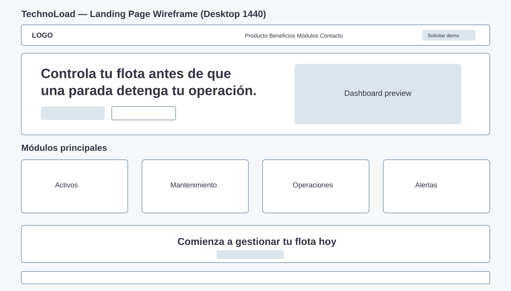

### 4.3.2. Landing Page Mock-ups

En esta sección se presentan los mockups de alta fidelidad de la Landing Page de TechnoLoad.

Los mockups aplican la identidad visual definida previamente, incluyendo colores, tipografía, componentes, botones, tarjetas, iconografía y distribución responsive.

La interfaz final está compuesta por las siguientes secciones:

* **Header.**
* **Hero Section.**
* **Benefits Section.**
* **Target Segments Section.**
* **How It Works Section.**
* **Value Proposition.**
* **Pricing Section.**
* **Final Call to Action.**
* **Footer.**

El mock-up de alta fidelidad aplica la jerarquía Inter, superficies claras, cards con bordes suaves y CTAs contrastantes. El copy principal, “Controla tu flota antes de que una parada detenga tu operación”, se acompaña de “Solicitar una demostración” y “Conocer los módulos”.

---

#### **Vista Desktop**

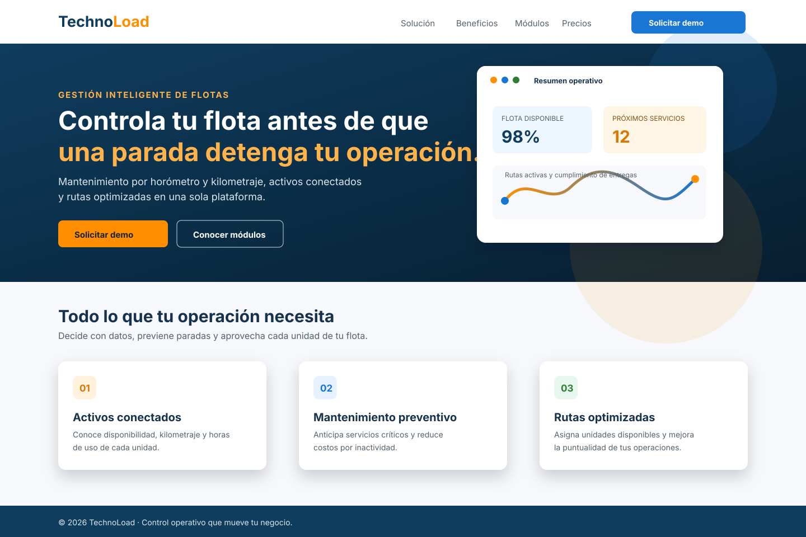

<!-- SVG embebido anterior conservado solo como referencia de diseño; la imagen local anterior es la representación visible.
<svg xmlns="http://www.w3.org/2000/svg" viewBox="0 0 1200 800" width="100%" style="background:#0F1115; border-radius:8px; font-family:'Inter', sans-serif;">
  <!-- Header -->
  <rect x="0" y="0" width="1200" height="70" fill="#171A20"/>
  <text x="40" y="42" fill="#F5F5F5" font-size="20" font-weight="bold">TechnoLoad</text>
  <text x="750" y="42" fill="#A8ADB8" font-size="14">Inicio</text>
  <text x="820" y="42" fill="#A8ADB8" font-size="14">Servicios</text>
  <text x="910" y="42" fill="#A8ADB8" font-size="14">Planes</text>
  <rect x="1000" y="20" width="160" height="36" rx="6" fill="#FF8F00"/>
  <text x="1035" y="43" fill="#FFFFFF" font-size="13" font-weight="bold">Ir a la Plataforma</text>

  <!-- Hero Section -->
  <text x="80" y="160" fill="#FFFFFF" font-size="38" font-weight="bold">Controla tu flota antes de que</text>
  <text x="80" y="210" fill="#FF8F00" font-size="38" font-weight="bold">una parada detenga tu operación.</text>
  <text x="80" y="260" fill="#A8ADB8" font-size="16">Monitoreo de horómetros, mantenimiento preventivo y gestión logística en tiempo real.</text>

  <rect x="80" y="300" width="200" height="48" rx="6" fill="#1976D2"/>
  <text x="110" y="330" fill="#FFFFFF" font-size="15" font-weight="bold">Solicitar Demostración</text>

  <rect x="300" y="300" width="180" height="48" rx="6" fill="none" stroke="#2A2F38" stroke-width="2"/>
  <text x="335" y="330" fill="#F5F5F5" font-size="15">Conocer Módulos</text>

  <!-- Hero Card Graphic -->
  <rect x="680" y="130" width="440" height="260" rx="12" fill="#171A20" stroke="#2A2F38" stroke-width="2"/>
  <rect x="710" y="160" width="380" height="130" rx="8" fill="#0F3D5E"/>
  <circle cx="800" cy="225" r="30" fill="#FF8F00"/>
  <rect x="850" y="210" width="180" height="12" rx="4" fill="#FFFFFF"/>
  <rect x="850" y="232" width="120" height="10" rx="4" fill="#A8ADB8"/>
  <rect x="710" y="310" width="140" height="32" rx="16" fill="#2E7D32"/>
  <text x="735" y="331" fill="#FFFFFF" font-size="12" font-weight="bold">● Flota Operativa 98%</text>

  <!-- Cards Grid -->
  <rect x="80" y="440" width="320" height="280" rx="10" fill="#171A20" stroke="#2A2F38"/>
  <rect x="110" y="470" width="40" height="40" rx="8" fill="#FF8F00"/>
  <text x="123" y="496" fill="#FFFFFF" font-size="18" font-weight="bold">01</text>
  <text x="110" y="545" fill="#FFFFFF" font-size="20" font-weight="bold">Maquinaria Pesada</text>
  <text x="110" y="580" fill="#A8ADB8" font-size="14">Control automático de horómetros,</text>
  <text x="110" y="605" fill="#A8ADB8" font-size="14">alertas de servicios preventivos y</text>
  <text x="110" y="630" fill="#A8ADB8" font-size="14">reportes de costos operativos en obra.</text>

  <rect x="440" y="440" width="320" height="280" rx="10" fill="#171A20" stroke="#2A2F38"/>
  <rect x="470" y="470" width="40" height="40" rx="8" fill="#1976D2"/>
  <text x="483" y="496" fill="#FFFFFF" font-size="18" font-weight="bold">02</text>
  <text x="470" y="545" fill="#FFFFFF" font-size="20" font-weight="bold">Transporte y Carga</text>
  <text x="470" y="580" fill="#A8ADB8" font-size="14">Asignación eficiente de rutas,</text>
  <text x="470" y="605" fill="#A8ADB8" font-size="14">seguimiento de kilometraje y</text>
  <text x="470" y="630" fill="#A8ADB8" font-size="14">reducción de tiempos muertos.</text>

  <rect x="800" y="440" width="320" height="280" rx="10" fill="#171A20" stroke="#2A2F38"/>
  <rect x="830" y="470" width="40" height="40" rx="8" fill="#2E7D32"/>
  <text x="843" y="496" fill="#FFFFFF" font-size="18" font-weight="bold">03</text>
  <text x="830" y="545" fill="#FFFFFF" font-size="20" font-weight="bold">Mantenimiento</text>
  <text x="830" y="580" fill="#A8ADB8" font-size="14">Planificación centralizada para</text>
  <text x="830" y="605" fill="#A8ADB8" font-size="14">evitar averías críticas y reducir</text>
  <text x="830" y="630" fill="#A8ADB8" font-size="14">penalizaciones contractuales.</text>
</svg>
-->

---

#### **Vista Mobile**

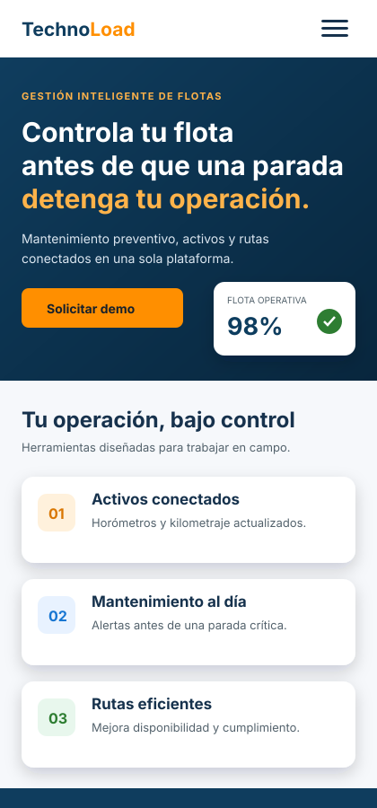

### 4.4. Web Applications UX/UI Design

El Dashboard y la Web App se diseñan a partir de los User Personas y User Stories. El administrador requiere visibilidad de activos y mantenimiento; el coordinador necesita conocer disponibilidad y asignar unidades sin perder trazabilidad.

### 4.4.1. Web Applications Wireframes

Los wireframes de TechnoLoad representan la estructura inicial de las principales vistas de la Web Application antes de aplicar los estilos visuales definitivos.

Estos diseños de baja fidelidad permiten establecer la distribución de los componentes, la jerarquía de la información y la ubicación de los principales elementos de interacción.

Los wireframes fueron elaborados considerando los principales procesos de la plataforma, permitiendo validar la organización de las vistas antes de desarrollar los mock-ups de alta fidelidad.

A continuación, se presentan los wireframes correspondientes a las principales interfaces de la Web Application de TechnoLoad.

---

#### **14 Vistas Prioritarias del MVP**

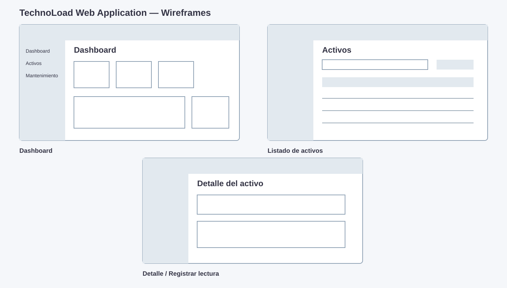

### 4.4.2. Web Applications Wireflow Diagrams

Los Wireflow Diagrams permiten representar la relación entre los wireframes y las acciones que conectan las diferentes vistas de la Web Application de TechnoLoad.

Estos diagramas muestran cómo el usuario puede desplazarse entre las interfaces para completar determinadas tareas, combinando la representación visual de las pantallas con las conexiones que describen el flujo de navegación.

Los wireflows permiten validar la continuidad de la experiencia y detectar posibles problemas de navegación antes de la implementación de la aplicación.

A continuación, se presentan los principales Wireflow Diagrams de TechnoLoad.

---

#### **Seis Wireflows Priorizados**

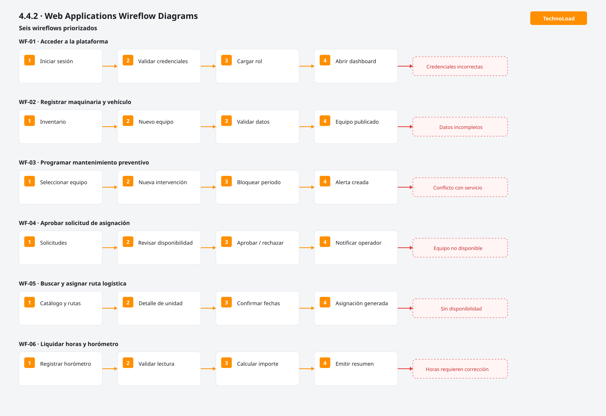

### 4.4.3. Web Applications Mock-ups

Los mock-ups presentan la propuesta visual de alta fidelidad de la Web Application de TechnoLoad.

A diferencia de los wireframes, estas interfaces incorporan la identidad visual definida en las Style Guidelines, incluyendo colores, tipografía, iconografía, componentes, botones, tarjetas, estados visuales y jerarquías de información.

Los mock-ups permiten representar de manera más cercana la apariencia final de la aplicación y sirven como referencia visual para la etapa de implementación.

A continuación, se presentan los mock-ups correspondientes a las principales vistas de la Web Application de TechnoLoad.

---

#### **Mock-ups de Alta Fidelidad**

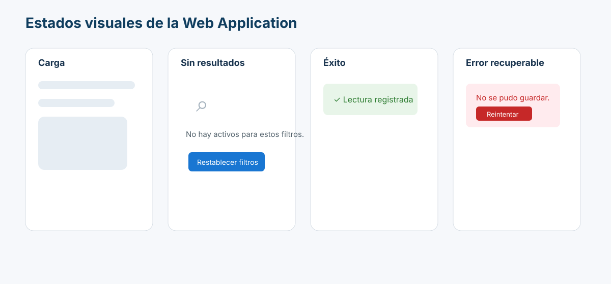

### 4.4.4. Web Applications User Flow Diagrams

Los User Flow Diagrams representan los recorridos que realizan los usuarios para completar las principales tareas dentro de la Web Application de TechnoLoad.

Estos diagramas muestran las acciones, decisiones y transiciones entre diferentes vistas, permitiendo comprender cómo cada tipo de usuario interactúa con la plataforma para alcanzar un objetivo determinado.

Los flujos fueron definidos tomando como referencia las User Stories y las necesidades identificadas para los User Personas de TechnoLoad.

A continuación, se presentan los principales User Flow Diagrams de la aplicación.

---

#### **Seis User Flows**

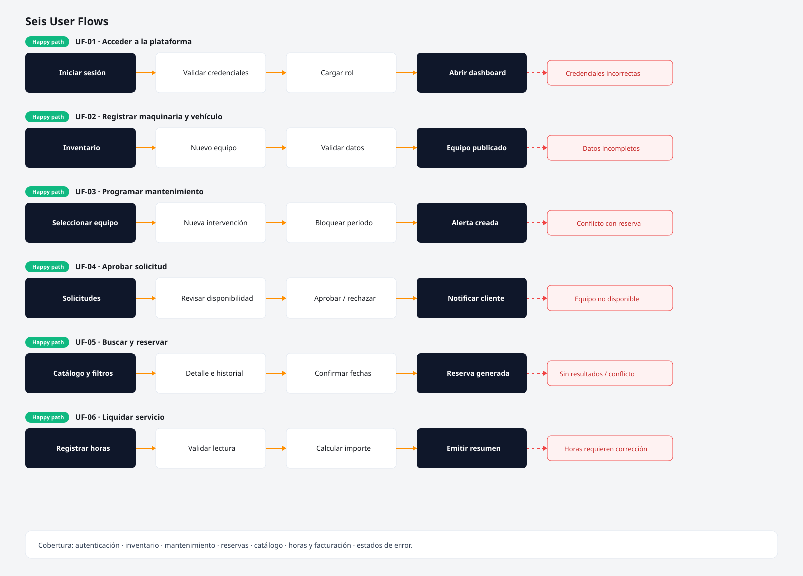

### 4.5 Web Applications Prototyping

En esta sección se presenta el prototipo interactivo de la Web Application de TechnoLoad, desarrollado a partir de los mock-ups y User Flow Diagrams definidos previamente.

El prototipo permite simular la navegación entre las principales vistas de la aplicación y validar la secuencia de interacción que siguen los usuarios para completar sus tareas principales. Las conexiones entre pantallas fueron definidas considerando los recorridos planteados en los User Flows y el sistema de navegación establecido para la aplicación.

Se consideraron las principales funcionalidades de TechnoLoad, como el acceso a la plataforma, visualización del dashboard, consulta y gestión de maquinaria, reservas, mantenimiento, disponibilidad y seguimiento de servicios.

A continuación, se presenta una captura del prototipo en funcionamiento y el enlace al video de demostración, donde se muestran los principales flujos de navegación e interacción de la aplicación.

---

#### **Prototipo Interactivo en Figma**

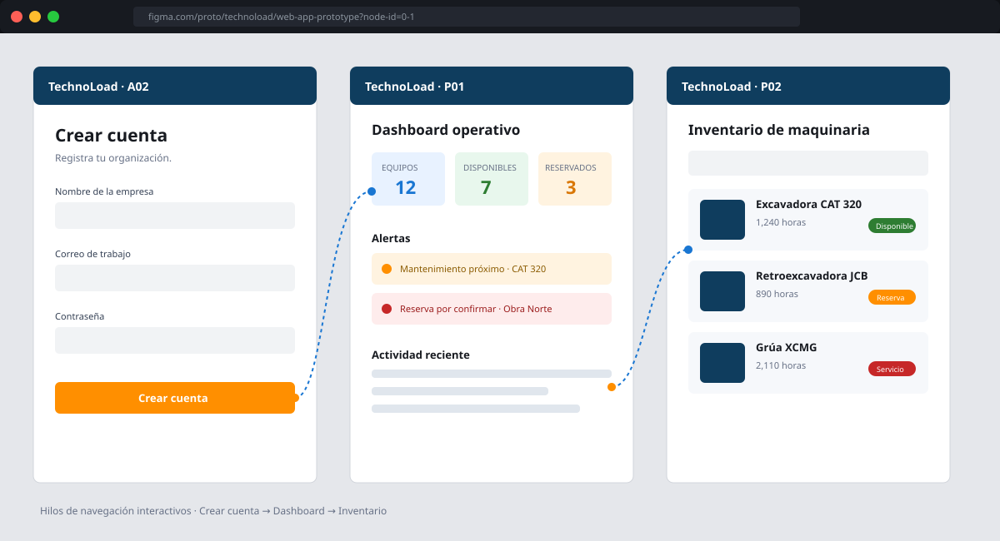

## 4.6. Domain-Driven Software Architecture

En esta sección se presenta la arquitectura de software de TechnoLoad desde una perspectiva orientada al dominio.

La propuesta arquitectónica toma como referencia los procesos de negocio identificados previamente, el Ubiquitous Language, el Big Picture Event Storming y los principales requerimientos funcionales de la plataforma.

A partir de estos elementos se identifican los principales límites del dominio, las responsabilidades del sistema y las relaciones entre los diferentes componentes que conforman la solución.

La arquitectura se documenta mediante Design-Level Event Storming y diagramas C4 a nivel de Context, Container y Component.

### 4.6.1. Design-Level Event Storming

En esta sección se presenta el Design-Level Event Storming de TechnoLoad, desarrollado a partir del Big Picture Event Storming realizado previamente.

El objetivo de esta etapa es profundizar en el dominio del problema e identificar los principales Bounded Contexts, Aggregates, Commands, Domain Events, Queries y Read Models de la solución.

A partir del análisis realizado se identificaron los siguientes Bounded Contexts principales: Fleet Management, Rental Management, Maintenance Management, Operations Management, Identity & Access Management y Profiles Management.

#### Fleet Management Bounded Context

Este Bounded Context concentra las responsabilidades relacionadas con la gestión de la maquinaria, incluyendo su registro, actualización de información, cambio de estado, consulta de inventario y disponibilidad.

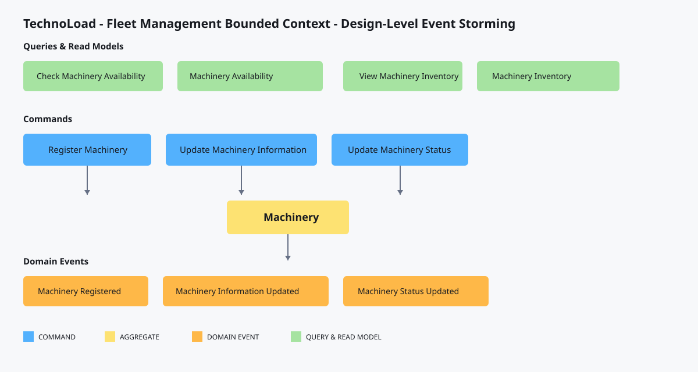

#### Rental Management Bounded Context

Este Bounded Context gestiona las solicitudes y reservas de maquinaria, incluyendo la creación de solicitudes, confirmación, cancelación y actualización de las fechas asociadas al alquiler.

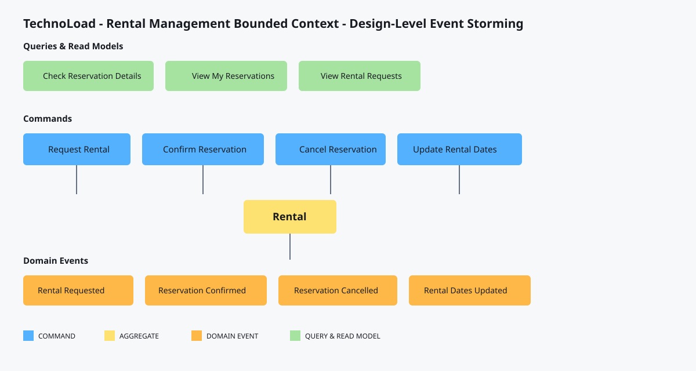

#### Maintenance Management Bounded Context

Este Bounded Context agrupa las responsabilidades relacionadas con el mantenimiento de la maquinaria. Incluye la programación y finalización de mantenimientos, el reporte de averías y la actualización del estado de mantenimiento. Su agregado principal es Maintenance y permite además consultar el historial, los mantenimientos pendientes y el detalle de cada intervención realizada.

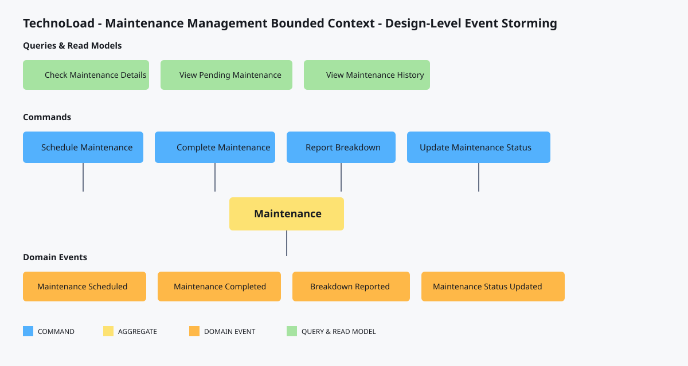

#### Operations Management Bounded Context

Este Bounded Context representa la ejecución operativa de los servicios realizados con la maquinaria. Incluye el inicio y finalización de un servicio, el registro de horas trabajadas y la validación de dichas horas. Su agregado principal es Service Operation y permite consultar el estado del servicio, el resumen de horas trabajadas y el historial de operaciones.

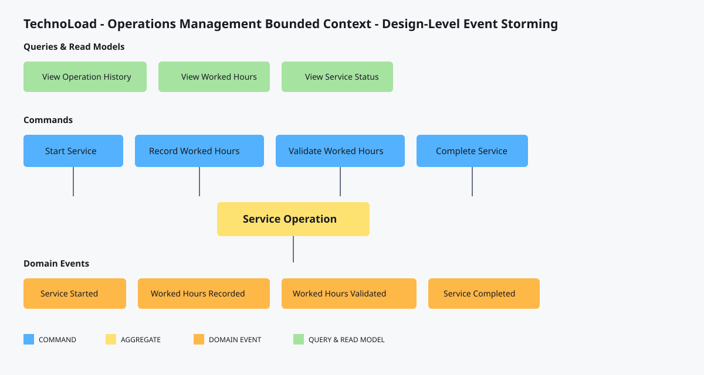

#### Identity & Access Management Bounded Context

Este Bounded Context se encarga de la gestión de identidad, autenticación y control de acceso de los usuarios de TechnoLoad. Incluye el registro de cuentas, la autenticación, la asignación de roles y el cambio de contraseñas. Su agregado principal es User Account y permite consultar los datos de la cuenta, los roles asignados y el estado de autenticación.

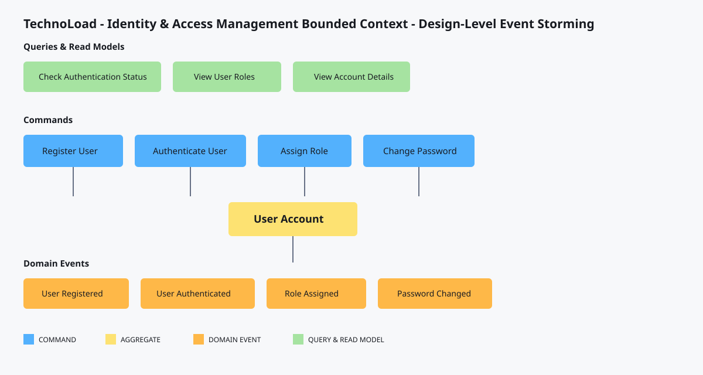

#### Profiles Management Bounded Context

Este Bounded Context gestiona la información asociada a los perfiles de los usuarios. Incluye la creación y actualización de perfiles, datos de contacto e información de la organización. Su agregado principal es Profile y permite consultar la información personal, de contacto y organizacional asociada a cada usuario.

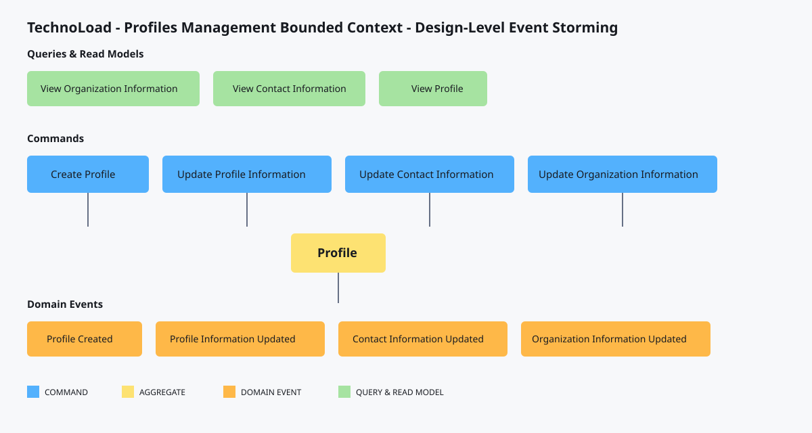

### 4.6.2. Software Architecture Context Diagram

El Software Architecture Context Diagram presenta a TechnoLoad como el sistema principal y muestra su relación con los principales tipos de usuario identificados en el proyecto.

El Fleet Administrator utiliza TechnoLoad para gestionar la maquinaria, reservas, mantenimiento y operaciones asociadas al servicio. Por otro lado, el Contractor o Site Manager utiliza la plataforma para consultar maquinaria disponible, solicitar alquileres y realizar seguimiento de los servicios contratados.

Este nivel del modelo C4 permite visualizar el alcance general de TechnoLoad y las principales interacciones entre el sistema y sus usuarios.

---

#### **Diagrama de Contexto (Modelo C4 - Nivel 1)**

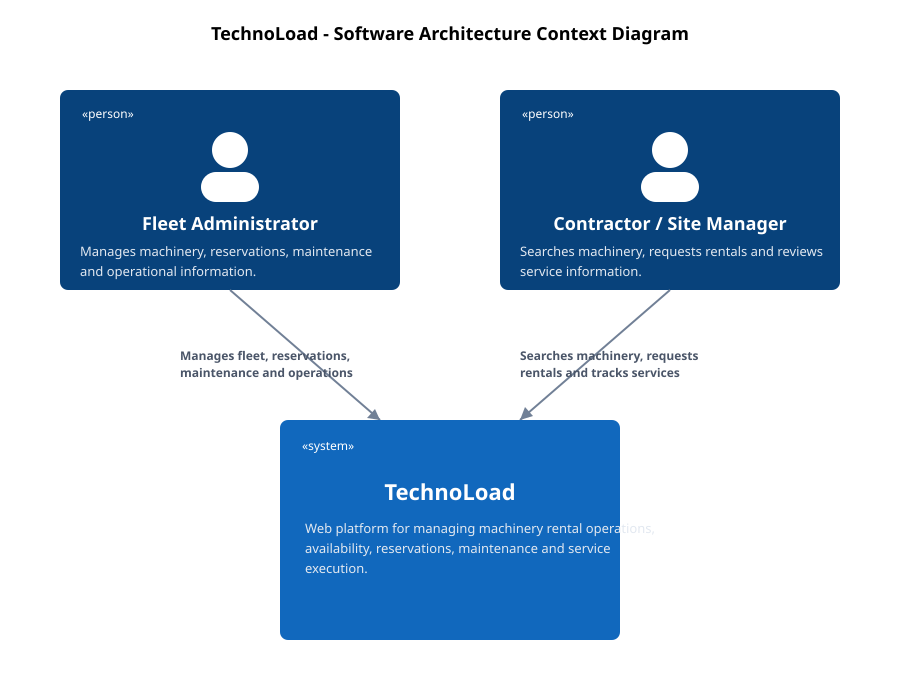

### 4.6.3. Software Architecture Container Diagram

El Software Architecture Container Diagram muestra la estructura de alto nivel de TechnoLoad y la distribución de responsabilidades entre los principales elementos de la solución.

La aplicación está compuesta por una Single Page Application desarrollada con Angular, una REST API desarrollada con Spring Boot y Java, y una base de datos relacional encargada de la persistencia de la información.

Los usuarios interactúan con la aplicación web mediante un navegador. La Single Page Application consume los servicios proporcionados por la REST API utilizando HTTPS y JSON. A su vez, la API gestiona el acceso a la información persistida mediante Spring Data JPA.

Este nivel del modelo C4 permite visualizar las principales decisiones tecnológicas de la solución y la comunicación entre los containers que conforman TechnoLoad.

---

#### **Diagrama de Contenedores (Modelo C4 - Nivel 2)**

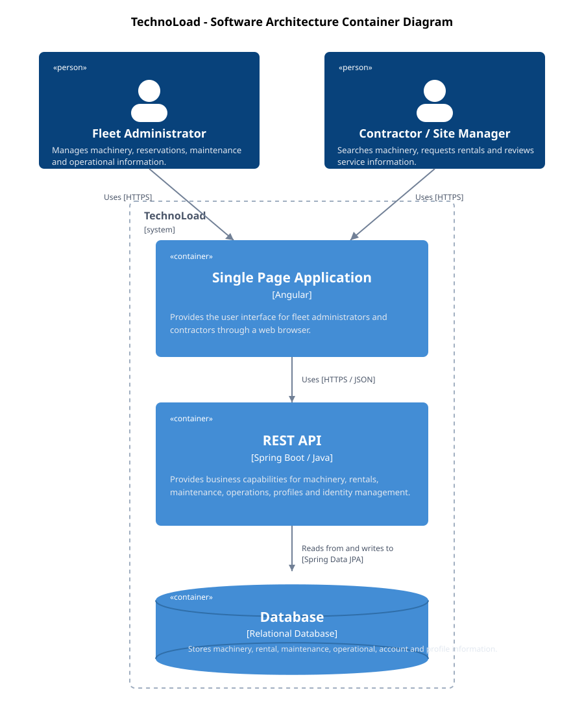

### 4.6.4. Software Architecture Components Diagrams

En esta sección se presentan los Component Diagrams de TechnoLoad, los cuales permiten visualizar la descomposición interna del container correspondiente a la REST API.

En primer lugar, se muestra la organización general de los principales Bounded Contexts identificados durante el proceso de Domain-Driven Design. Posteriormente, se presenta el detalle interno de cada Bounded Context, mostrando sus principales capas y responsabilidades.

La estructura interna sigue una separación entre Interfaces Layer, Application Layer, Domain Layer e Infrastructure Layer, permitiendo mantener separadas las responsabilidades del dominio y los aspectos técnicos de la implementación.

---

#### **API Application Component Diagram**

El siguiente diagrama muestra la organización general de la REST API de TechnoLoad y los principales Bounded Contexts que forman parte de la solución: Identity & Access Management, Profiles Management, Fleet Management, Rental Management, Maintenance Management y Operations Management.

También se representan las principales relaciones entre los contextos, la Single Page Application y la base de datos.

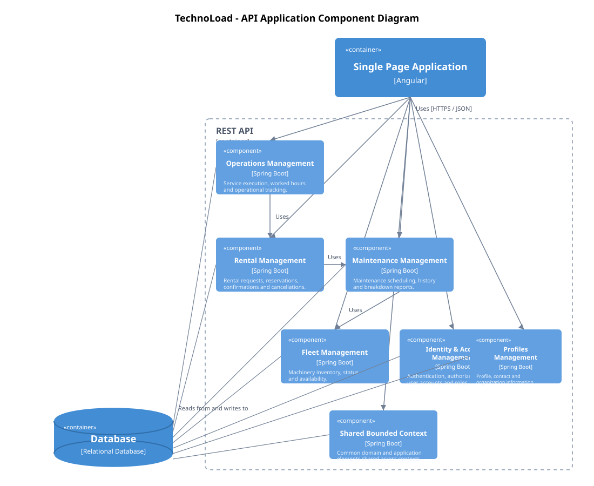

#### **Identity & Access Management Bounded Context Component Diagram**

Este diagrama representa la estructura interna del Identity & Access Management Bounded Context. Este contexto se encarga de la autenticación, autorización, gestión de cuentas, roles y credenciales de los usuarios de TechnoLoad.

La Domain Layer contiene el aggregate User Account y las reglas asociadas al control de identidad y acceso.

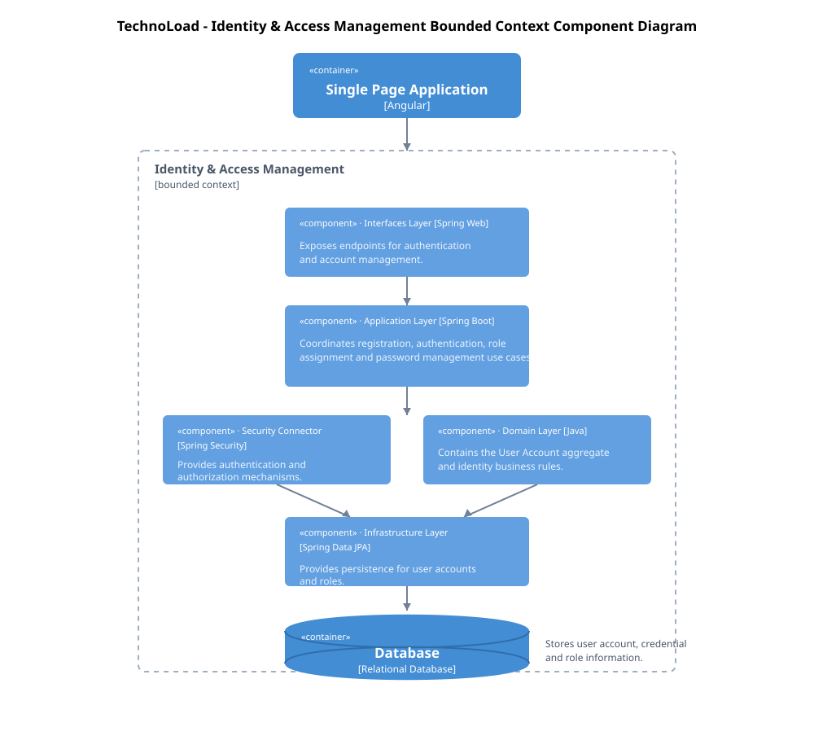

#### **Profiles Management Bounded Context Component Diagram**

Este diagrama muestra la estructura interna del Profiles Management Bounded Context, encargado de gestionar la información del perfil, datos de contacto e información de las organizaciones asociadas a los usuarios.

La Domain Layer contiene el aggregate Profile y sus reglas de negocio correspondientes.

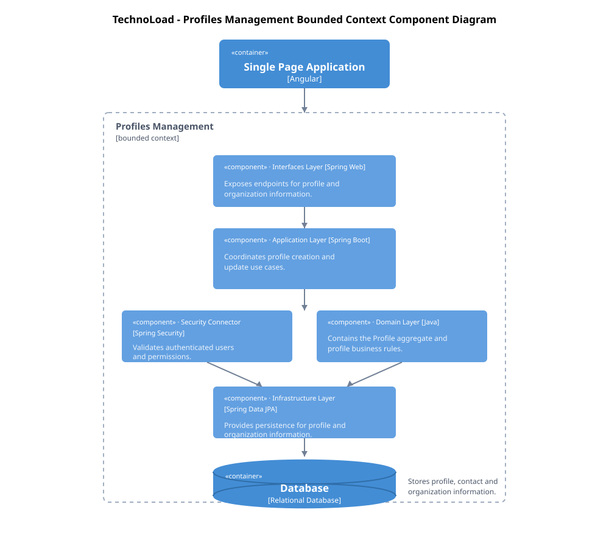  

## 4.7 Software Object-Oriented Design

El diseño orientado a objetos de TechnoLoad representa las principales clases, interfaces, enumeraciones, atributos, operaciones y relaciones que conforman cada Bounded Context. Los modelos mantienen los límites definidos mediante Domain-Driven Design y utilizan identificadores para referenciar agregados pertenecientes a otros contextos, evitando el acoplamiento directo entre ellos.

### 4.7.1 Class Diagrams

#### Fleet Management Bounded Context Class Diagram

El diagrama de Fleet Management representa el agregado Machinery, responsable del registro, actualización, clasificación, ubicación, estado y disponibilidad de la maquinaria. También incluye el objeto de valor MachineryLocation, las enumeraciones correspondientes y los servicios e interfaces necesarios para coordinar y persistir las operaciones del contexto.

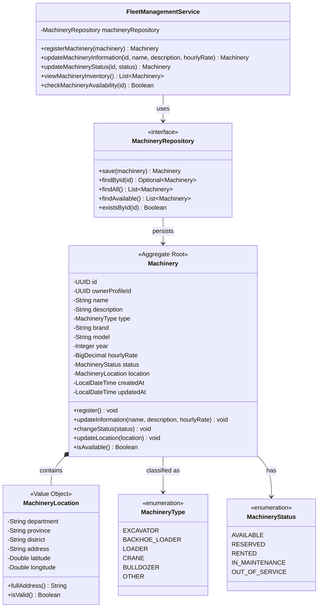
```mermaid
classDiagram
    class FleetManagementService {
        -MachineryRepository machineryRepository
        +registerMachinery(machinery) Machinery
        +updateMachineryInformation(id, name, description, hourlyRate) Machinery
        +updateMachineryStatus(id, status) Machinery
        +viewMachineryInventory() List~Machinery~
        +checkMachineryAvailability(id) Boolean
    }
    class MachineryRepository {
        <<interface>>
        +save(machinery) Machinery
        +findById(id) Optional~Machinery~
        +findAll() List~Machinery~
        +findAvailable() List~Machinery~
        +existsById(id) Boolean
    }
    class Machinery {
        <<Aggregate Root>>
        -UUID id
        -UUID ownerProfileId
        -String name
        -String description
        -MachineryType type
        -String brand
        -String model
        -Integer year
        -BigDecimal hourlyRate
        -MachineryStatus status
        -MachineryLocation location
        -LocalDateTime createdAt
        -LocalDateTime updatedAt
        +register() void
        +updateInformation(name, description, hourlyRate) void
        +changeStatus(status) void
        +updateLocation(location) void
        +isAvailable() Boolean
    }
    class MachineryLocation {
        <<Value Object>>
        -String department
        -String province
        -String district
        -String address
        -Double latitude
        -Double longitude
        +fullAddress() String
        +isValid() Boolean
    }
    class MachineryType {
        <<enumeration>>
        EXCAVATOR
        BACKHOE_LOADER
        LOADER
        CRANE
        BULLDOZER
        OTHER
    }
    class MachineryStatus {
        <<enumeration>>
        AVAILABLE
        RESERVED
        RENTED
        IN_MAINTENANCE
        OUT_OF_SERVICE
    }

    FleetManagementService --> MachineryRepository : uses
    MachineryRepository --> Machinery : persists
    Machinery *-- MachineryLocation : contains
    Machinery --> MachineryType : classified as
    Machinery --> MachineryStatus : has
```

#### Rental Management Bounded Context Class Diagram

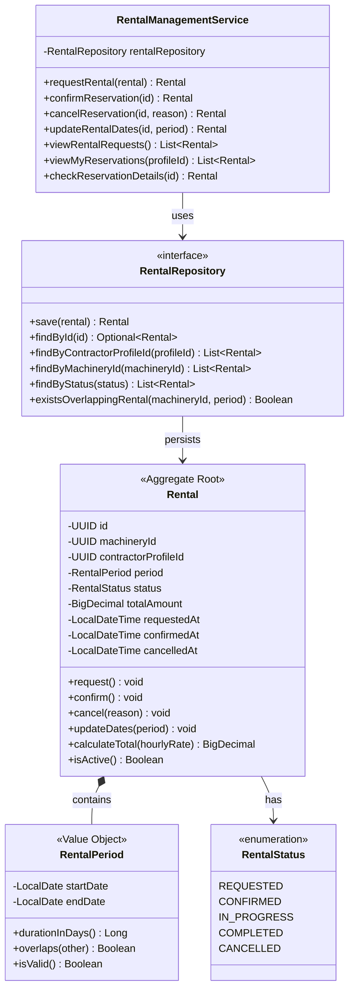
```mermaid
classDiagram
    class RentalManagementService {
        -RentalRepository rentalRepository
        +requestRental(rental) Rental
        +confirmReservation(id) Rental
        +cancelReservation(id, reason) Rental
        +updateRentalDates(id, period) Rental
        +viewRentalRequests() List~Rental~
        +viewMyReservations(profileId) List~Rental~
        +checkReservationDetails(id) Rental
    }
    class RentalRepository {
        <<interface>>
        +save(rental) Rental
        +findById(id) Optional~Rental~
        +findByContractorProfileId(profileId) List~Rental~
        +findByMachineryId(machineryId) List~Rental~
        +findByStatus(status) List~Rental~
        +existsOverlappingRental(machineryId, period) Boolean
    }
    class Rental {
        <<Aggregate Root>>
        -UUID id
        -UUID machineryId
        -UUID contractorProfileId
        -RentalPeriod period
        -RentalStatus status
        -BigDecimal totalAmount
        -LocalDateTime requestedAt
        -LocalDateTime confirmedAt
        -LocalDateTime cancelledAt
        +request() void
        +confirm() void
        +cancel(reason) void
        +updateDates(period) void
        +calculateTotal(hourlyRate) BigDecimal
        +isActive() Boolean
    }
    class RentalPeriod {
        <<Value Object>>
        -LocalDate startDate
        -LocalDate endDate
        +durationInDays() Long
        +overlaps(other) Boolean
        +isValid() Boolean
    }
    class RentalStatus {
        <<enumeration>>
        REQUESTED
        CONFIRMED
        IN_PROGRESS
        COMPLETED
        CANCELLED
    }

    RentalManagementService --> RentalRepository : uses
    RentalRepository --> Rental : persists
    Rental *-- RentalPeriod : contains
    Rental --> RentalStatus : has
```

#### Maintenance Management Bounded Context Class Diagram

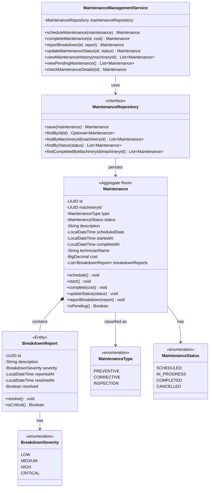
```mermaid
classDiagram
    class MaintenanceManagementService {
        -MaintenanceRepository maintenanceRepository
        +scheduleMaintenance(maintenance) Maintenance
        +completeMaintenance(id, cost) Maintenance
        +reportBreakdown(id, report) Maintenance
        +updateMaintenanceStatus(id, status) Maintenance
        +viewMaintenanceHistory(machineryId) List~Maintenance~
        +viewPendingMaintenance() List~Maintenance~
        +checkMaintenanceDetails(id) Maintenance
    }
    class MaintenanceRepository {
        <<interface>>
        +save(maintenance) Maintenance
        +findById(id) Optional~Maintenance~
        +findByMachineryId(machineryId) List~Maintenance~
        +findByStatus(status) List~Maintenance~
        +findCompletedByMachineryId(machineryId) List~Maintenance~
    }
    class Maintenance {
        <<Aggregate Root>>
        -UUID id
        -UUID machineryId
        -MaintenanceType type
        -MaintenanceStatus status
        -String description
        -LocalDateTime scheduledDate
        -LocalDateTime startedAt
        -LocalDateTime completedAt
        -String technicianName
        -BigDecimal cost
        -List~BreakdownReport~ breakdownReports
        +schedule() void
        +start() void
        +complete(cost) void
        +updateStatus(status) void
        +reportBreakdown(report) void
        +isPending() Boolean
    }
    class BreakdownReport {
        <<Entity>>
        -UUID id
        -String description
        -BreakdownSeverity severity
        -LocalDateTime reportedAt
        -LocalDateTime resolvedAt
        -Boolean resolved
        +resolve() void
        +isCritical() Boolean
    }
    class MaintenanceType {
        <<enumeration>>
        PREVENTIVE
        CORRECTIVE
        INSPECTION
    }
    class MaintenanceStatus {
        <<enumeration>>
        SCHEDULED
        IN_PROGRESS
        COMPLETED
        CANCELLED
    }
    class BreakdownSeverity {
        <<enumeration>>
        LOW
        MEDIUM
        HIGH
        CRITICAL
    }

    MaintenanceManagementService --> MaintenanceRepository : uses
    MaintenanceRepository --> Maintenance : persists
    Maintenance *-- BreakdownReport : contains
    Maintenance --> MaintenanceType : classified as
    Maintenance --> MaintenanceStatus : has
    BreakdownReport --> BreakdownSeverity : has
```

#### Operations Management Bounded Context Class Diagram

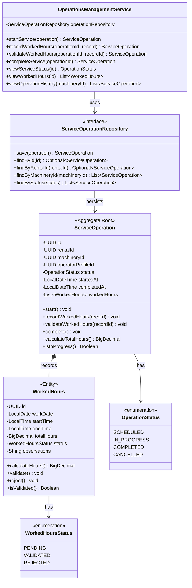
```mermaid
classDiagram
    class OperationsManagementService {
        -ServiceOperationRepository operationRepository
        +startService(operation) ServiceOperation
        +recordWorkedHours(operationId, record) ServiceOperation
        +validateWorkedHours(operationId, recordId) ServiceOperation
        +completeService(operationId) ServiceOperation
        +viewServiceStatus(id) OperationStatus
        +viewWorkedHours(id) List~WorkedHours~
        +viewOperationHistory(machineryId) List~ServiceOperation~
    }
    class ServiceOperationRepository {
        <<interface>>
        +save(operation) ServiceOperation
        +findById(id) Optional~ServiceOperation~
        +findByRentalId(rentalId) Optional~ServiceOperation~
        +findByMachineryId(machineryId) List~ServiceOperation~
        +findByStatus(status) List~ServiceOperation~
    }
    class ServiceOperation {
        <<Aggregate Root>>
        -UUID id
        -UUID rentalId
        -UUID machineryId
        -UUID operatorProfileId
        -OperationStatus status
        -LocalDateTime startedAt
        -LocalDateTime completedAt
        -List~WorkedHours~ workedHours
        +start() void
        +recordWorkedHours(record) void
        +validateWorkedHours(recordId) void
        +complete() void
        +calculateTotalHours() BigDecimal
        +isInProgress() Boolean
    }
    class WorkedHours {
        <<Entity>>
        -UUID id
        -LocalDate workDate
        -LocalTime startTime
        -LocalTime endTime
        -BigDecimal totalHours
        -WorkedHoursStatus status
        -String observations
        +calculateHours() BigDecimal
        +validate() void
        +reject() void
        +isValidated() Boolean
    }
    class OperationStatus {
        <<enumeration>>
        SCHEDULED
        IN_PROGRESS
        COMPLETED
        CANCELLED
    }
    class WorkedHoursStatus {
        <<enumeration>>
        PENDING
        VALIDATED
        REJECTED
    }

    OperationsManagementService --> ServiceOperationRepository : uses
    ServiceOperationRepository --> ServiceOperation : persists
    ServiceOperation *-- WorkedHours : records
    ServiceOperation --> OperationStatus : has
    WorkedHours --> WorkedHoursStatus : has
```

#### Identity & Access Management Bounded Context Class Diagram

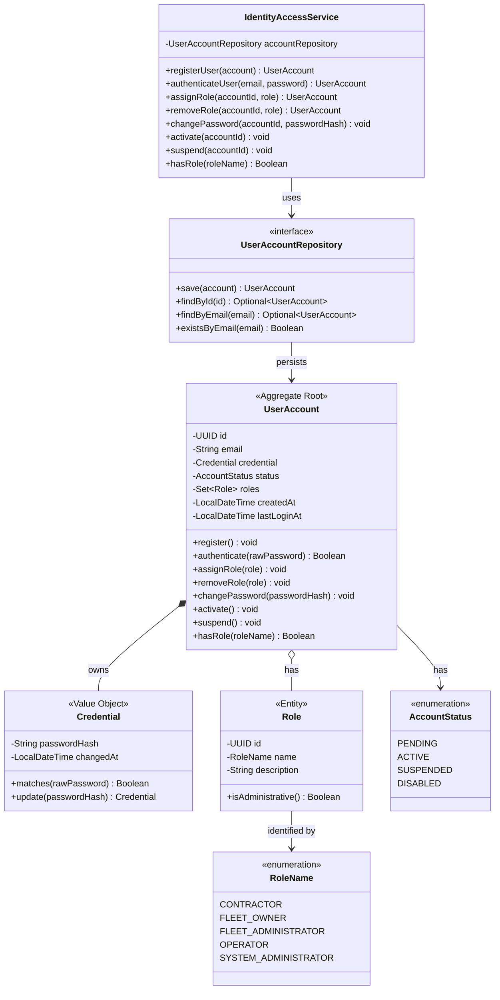
```mermaid
classDiagram
    class IdentityAccessService {
        -UserAccountRepository accountRepository
        +registerUser(account) UserAccount
        +authenticateUser(email, password) UserAccount
        +assignRole(accountId, role) UserAccount
        +removeRole(accountId, role) UserAccount
        +changePassword(accountId, passwordHash) void
        +activate(accountId) void
        +suspend(accountId) void
        +hasRole(roleName) Boolean
    }
    class UserAccountRepository {
        <<interface>>
        +save(account) UserAccount
        +findById(id) Optional~UserAccount~
        +findByEmail(email) Optional~UserAccount~
        +existsByEmail(email) Boolean
    }
    class UserAccount {
        <<Aggregate Root>>
        -UUID id
        -String email
        -Credential credential
        -AccountStatus status
        -Set~Role~ roles
        -LocalDateTime createdAt
        -LocalDateTime lastLoginAt
        +register() void
        +authenticate(rawPassword) Boolean
        +assignRole(role) void
        +removeRole(role) void
        +changePassword(passwordHash) void
        +activate() void
        +suspend() void
        +hasRole(roleName) Boolean
    }
    class Credential {
        <<Value Object>>
        -String passwordHash
        -LocalDateTime changedAt
        +matches(rawPassword) Boolean
        +update(passwordHash) Credential
    }
    class Role {
        <<Entity>>
        -UUID id
        -RoleName name
        -String description
        +isAdministrative() Boolean
    }
    class AccountStatus {
        <<enumeration>>
        PENDING
        ACTIVE
        SUSPENDED
        DISABLED
    }
    class RoleName {
        <<enumeration>>
        CONTRACTOR
        FLEET_OWNER
        FLEET_ADMINISTRATOR
        OPERATOR
        SYSTEM_ADMINISTRATOR
    }

    IdentityAccessService --> UserAccountRepository : uses
    UserAccountRepository --> UserAccount : persists
    UserAccount *-- Credential : owns
    UserAccount o-- Role : has
    UserAccount --> AccountStatus : has
    Role --> RoleName : identified by
```

#### Profiles Management Bounded Context Class Diagram

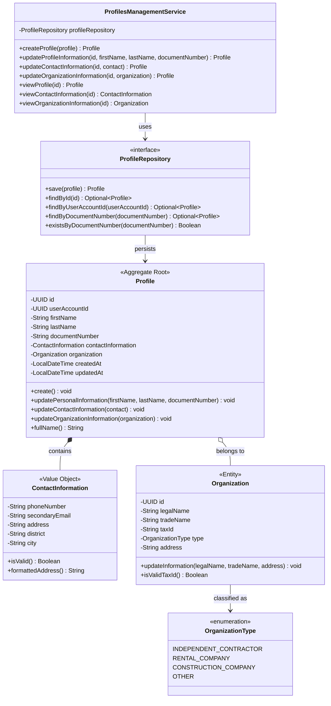
```mermaid
classDiagram
    class ProfilesManagementService {
        -ProfileRepository profileRepository
        +createProfile(profile) Profile
        +updateProfileInformation(id, firstName, lastName, documentNumber) Profile
        +updateContactInformation(id, contact) Profile
        +updateOrganizationInformation(id, organization) Profile
        +viewProfile(id) Profile
        +viewContactInformation(id) ContactInformation
        +viewOrganizationInformation(id) Organization
    }
    class ProfileRepository {
        <<interface>>
        +save(profile) Profile
        +findById(id) Optional~Profile~
        +findByUserAccountId(userAccountId) Optional~Profile~
        +findByDocumentNumber(documentNumber) Optional~Profile~
        +existsByDocumentNumber(documentNumber) Boolean
    }
    class Profile {
        <<Aggregate Root>>
        -UUID id
        -UUID userAccountId
        -String firstName
        -String lastName
        -String documentNumber
        -ContactInformation contactInformation
        -Organization organization
        -LocalDateTime createdAt
        -LocalDateTime updatedAt
        +create() void
        +updatePersonalInformation(firstName, lastName, documentNumber) void
        +updateContactInformation(contact) void
        +updateOrganizationInformation(organization) void
        +fullName() String
    }
    class ContactInformation {
        <<Value Object>>
        -String phoneNumber
        -String secondaryEmail
        -String address
        -String district
        -String city
        +isValid() Boolean
        +formattedAddress() String
    }
    class Organization {
        <<Entity>>
        -UUID id
        -String legalName
        -String tradeName
        -String taxId
        -OrganizationType type
        -String address
        +updateInformation(legalName, tradeName, address) void
        +isValidTaxId() Boolean
    }
    class OrganizationType {
        <<enumeration>>
        INDEPENDENT_CONTRACTOR
        RENTAL_COMPANY
        CONSTRUCTION_COMPANY
        OTHER
    }

    ProfilesManagementService --> ProfileRepository : uses
    ProfileRepository --> Profile : persists
    Profile *-- ContactInformation : contains
    Profile o-- Organization : belongs to
    Organization --> OrganizationType : classified as
```

## 4.8. Database Design

### 4.8.1. Database Diagrams

El modelo relacional conserva la trazabilidad entre los activos, sus lecturas, las órdenes de mantenimiento y las asignaciones operativas. Las relaciones garantizan que una orden o lectura pertenezca a un activo existente y que el historial pueda consultarse sin modificar datos pasados.

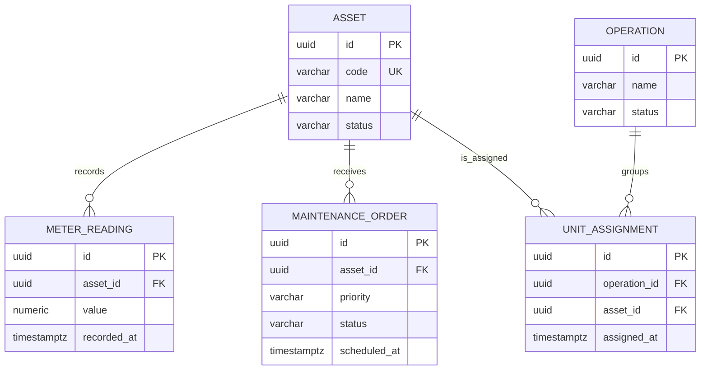
```mermaid
erDiagram
  ASSET ||--o{ METER_READING : records
  ASSET ||--o{ MAINTENANCE_ORDER : receives
  ASSET ||--o{ UNIT_ASSIGNMENT : is_assigned
  OPERATION ||--o{ UNIT_ASSIGNMENT : groups
  ASSET {
    uuid id PK
    varchar code UK
    varchar name
    varchar status
  }
  METER_READING {
    uuid id PK
    uuid asset_id FK
    numeric value
    timestamptz recorded_at
  }
  MAINTENANCE_ORDER {
    uuid id PK
    uuid asset_id FK
    varchar priority
    varchar status
    timestamptz scheduled_at
  }
  OPERATION {
    uuid id PK
    varchar name
    varchar status
  }
  UNIT_ASSIGNMENT {
    uuid id PK
    uuid operation_id FK
    uuid asset_id FK
    timestamptz assigned_at
  }
```

### 4.8.2. Script DDL

```sql
CREATE EXTENSION IF NOT EXISTS pgcrypto;

CREATE TABLE asset (
                     id UUID PRIMARY KEY DEFAULT gen_random_uuid(),
                     code VARCHAR(40) NOT NULL UNIQUE,
                     name VARCHAR(160) NOT NULL,
                     status VARCHAR(30) NOT NULL CHECK (status IN ('AVAILABLE', 'IN_MAINTENANCE', 'ASSIGNED', 'INACTIVE')),
                     image_url TEXT,
                     created_at TIMESTAMPTZ NOT NULL DEFAULT now(),
                     updated_at TIMESTAMPTZ NOT NULL DEFAULT now()
);

CREATE TABLE meter_reading (
                             id UUID PRIMARY KEY DEFAULT gen_random_uuid(),
                             asset_id UUID NOT NULL REFERENCES asset(id) ON DELETE RESTRICT,
                             value NUMERIC(14,2) NOT NULL CHECK (value >= 0),
                             unit VARCHAR(12) NOT NULL CHECK (unit IN ('KM', 'HOURS')),
                             recorded_at TIMESTAMPTZ NOT NULL DEFAULT now()
);

CREATE TABLE maintenance_order (
                                 id UUID PRIMARY KEY DEFAULT gen_random_uuid(),
                                 asset_id UUID NOT NULL REFERENCES asset(id) ON DELETE RESTRICT,
                                 maintenance_type VARCHAR(60) NOT NULL,
                                 priority VARCHAR(20) NOT NULL CHECK (priority IN ('LOW', 'MEDIUM', 'HIGH', 'CRITICAL')),
                                 status VARCHAR(25) NOT NULL CHECK (status IN ('SCHEDULED', 'IN_PROGRESS', 'COMPLETED', 'CANCELLED')),
                                 scheduled_at TIMESTAMPTZ NOT NULL,
                                 completed_at TIMESTAMPTZ,
                                 CHECK (completed_at IS NULL OR completed_at >= scheduled_at)
);

CREATE TABLE operation (
                         id UUID PRIMARY KEY DEFAULT gen_random_uuid(),
                         name VARCHAR(160) NOT NULL,
                         status VARCHAR(25) NOT NULL CHECK (status IN ('PLANNED', 'ACTIVE', 'CLOSED')),
                         created_at TIMESTAMPTZ NOT NULL DEFAULT now()
);

CREATE TABLE unit_assignment (
                               id UUID PRIMARY KEY DEFAULT gen_random_uuid(),
                               operation_id UUID NOT NULL REFERENCES operation(id) ON DELETE RESTRICT,
                               asset_id UUID NOT NULL REFERENCES asset(id) ON DELETE RESTRICT,
                               assigned_at TIMESTAMPTZ NOT NULL DEFAULT now(),
                               released_at TIMESTAMPTZ,
                               CHECK (released_at IS NULL OR released_at >= assigned_at)
);

CREATE INDEX idx_meter_reading_asset_recorded_at ON meter_reading(asset_id, recorded_at DESC);
CREATE INDEX idx_maintenance_order_asset_status ON maintenance_order(asset_id, status);
CREATE INDEX idx_unit_assignment_operation ON unit_assignment(operation_id);
CREATE INDEX idx_asset_status ON asset(status);
```

# Capítulo V: Product Implementation, Validation & Deployment

## 5.1. Software Configuration Management

La gestión de configuración de software de TechnoLoad establece las herramientas, convenciones y procedimientos utilizados por el equipo para mantener consistencia y trazabilidad durante el ciclo de vida de los productos digitales.

Para ello, se utilizan herramientas de gestión de proyectos, diseño UX/UI, desarrollo de software, documentación, control de versiones y despliegue. Git y GitHub permiten registrar los cambios realizados por los integrantes del equipo, mientras que GitFlow, Conventional Commits y Semantic Versioning proporcionan un esquema organizado para la evolución del código fuente.

  ### 5.1.1. Software Development Environment Configuration
  
El desarrollo de TechnoLoad requiere diferentes herramientas que permiten cubrir las actividades de gestión del proyecto, especificación de requisitos, diseño UX/UI, implementación, documentación, control de versiones y despliegue.

Las principales herramientas utilizadas o previstas para el proyecto son las siguientes:

| Área | Herramienta / Tecnología | Propósito en TechnoLoad | Referencia |
|---|---|---|---|
| Project Management | [Trello / Jira / YouTrack - seleccionar el utilizado] | Organización del Product Backlog, Sprints, User Stories y tareas del equipo. | [COLOCAR URL DEL BOARD] |
| Requirements Management | GitHub + Markdown | Documentación colaborativa de requisitos, User Stories, Product Backlog y demás artefactos del informe. | https://github.com/TechnoLoad-TechFlow/TechFlow |
| UX Research | UXPressia | Elaboración de User Personas, Empathy Maps, User Journey Maps e Impact Maps. | https://uxpressia.com/ |
| UX/UI Design | Figma | Elaboración de Wireframes, Mock-ups y Prototipos de la experiencia web. | https://www.figma.com/ |
| Version Control | Git | Control distribuido de versiones del código fuente y documentación. | https://git-scm.com/ |
| Source Code Management | GitHub | Almacenamiento de repositorios, gestión de ramas, commits y colaboración del equipo. | https://github.com/ |
| Development Environment | [IDE UTILIZADO POR EL EQUIPO] | Edición, ejecución y depuración del código fuente. | [COLOCAR URL] |
| Frontend Runtime | Node.js | Entorno de ejecución utilizado para instalar y administrar las dependencias del Frontend Web Application. | https://nodejs.org/ |
| Frontend Framework | Vue | Framework utilizado para desarrollar la Frontend Web Application. | https://vuejs.org/ |
| Frontend Build Tool | Vite | Herramienta utilizada para gestionar el entorno de desarrollo y generar el build de producción del frontend. | https://vite.dev/ |
| UI Components | PrimeVue | Biblioteca de componentes basada en Material Design utilizada para construir la interfaz de usuario. | https://primevue.org/ |
| Backend Framework | ASP.NET Core | Framework utilizado para implementar los RESTful Web Services de TechnoLoad. | https://dotnet.microsoft.com/apps/aspnet |
| Programming Language | C# | Lenguaje utilizado para implementar la lógica del lado servidor. | https://learn.microsoft.com/dotnet/csharp/ |
| ORM | Entity Framework Core | Gestión de persistencia y acceso a datos desde los Web Services. | https://learn.microsoft.com/ef/core/ |
| DBMS | PostgreSQL | Sistema gestor de base de datos relacional utilizado para almacenar la información del dominio. | https://www.postgresql.org/ |
| API Documentation | OpenAPI / Swagger | Documentación e interacción con los endpoints de los RESTful Web Services. | https://swagger.io/ |
| Software Documentation | Markdown | Elaboración del Project Report y documentación técnica dentro de GitHub. | https://www.markdownguide.org/ |
| Software Deployment | [PLATAFORMA DE DESPLIEGUE] | Publicación del Landing Page, Frontend Web Application y Web Services. | [COLOCAR URL] |

La combinación de estas herramientas permite mantener un entorno común entre los integrantes del equipo. El frontend es desarrollado con Vue y PrimeVue, mientras que los servicios del lado servidor se implementan mediante ASP.NET Core, Entity Framework Core y C#. PostgreSQL proporciona la persistencia relacional de la información correspondiente a activos, lecturas, mantenimientos y operaciones.


  ### 5.1.2. Source Code Management
  
El código fuente y la documentación de TechnoLoad se administran mediante Git y GitHub. El uso de control de versiones permite mantener la trazabilidad de cada modificación realizada por el equipo, identificar la participación de los integrantes y recuperar versiones anteriores cuando sea necesario.

Los repositorios correspondientes a los productos de TechnoLoad son:

| Producto | Repositorio |
|---|---|
| Project Report | https://github.com/TechnoLoad-TechFlow/TechFlow |
| Landing Page | [COLOCAR URL DEL REPOSITORIO] |
| Frontend Web Application | [COLOCAR URL DEL REPOSITORIO] |
| RESTful Web Services | [COLOCAR URL DEL REPOSITORIO] |

El repositorio correspondiente a los RESTful Web Services deberá incluir tanto el código fuente de la solución como los archivos correspondientes a las pruebas unitarias y de integración.


#### GitFlow Workflow

Para organizar el desarrollo se establece GitFlow como flujo de trabajo de control de versiones.

Las ramas principales consideradas son:

| Branch | Propósito |
|---|---|
| `main` | Contiene las versiones estables y preparadas para producción. |
| `develop` | Integra los cambios terminados correspondientes al desarrollo de la siguiente versión. |
| `feature/*` | Desarrollo de nuevas características o modificaciones específicas. |
| `release/*` | Preparación y estabilización de una nueva versión antes de integrarla en `main`. |
| `hotfix/*` | Correcciones urgentes sobre una versión publicada en producción. |

Los feature branches deben utilizar nombres descriptivos escritos en inglés y en formato kebab-case.

Ejemplos:

`feature/fleet-management`

`feature/maintenance-alerts`

`feature/asset-registration`

`feature/reservation-management`

`feature/landing-page`

Las ramas de release utilizarán Semantic Versioning:

`release/v1.0.0`

`release/v1.1.0`

Las correcciones urgentes seguirán el mismo esquema:

`hotfix/v1.0.1`


#### Semantic Versioning

Las versiones de TechnoLoad seguirán el esquema:

`MAJOR.MINOR.PATCH`

- `MAJOR`: cambios incompatibles con versiones anteriores.
- `MINOR`: nuevas funcionalidades compatibles con versiones anteriores.
- `PATCH`: correcciones de errores compatibles con versiones anteriores.

Ejemplos:

`v1.0.0`

`v1.1.0`

`v1.1.1`

#### Conventional Commits

Los mensajes de commit siguen la estructura:

`<type>(<scope>): <description>`

Los principales tipos utilizados son:

| Type | Uso |
|---|---|
| `feat` | Nueva funcionalidad. |
| `fix` | Corrección de un error. |
| `docs` | Cambios en documentación. |
| `style` | Cambios de formato que no modifican comportamiento. |
| `refactor` | Reestructuración interna del código. |
| `test` | Creación o modificación de pruebas. |
| `chore` | Tareas de mantenimiento o configuración. |

Ejemplos aplicados al proyecto:

`feat(fleet): add asset registration`

`feat(maintenance): add preventive maintenance alerts`

`feat(operations): add unit assignment`

`fix(reservations): prevent duplicate reservations`

`docs(readme): add needfinding artifacts`

`docs(chapter5): add software configuration management`

Con estas convenciones se busca facilitar la comprensión del historial de cambios y mantener consistencia entre los diferentes repositorios del proyecto.


---

  ### 5.1.3. Source Code Style Guide & Conventions
  
TechnoLoad adopta convenciones de programación para mantener un código consistente, legible y mantenible entre todos los integrantes del equipo.

Los nombres utilizados en código fuente deben escribirse en inglés, evitando abreviaturas ambiguas y manteniendo una terminología consistente con el Ubiquitous Language del proyecto.

#### HTML

Para HTML5 se aplican las siguientes convenciones:

- Utilizar elementos semánticos como `header`, `nav`, `main`, `section`, `article` y `footer`.
- Escribir etiquetas y atributos en minúsculas.
- Utilizar comillas dobles para atributos.
- Mantener una indentación consistente.
- Incluir el atributo `alt` en imágenes.
- Utilizar atributos ARIA cuando sea necesario para mejorar la accesibilidad.
- Evitar elementos HTML utilizados únicamente con fines visuales cuando exista una alternativa semántica.

#### CSS

Las clases CSS deben utilizar nombres descriptivos en inglés y formato kebab-case.

Ejemplos:

`.asset-card`

`.maintenance-alert`

`.fleet-dashboard`

`.primary-button`

`.reservation-form`

Se debe evitar el uso de nombres poco descriptivos como:

`.box1`

`.red-button`

`.section2`

Los estilos deben mantener coherencia con el Design System establecido en el Capítulo IV.

#### JavaScript

Para JavaScript se establecen las siguientes convenciones:

- Variables y funciones: `camelCase`.
- Clases y componentes: `PascalCase`.
- Constantes globales: `UPPER_SNAKE_CASE`.
- Utilizar `const` por defecto y `let` cuando el valor requiera modificación.
- Evitar `var`.
- Mantener funciones pequeñas y orientadas a una responsabilidad específica.

Ejemplos:

`assetList`

`getAvailableAssets()`

`MAX_RETRY_ATTEMPTS`

#### Vue

Los componentes Vue deben utilizar nombres descriptivos y mantener una responsabilidad claramente delimitada.

Ejemplos:

`AssetList.vue`

`AssetDetail.vue`

`MaintenanceBoard.vue`

`ReservationForm.vue`

`FleetDashboard.vue`

Los componentes reutilizables deben separarse de las vistas específicas del dominio y mantenerse organizados según el módulo al que pertenecen.

#### C#

Para C# se adoptan las convenciones recomendadas por Microsoft:

- Clases, interfaces, métodos y propiedades públicas: `PascalCase`.
- Variables locales y parámetros: `camelCase`.
- Interfaces con prefijo `I`.
- Namespaces escritos en PascalCase.
- Clases con una responsabilidad claramente definida.

Ejemplos:

`AssetController`

`MaintenanceService`

`ReservationRepository`

`IAssetRepository`

`GetAvailableAssetsAsync()`

#### RESTful Web Services

Los endpoints deben representar recursos mediante sustantivos escritos en inglés y mantener una estructura consistente.

Ejemplos:

`GET /api/v1/assets`

`POST /api/v1/assets`

`GET /api/v1/assets/{id}`

`GET /api/v1/maintenance-orders`

`POST /api/v1/reservations`

Se utilizarán correctamente los códigos de estado HTTP, entre ellos:

`200 OK`

`201 Created`

`400 Bad Request`

`401 Unauthorized`

`404 Not Found`

`409 Conflict`

`500 Internal Server Error`

#### Internationalization and Accessibility

La experiencia web deberá considerar internacionalización mediante los idiomas:

`en_US` — English

`es_419` — Latin American Spanish

El idioma predeterminado será inglés.

Asimismo, el Landing Page y la Frontend Web Application deberán considerar prácticas de accesibilidad como HTML semántico, atributos ARIA, navegación mediante teclado, texto alternativo en imágenes, contraste adecuado y feedback comprensible para las acciones del usuario.

---

  ### 5.1.4. Software Deployment Configuration
  
El proceso de despliegue de TechnoLoad comprende la publicación independiente de los tres productos principales que conforman la solución: Landing Page, Frontend Web Application y RESTful Web Services.

| Producto | Tecnología | Branch de producción | Plataforma |
|---|---|---|---|
| Landing Page | HTML5, CSS3 y JavaScript | `main` | [COLOCAR PLATAFORMA] |
| Frontend Web Application | Vue, Vite y PrimeVue | `main` | [COLOCAR PLATAFORMA] |
| RESTful Web Services | ASP.NET Core, Entity Framework Core y C# | `main` | [COLOCAR PLATAFORMA] |
| Database | PostgreSQL | — | [COLOCAR PLATAFORMA] |

#### Landing Page Deployment

El proceso de publicación del Landing Page seguirá el siguiente flujo:

`feature branch → develop → validation → main → build/publication → production`

Los archivos HTML, CSS, JavaScript y assets son obtenidos desde el repositorio correspondiente y publicados en la plataforma seleccionada.

**Production URL:**

[COLOCAR URL DEL LANDING PAGE]

#### Frontend Web Application Deployment

El Frontend Web Application será construido con Vue y Vite.

El flujo de despliegue será:

`feature branch → develop → validation → main → npm install → npm run build → deployment`

El resultado del build de producción será publicado en la plataforma seleccionada.

Las variables dependientes del entorno, especialmente la URL base de los RESTful Web Services, deberán configurarse mediante variables de entorno y no directamente en el código fuente.

**Production URL:**

[COLOCAR URL DEL FRONTEND WEB APPLICATION]

#### RESTful Web Services Deployment

Los Web Services desarrollados con ASP.NET Core serán construidos y publicados desde el repositorio correspondiente.

El proceso considera:

1. Obtener la versión estable desde `main`.
2. Restaurar las dependencias del proyecto.
3. Ejecutar las pruebas correspondientes.
4. Generar el build de producción.
5. Configurar las variables de entorno.
6. Establecer la conexión con PostgreSQL.
7. Publicar el servicio en la plataforma seleccionada.
8. Verificar los endpoints mediante Swagger/OpenAPI.

Las credenciales, cadenas de conexión y demás información sensible no serán almacenadas directamente en el repositorio.

**RESTful API Base URL:**

[COLOCAR URL DEL WEB SERVICE]

**Swagger / OpenAPI URL:**

[COLOCAR URL DE SWAGGER]

#### Database Deployment

La base de datos PostgreSQL deberá estar configurada en un entorno accesible desde los RESTful Web Services.

La cadena de conexión será administrada mediante variables de entorno. Las migraciones generadas mediante Entity Framework Core permitirán mantener sincronizada la estructura de la base de datos entre los diferentes entornos.

---

## 5.2. Landing Page, Services & Applications Implementation
## 5.3. Validation Interviews
## 5.4. Video About-the-Product
