# GRUPO-3

<p align="center">
  
</p>

<div align="center">

# UNIVERSIDAD PERUANA DE CIENCIAS APLICADAS

### FACULTAD DE INGENIERÍA
### CARRERA DE INGENIERÍA DE SOFTWARE

<br>

# INFORME DE PROYECTO

## Nombre del proyecto
### TechnoLoad

<br>

**Curso:**  
Aplicaciones Web

**Sección:**  
8093
<br>

### Integrantes


NICOLAS TANTALEAN GRANDA | U202410728 |

WILMER SEBASTIAN GUTIERREZ LIZARBE | U202412044 |

MATHIAS ALEJANDRO CASTILLO GUEVARA | U202410783 |

EDGARD DANIEL DIAZ CARUZO | U202323911 |


<br>

**Docente:**  
Efrain Ricardo Bautista Ubillus

<br>

**Ciclo:**  
2026-2

<br>

**Lima, Perú**  
**2026**

</div>

---

# Registro de Versiones del Informe

El presente registro resume las modificaciones relevantes realizadas al informe durante el ciclo de vida del proyecto para la entrega de la Semana 4 (AV1).

| Versión | Fecha | Autor | Descripción de modificación |
| :---: | :---: | :--- | :--- |
| **1.0.0** | 2026-08-25 | Wilmer Gutierrez | Creación inicial del repositorio en GitHub y estructuración base de la plantilla Markdown para el informe de proyecto. |
| **1.1.0** | 2026-08-28 | Nicolas Tantalean | Elaboración del Capítulo I: Startup Profile, perfiles de los integrantes y definición de la problemática aplicando The 5 W's y 2 H's. |
| **1.2.0** | 2026-09-02 | Mathias Castillo | Desarrollo del marco Lean UX: Problem Statements, Assumptions, Hypothesis Statements y elaboración del Lean UX Canvas inicial. |
| **1.3.0** | 2026-09-06 | Edgard Diaz | Elaboración del Capítulo II: Competitive Analysis Landscape y diseño preliminar de guías de entrevistas a los segmentos objetivo. |
| **1.4.0** | 2026-09-10 | Wilmer Gutierrez, Nicolas Tantalean | Registro de entrevistas, análisis cualitativo y elaboración de artefactos de Needfinding en UXPressia (User Personas, User Task Matrix y Journey Maps). |
| **1.5.0** | 2026-09-13 | Mathias Castillo, Edgard Diaz | Elaboración de Empathy Maps, Big Picture Event Storming, glosario de Ubiquitous Language y especificación de User Stories en el Capítulo III. |
| **1.6.0** | 2026-09-15 | Wilmer Gutierrez | Elaboración del Impact Mapping, estructuración del Product Backlog priorizado y definición de Style Guidelines e Information Architecture en el Capítulo IV. |
| **1.7.0** | 2026-09-17 | Nicolas Tantalean, Mathias Castillo | Diseño de Wireframes, Mock-ups de alta fidelidad y prototipos en Figma; elaboración de diagramas de arquitectura C4 (Contexto, Contenedor y Componentes) y modelo relacional de base de datos. |
| **1.8.0** | 2026-09-18 | Wilmer Gutierrez, Edgard Diaz | Redacción del Capítulo V: Software Configuration Management, registro del Sprint 1 y despliegue del Landing Page en GitHub Pages. |
| **1.9.0** | 2026-09-19 | Todos los integrantes | Revisión general, incorporación de Conclusiones, Bibliografía según formato APA 7 y consolidación final del informe para la entrega AV1 (Semana 4). |

---

# Project Report Collaboration Insights

En esta sección, el equipo evidencia y detalla la dinámica de colaboración para la redacción, edición y consolidación del informe del proyecto durante el desarrollo del hito **AV1 (Semana 4)**.

* **URL del repositorio del Project Report:** [https://github.com/TechnoLoad-TechFlow/TechFlow](https://github.com/TechnoLoad-TechFlow/TechFlow)

### Dinamica de colaboración y gestión del informe
La elaboración del informe se gestionó de forma colaborativa y continua bajo la plataforma **GitHub**, empleando Markdown como estándar de documentación técnica. Para garantizar la integridad y trazabilidad del documento, el equipo adoptó las siguientes prácticas de ingeniería:
1. **Flujo de trabajo basado en ramas (GitFlow):** La rama `main` se reservó para versiones estables e hitos consolidados. Los integrantes trabajaron en ramas dedicadas (`feature/report-chapter-i`, `feature/report-needfinding`, `feature/report-c4-diagrams`, etc.), integrando los avances hacia `develop` mediante *Pull Requests* revisados por pares.
2. **Convención de commits (Conventional Commits):** Se estandarizó el uso de mensajes con prefijos semánticos como `docs(cap-1): ...`, `docs(ux): ...`, `feat(report): ...` y `fix(grammar): ...`, permitiendo un historial claro y auditable.
3. **Distribución equitativa de responsabilidades:** Todos los miembros del equipo participaron en la redacción técnica, diseño de artefactos y verificación de la coherencia interna del informe, manteniendo alineación con el *Registro de Versiones del Informe*.

### Evidencias de colaboración y analíticas en GitHub

A continuación, se presentan los espacios para las capturas de pantalla de los analíticos de colaboración, historial de commits y contribuciones por miembro del equipo en el repositorio del informe (`TechFlow`), demostrando la participación activa y conjunta durante las semanas de trabajo:


#### Historial de Commits y Registro de Actividad (GitHub Network / Commits Graph)

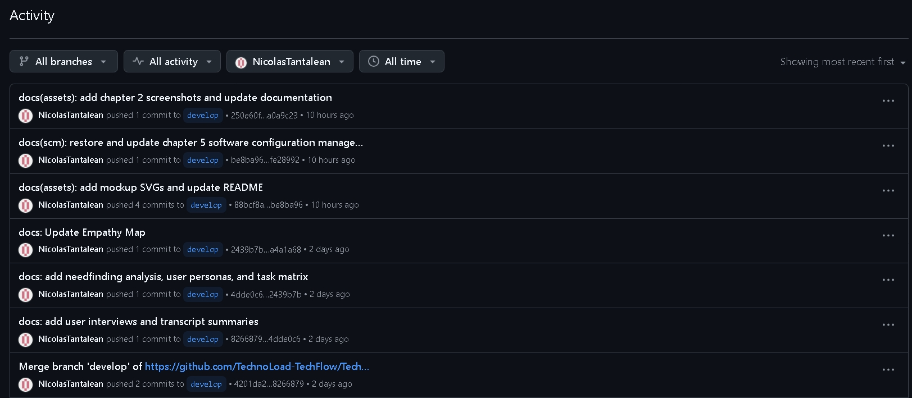
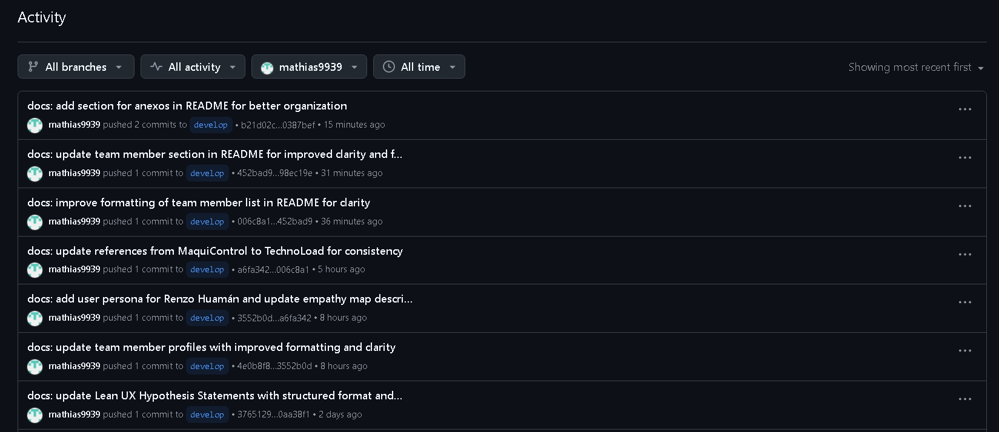
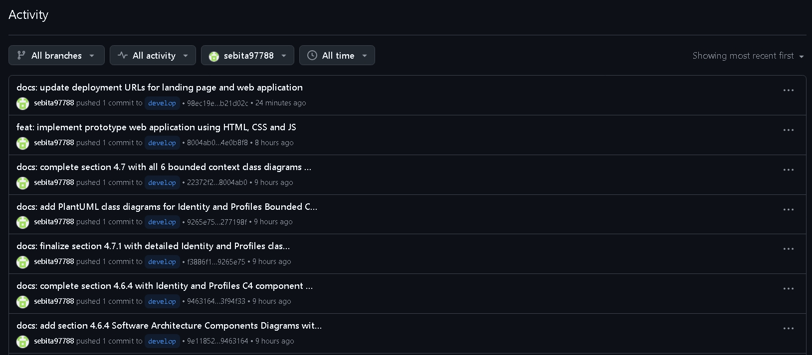
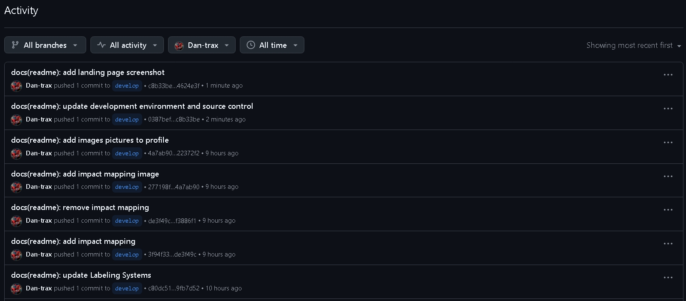

---

# ÍNDICE

- [Registro de Versiones del Informe](#registro-de-versiones-del-informe)
- [Project Report Collaboration Insights](#project-report-collaboration-insights)

## Capítulo I: Introducción
- [1.1. Startup Profile](#11-startup-profile)
  - [1.1.1. Descripción de la Startup](#111-descripción-de-la-startup)
  - [1.1.2. Perfiles de integrantes del equipo](#112-perfiles-de-integrantes-del-equipo)
- [1.2. Solution Profile](#12-solution-profile)
  - [1.2.1. Antecedentes y problemática](#121-antecedentes-y-problemática)
  - [1.2.2. Lean UX Process](#122-lean-ux-process)
    - [1.2.2.1. Lean UX Problem Statements](#1221-lean-ux-problem-statements)
    - [1.2.2.2. Lean UX Assumptions](#1222-lean-ux-assumptions)
    - [1.2.2.3. Lean UX Hypothesis Statements](#1223-lean-ux-hypothesis-statements)
    - [1.2.2.4. Lean UX Canvas](#1224-lean-ux-canvas)
- [1.3. Segmentos objetivo](#13-segmentos-objetivo)

## Capítulo II: Requirements Elicitation & Analysis
- [2.1. Competidores](#21-competidores)
  - [2.1.1. Análisis competitivo](#211-competitive-analysis-landscape)
  - [2.1.2. Estrategias y tácticas frente a competidores](#212-estrategias-y-tácticas-frente-a-competidores)
- [2.2. Entrevistas](#22-entrevistas)
  - [2.2.1. Diseño de entrevistas](#221-diseño-de-entrevistas)
  - [2.2.2. Registro de entrevistas](#222-registro-de-entrevistas)
  - [2.2.3. Análisis de entrevistas](#223-análisis-de-entrevistas)
- [2.3. Needfinding](#23-needfinding)
  - [2.3.1. User Personas](#231-user-personas)
  - [2.3.2. User Task Matrix](#232-user-task-matrix)
  - [2.3.3. User Journey Mapping](#233-user-journey-mapping)
  - [2.3.4. Empathy Mapping](#234-empathy-mapping)
  - [2.3.5. Big Picture Event Storming](#235-big-picture-event-storming)
- [2.4. Ubiquitous Language](#24-ubiquitous-language)

## Capítulo III: Requirements Specification
- [3.1. User Stories](#31-user-stories)
- [3.2. Impact Mapping](#32-impact-mapping)
- [3.3. Product Backlog](#33-product-backlog)

## Capítulo IV: Product Design
- [4.1. Style Guidelines](#41-style-guidelines)
  - [4.1.1. General Style Guidelines](#411-general-style-guidelines)
  - [4.1.2. Web Style Guidelines](#412-web-style-guidelines)
- [4.2. Information Architecture](#42-information-architecture)
  - [4.2.1. Organization Systems](#421-organization-systems)
  - [4.2.2. Labeling Systems](#422-labeling-systems)
  - [4.2.3. SEO Tags and Meta Tags](#423-seo-tags-and-meta-tags)
  - [4.2.4. Searching Systems](#424-searching-systems)
  - [4.2.5. Navigation Systems](#425-navigation-systems)
- [4.3. Landing Page UI Design](#43-landing-page-ui-design)
  - [4.3.1. Landing Page Wireframes](#431-landing-page-wireframes)
  - [4.3.2. Landing Page Mock-ups](#432-landing-page-mock-ups)
- [4.4. Web Applications UX/UI Design](#44-web-applications-uxui-design)
  - [4.4.1. Web Applications Wireframes](#441-web-applications-wireframes)
  - [4.4.2. Web Applications Wireflow Diagrams](#442-web-applications-wireflow-diagrams)
  - [4.4.3. Web Applications Mock-ups](#443-web-applications-mock-ups)
  - [4.4.4. Web Applications User Flow Diagrams](#444-web-applications-user-flow-diagrams)
- [4.5. Web Applications Prototyping](#45-web-applications-prototyping)
- [4.6. Domain-Driven Software Architecture](#46-domain-driven-software-architecture)
  - [4.6.1. Design-Level Event Storming](#461-design-level-event-storming)
  - [4.6.2. Software Architecture Context Diagram](#462-software-architecture-context-diagram)
  - [4.6.3. Software Architecture Container Diagram](#463-software-architecture-container-diagram)
  - [4.6.4. Software Architecture Components Diagrams](#464-software-architecture-components-diagrams)
- [4.7. Software Object-Oriented Design](#47-software-object-oriented-design)
  - [4.7.1. Class Diagrams](#471-class-diagrams)
- [4.8. Database Design](#48-database-design)
  - [4.8.1. Database Diagrams](#481-database-diagrams)
  - [4.8.2. Script DDL](#482-script-ddl)

## Capítulo V: Product Implementation, Validation & Deployment
- [5.1. Software Configuration Management](#51-software-configuration-management)
  - [5.1.1. Software Development Environment Configuration](#511-software-development-environment-configuration)
  - [5.1.2. Source Code Management](#512-source-code-management)
  - [5.1.3. Source Code Style Guide & Conventions](#513-source-code-style-guide--coding-conventions)
  - [5.1.4. Software Deployment Configuration](#514-software-deployment-configuration)
- [5.2. Landing Page, Services & Applications Implementation](#52-landing-page-services--applications-implementation)

## Conclusiones
- [Conclusiones y recomendaciones](#conclusiones)

## Bibliografía
- [Bibliografía](#bibliografía)

## Anexos
- [Anexos](#anexos)

# Capítulo I: Introducción

## 1.1. Startup Profile

### 1.1.1. Descripción de la Startup
Somos una compañía recién creada llamada **"TechnoLoad"** que tiene una misión en mente: **optimizar la gestión operativa y reducir los costos de mantenimiento e inoperatividad en empresas de alquiler de maquinaria pesada y transporte de carga.**

Por esta razón, nos reunimos y trabajamos con cooperación, eficiencia y responsabilidad para crear nuestra solución tecnológica **"TechnoLoad"**. Los integrantes que conforman este equipo son:

### 1.1.2. Perfiles de integrantes del equipo

|                                         Foto                                         | Descripción del Integrante |
|:------------------------------------------------------------------------------------:| :--- |
|  | Mi nombre es Wilmer Sebastian Gutierrez Lizarbe con el código de estudiante u202412044, estoy cursando el quinto ciclo en la carrera de Ingeniería de Software. Tengo conocimientos que pueden aportar al proyecto, tales como: codificación en Python, JavaScript, C++, gestión de bases de datos relacionales y no relacionales como SQL Server, MongoDB y Firebase, así como el diseño de arquitectura web. Las habilidades que puedo aportar a mi equipo son responsabilidad, liderazgo técnico y compromiso para entregar un producto de software funcional y de alta calidad. |
|                        | Mi nombre es Edgard Daniel Diaz Caruzo con código de estudiante u202323911 estoy en la carrera de Ingeniería de Software y voy en mi 5to ciclo de la carrera, una de mis cualidades es la responsabilidad y la puntualidad. Mi objetivo es apoyar en cualquier cosa a mis compañeros. |
|             | Mi nombre es NICOLAS TANTALEAN GRANDA con código de estudiante U202410728, soy estudiante de la carrera de Ingeniería de Software. Entre mis conocimientos se encuentran desarrollo web y algoritmos. Como miembro del equipo, aportaré dedicación y colaboración constante para lograr un proyecto sólido. |
|              | Mi nombre es MATHIAS ALEJANDRO CASTILLO GUEVARA con código de estudiante U202410783, soy estudiante de la carrera de Ingeniería de Software. Entre mis conocimientos se encuentran bases de datos y desarrollo de software. Como miembro del equipo, aportaré dedicación y colaboración constante. |te. |


## 1.2. Solution Profile

TechnoLoad es una completa plataforma web desarrollada por nuestra startup, diseñada para atender tanto a empresas de alquiler de maquinaria pesada como a empresas de transporte y logística de carga. Ofrece un modelo de suscripción SaaS que brinda a los administradores de flota y coordinadores logísticos acceso a un control centralizado de mantenimiento preventivo, seguimiento telemetrado de uso por horómetros/kilometraje y asignación optimizada de rutas. TechnoLoad tiene como objetivo revolucionar la gestión de flotas integrando tecnología con soluciones operativas personalizadas de manera fluida.

**Características Principales:**

* **Gestión de Mantenimiento Preventivo:** TechnoLoad utiliza algoritmos basados en horómetros y kilometraje para generar alertas y planes de mantenimiento preventivo adaptados a las especificaciones de cada máquina o vehículo, asegurando máxima disponibilidad operativa.
* **Asignación y Optimización de Rutas:** TechnoLoad conecta a los coordinadores logísticos con la flota disponible, permitiendo programar despachos de carga en tiempo real, optimizando consumos de combustible y reduciendo tiempos muertos.
* **Monitoreo Telemetrado de Flota:** TechnoLoad ofrece un dashboard interactivo donde los usuarios pueden visualizar el estado operativo (Disponible, En Tránsito, En Mantenimiento) de cada activo de la empresa.
* **Seguimiento de Rendimiento y Costos:** TechnoLoad permite realizar un seguimiento continuo del desempeño de la flota mediante informes detallados, monitoreando métricas clave como costos de mantenimiento, horas de uso y rentabilidad por unidad.

### 1.2.1. Antecedentes y problemática

Esta sección presenta los objetivos, la justificación y el alcance del proyecto, junto con el análisis de antecedentes y problemática aplicando la técnica 5W+2H.

#### Objetivos, justificación y alcance

**Objetivo general.** Desarrollar una plataforma SaaS que centralice la gestión de activos, lecturas de uso, mantenimiento preventivo y disponibilidad operativa para organizaciones de maquinaria pesada y transporte de carga.

**Objetivos específicos.** La solución debe permitir registrar activos y sus estados, capturar horómetro o kilometraje con trazabilidad, programar y controlar órdenes de mantenimiento, consultar alertas y asignar únicamente unidades disponibles a una operación.

**Justificación.** La información fragmentada en hojas de cálculo, llamadas y mensajes produce mantenimiento reactivo, decisiones tardías y períodos de inoperatividad costosos. TechnoLoad convierte registros dispersos en información operativa auditable, oportuna y accesible desde una interfaz web.

**Alcance.** El MVP comprende gestión de activos, lecturas, órdenes de mantenimiento, alertas, consulta de disponibilidad y asignación de unidades. Quedan fuera del alcance inicial la telemetría en tiempo real, la optimización automática de rutas, la facturación y la integración productiva con proveedores IoT; estas capacidades se consideran extensiones futuras.

#### Uso de la técnica The 5 W's y 2 H's

Presentación del modelo de las preguntas 5Ws y 2Hs con la que se analizaron los antecedentes y la problemática que abarca nuestro proyecto.

| LAS 5W y 2H | Pregunta | Descripción |
| :---: | :--- | :--- |
| **Who?** | ¿Quién es afectado? | Administradores de flota, coordinadores logísticos y gerentes de operaciones en empresas de alquiler de maquinaria pesada y transporte de carga por carretera. |
| **What?** | ¿Cuál es el problema? | Las elevadas pérdidas financieras y la baja rentabilidad causadas por paradas no programadas de maquinaria en obra y sobrecostos por ineficiencias logísticas. De acuerdo con estudios del sector transporte en Lima Metropolitana, existe una alta correlación entre la mala gestión de costos operativos y la reducción directa del margen de utilidad en empresas de transporte y servicios. |
| **When?** | ¿Cuándo sucede el problema? | El problema ocurre continuamente durante la ejecución de proyectos de construcción/minería y el despacho diario de carga, manifestándose en el momento exacto en que un equipo sufre una avería por falta de mantenimiento preventivo oportuno o cuando una unidad de transporte permanece inactiva por falta de coordinación. |
| **Where?** | ¿Dónde surge el problema? | El problema surge en las áreas de operaciones y logística de las empresas ubicadas en hubs comerciales e industriales del Perú (como Lima, Callao, Arequipa, entre otros), afectando tanto los centros de control como los puntos de trabajo en obra y rutas interprovinciales. |
| **Why?** | ¿Cuál es la causa del problema? | La falta de herramientas digitales centralizadas que permitan llevar un control riguroso e inteligible de los horómetros/kilometraje de la flota, así como la desarticulación entre la asignación de pedidos y la disponibilidad real de las unidades. |
| **How?** | ¿Qué llevó a la persona a esta situación? | Los métodos tradicionales basados en hojas de cálculo manuales o registros en papel impiden la visibilidad en tiempo real de los activos. TechnoLoad facilitará el control centralizado en línea a través de un dashboard inteligente y alertas automatizadas que permitirán a los usuarios coordinar mantenimientos y despachos eficientemente mediante suscripción mensual. |
| **How Much?** | ¿Cuál es la cantidad, duración o intensidad del evento? | Las paradas no planificadas de maquinaria provocan sobrecostos de mantenimiento correctivo de hasta un 32% más elevados comparados con esquemas preventivos, pudiendo representar hasta un 94% de tiempo fuera de servicio innecesario según estudios locales de confiabilidad. |

### 1.2.2. Lean UX Process

#### 1.2.2.1. Lean UX Problem Statements

TechnoLoad busca que los administradores de flota, coordinadores logísticos y gerentes de operaciones de empresas peruanas de alquiler de maquinaria pesada y transporte de carga gestionen sus activos con información centralizada, actualizada y trazable. El propósito de la plataforma es prevenir paradas no programadas, controlar costos de mantenimiento y permitir que las operaciones asignen únicamente unidades disponibles.

El problema se presenta de manera continua durante la operación diaria: las organizaciones registran horas de uso, kilometraje, mantenimientos y disponibilidad en hojas de cálculo, formatos físicos, llamadas o mensajería. Esta información fragmentada dificulta conocer el estado real de cada activo, programar intervenciones preventivas y coordinar despachos. Como consecuencia, las averías se atienden de forma reactiva, se incrementan los costos correctivos y se producen periodos de inoperatividad que afectan la continuidad del servicio.

El mercado objetivo enfrenta una creciente necesidad de digitalización operativa; sin embargo, muchas pequeñas y medianas empresas aún dependen de controles manuales o de soluciones aisladas. TechnoLoad identifica la oportunidad de ofrecer una solución SaaS accesible que integre el registro de activos, lecturas de horómetro o kilometraje, órdenes de mantenimiento, alertas y disponibilidad operativa en una única plataforma web.

La solución debe ser intuitiva para personal administrativo y operativo, proteger la información comercial y operativa de cada empresa, y funcionar con conectividad variable. El MVP se limita a la gestión de activos, lecturas manuales trazables, mantenimiento preventivo, alertas, consulta de disponibilidad y asignación de unidades. La telemetría IoT en tiempo real, la optimización automática de rutas, la facturación y las integraciones productivas con proveedores externos constituyen restricciones de alcance y se consideran evoluciones posteriores.

| Patrón 5W+2H | Definición para TechnoLoad |
| :--- | :--- |
| **¿Quién?** | Administradores de flota, coordinadores logísticos, responsables de mantenimiento y gerentes de operaciones de empresas de alquiler de maquinaria pesada y transporte de carga. |
| **¿Qué?** | Falta de visibilidad centralizada y trazable sobre el uso, mantenimiento y disponibilidad de maquinaria y vehículos. |
| **¿Cuándo?** | Durante el registro de uso de los activos, la planificación de mantenimientos y la asignación de unidades a operaciones diarias. |
| **¿Dónde?** | En las áreas de operaciones, mantenimiento y logística, tanto en oficinas como en obras, patios y rutas de empresas peruanas. |
| **¿Por qué?** | La información se encuentra dispersa en herramientas manuales y no existen alertas oportunas ni una fuente única del estado operativo de la flota. |
| **¿Cómo?** | Mediante una plataforma SaaS que centralice activos y lecturas, programe mantenimiento preventivo, genere alertas y muestre la disponibilidad de cada unidad. |
| **¿Cuánto?** | Se busca reducir el tiempo de consolidación de información, las paradas no planificadas y los costos asociados al mantenimiento correctivo; las métricas exactas se validarán con usuarios piloto. |

#### 1.2.2.2. Lean UX Assumptions

**Business Assumptions**

* **Pienso que mis clientes necesitan** un control automático e integral de sus flotas para evitar paradas no programadas y reducir costos de mantenimiento.
* **Estas demandas pueden ser satisfechas mediante** una plataforma en línea SaaS que centralice la información de horómetros, programe mantenimientos preventivos y optimice la asignación de rutas de transporte.
* **Los primeros clientes serán** aquellos gerentes de operaciones y administradores de flota que ya buscan activamente digitalizar sus procesos para mejorar la rentabilidad de sus equipos.
* **La principal necesidad que los clientes tienen de mi servicio es** contar con alertas oportunas de mantenimiento y visibilidad completa del estado operativo de sus unidades en tiempo real.
* **Obtendré la mayor parte de mis clientes mediante** estrategias de marketing B2B dirigidas a empresas del sector construcción, minería y logística, así como alianzas comerciales con gremios de transporte.
* **Generaré ingresos mediante** un modelo de suscripción mensual o anual ajustado según la cantidad de unidades o máquinas registradas en la plataforma.
* **El principal problema que puede afectar a mi producto es** la resistencia al cambio o la falta de hábito del personal operativo para ingresar lecturas de uso de manera constante.
* **Abordaremos esta situación mediante** una interfaz sumamente intuitiva, responsive y la integración progresiva de automatización para simplificar el registro de datos.

**User Assumptions**

* Los administradores de flota necesitan consultar en un solo lugar el inventario, estado operativo, lecturas de uso e historial de mantenimiento de maquinaria y vehículos.
* Los responsables operativos están dispuestos a registrar lecturas de horómetro o kilometraje cuando el flujo sea rápido, accesible desde dispositivos conectados y deje trazabilidad de quién realizó el registro.
* Los coordinadores logísticos necesitan identificar con certeza si una unidad está disponible, en operación o en mantenimiento antes de asignarla a un despacho.
* Los usuarios consideran valiosas las alertas configurables por tipo de activo, intervalo de uso, kilometraje y fecha, porque les permiten planificar mantenimientos antes de que ocurra una falla.
* Los gerentes de operaciones requieren indicadores comprensibles sobre disponibilidad, mantenimientos próximos, mantenimientos vencidos y costos para priorizar decisiones.
* Los clientes potenciales están dispuestos a evaluar una suscripción SaaS si perciben una reducción verificable de la inoperatividad, de los costos correctivos y del tiempo administrativo.
* Los usuarios esperan controles de acceso por rol y confidencialidad de la información de sus activos, mantenimientos y operaciones.
* La adopción inicial puede verse afectada por hábitos de registro manual, conectividad irregular o resistencia al cambio; por ello, la interfaz debe reducir pasos, validar datos y ofrecer capacitación inicial.
* En la primera versión, los usuarios aceptarán registrar datos manualmente mientras no exista integración con sensores IoT o sistemas externos.

#### 1.2.2.3. Lean UX Hypothesis Statements

Cada hipótesis sigue la estructura de *feature hypothesis*: **resultado de negocio + usuarios + resultado para el usuario + funcionalidad**. Las hipótesis se validarán con métricas observables durante pruebas piloto del MVP.

* **Hipótesis 1 — Registro y trazabilidad de activos.** Creemos que **incrementar la adopción y la frecuencia de uso de TechnoLoad** se logrará si **los administradores de flota** pueden **consultar y actualizar en una fuente única la información de sus unidades**. Para lograrlo, implementaremos **un módulo de registro de activos con estado operativo, datos técnicos e historial trazable**.

* **Hipótesis 2 — Lecturas de uso.** Creemos que **mejorar la calidad de los datos para la planificación operativa** se logrará si **los responsables de mantenimiento y operadores autorizados** pueden **registrar lecturas de horómetro o kilometraje de forma rápida y validada**. Para lograrlo, implementaremos **un formulario de lecturas manuales con fecha, usuario responsable, validaciones y registro histórico**.

* **Hipótesis 3 — Mantenimiento preventivo.** Creemos que **reducir las paradas no planificadas y los costos de mantenimiento correctivo** se logrará si **los administradores de flota y responsables de mantenimiento** pueden **anticipar los servicios requeridos según el uso y las fechas de cada activo**. Para lograrlo, implementaremos **planes de mantenimiento preventivo y órdenes de mantenimiento asociadas a cada unidad**.

* **Hipótesis 4 — Alertas oportunas.** Creemos que **incrementar la disponibilidad operativa de la flota** se logrará si **los responsables de mantenimiento y gerentes de operaciones** pueden **identificar con anticipación los mantenimientos próximos o vencidos**. Para lograrlo, implementaremos **alertas configurables por horómetro, kilometraje y fecha, visibles en el panel principal**.

* **Hipótesis 5 — Disponibilidad para operaciones.** Creemos que **reducir errores de asignación y reprogramaciones operativas** se logrará si **los coordinadores logísticos** pueden **conocer el estado real de disponibilidad de cada unidad antes de asignarla**. Para lograrlo, implementaremos **una vista de disponibilidad y un flujo de asignación que excluya activos en mantenimiento o fuera de servicio**.

* **Hipótesis 6 — Tablero de decisión.** Creemos que **aumentar la retención de clientes y la toma de decisiones basada en información** se logrará si **los gerentes de operaciones** pueden **visualizar indicadores consolidados de disponibilidad, mantenimientos y costos**. Para lograrlo, implementaremos **un dashboard con métricas operativas, alertas prioritarias y reportes por activo**.

* **Hipótesis 7 — Seguridad y acceso.** Creemos que **aumentar la confianza y disminuir el riesgo de cancelación de suscripciones** se logrará si **los administradores y gerentes de las empresas clientes** pueden **controlar quién accede a la información operativa de su organización**. Para lograrlo, implementaremos **autenticación, autorización por roles y aislamiento de datos por empresa**.

#### 1.2.2.4. Lean UX Canvas

| Bloque | Definición para TechnoLoad |
| :--- | :--- |
| **Problema de negocio** | Las empresas de alquiler de maquinaria pesada y transporte de carga manejan información de activos, uso y mantenimiento en fuentes dispersas. Esto genera mantenimiento reactivo, paradas no programadas, datos poco confiables y asignaciones realizadas sin conocer la disponibilidad real de la unidad. |
| **Usuarios y clientes** | Administradores de flota, responsables de mantenimiento, coordinadores logísticos y gerentes de operaciones de empresas de alquiler de maquinaria pesada y transporte de carga. |
| **Necesidades y beneficios para el usuario** | Conocer el estado e historial de cada activo; registrar lecturas trazables; recibir alertas antes de una falla; planificar órdenes de mantenimiento; y asignar solamente unidades disponibles. |
| **Resultados de negocio esperados** | Mayor adopción y retención de la plataforma, reducción de inoperatividad no planificada, disminución de mantenimiento correctivo, mejor uso de activos y crecimiento de suscripciones SaaS. |
| **Ideas de solución del MVP** | Registro de activos; lecturas de horómetro y kilometraje; planes y órdenes de mantenimiento preventivo; alertas; dashboard de indicadores; consulta de disponibilidad; asignación básica de unidades; autenticación y roles. |
| **Supuestos críticos** | Los usuarios registrarán lecturas manuales de forma constante; las alertas aportarán valor suficiente para modificar la planificación; y los coordinadores consultarán la disponibilidad digital antes de asignar una unidad. |
| **Hipótesis prioritarias** | H2: el registro validado de lecturas mejorará la calidad de los datos. H3 y H4: los planes y alertas preventivas reducirán la inoperatividad. H5: la disponibilidad centralizada reducirá errores de asignación. |
| **Riesgo más importante por validar** | La constancia con la que el personal operativo registrará lecturas manuales antes de que existan integraciones con telemetría IoT. |
| **Experimento mínimo** | Probar un prototipo funcional de registro de lecturas y alertas con tres administradores de flota durante dos semanas; medir porcentaje de días con registro, completitud de datos, tiempo de registro y percepción de utilidad de las alertas. |
| **Métricas de aprendizaje** | Tasa de registros completos, frecuencia de uso semanal, porcentaje de mantenimientos programados antes del vencimiento, número de asignaciones realizadas con consulta de disponibilidad y satisfacción de usuarios piloto. |

### 1.3. Segmentos objetivo

TechnoLoad está dirigido principalmente a empresas que necesitan mejorar la gestión de sus activos, reducir costos operativos y evitar periodos de inactividad ocasionados por fallas o una deficiente planificación del mantenimiento.

Los segmentos objetivo principales son los siguientes:

| Segmento objetivo | Descripción | Principales necesidades | Cómo ayuda TechnoLoad |
|---|---|---|---|
| **Empresas de alquiler de maquinaria pesada** | Empresas dedicadas al alquiler y gestión de maquinaria como excavadoras, cargadores frontales, retroexcavadoras, grúas y otros equipos utilizados en sectores como construcción y minería. | Controlar las horas de funcionamiento de cada máquina, programar mantenimientos preventivos, reducir fallas inesperadas y aumentar la disponibilidad de los equipos. | TechnoLoad permite registrar la maquinaria, controlar los horómetros, gestionar el historial de mantenimiento y generar alertas sobre próximos servicios. |
| **Empresas de transporte y logística de carga** | Empresas que realizan operaciones de transporte de mercancías mediante camiones y otros vehículos de carga. | Controlar el kilometraje, conocer la disponibilidad de los vehículos, reducir tiempos muertos y mejorar la organización de las operaciones logísticas. | TechnoLoad permite visualizar el estado de los vehículos, controlar el kilometraje, gestionar mantenimientos y conocer la disponibilidad de cada unidad. |

#### Principales usuarios de la plataforma

| Segmento objetivo | Usuario | Descripción | Necesidades principales |
|---|---|---|---|
| **Empresas de alquiler de maquinaria pesada** | **Administrador de maquinaria o flota** | Responsable de supervisar las máquinas y equipos pertenecientes a la empresa. | Conocer el estado de cada máquina, controlar las horas de uso, revisar mantenimientos y evitar paradas no programadas. |
| **Empresas de alquiler de maquinaria pesada** | **Gerente de operaciones** | Responsable de supervisar el rendimiento y disponibilidad general de la maquinaria. | Analizar costos, disponibilidad, historial de mantenimiento y rendimiento de los equipos para tomar decisiones. |
| **Empresas de transporte y logística de carga** | **Coordinador logístico** | Responsable de organizar los servicios de transporte y coordinar la asignación de vehículos. | Conocer qué unidades están disponibles, en operación o en mantenimiento para organizar los despachos. |
| **Empresas de transporte y logística de carga** | **Administrador de flota** | Responsable de supervisar los vehículos pertenecientes a la empresa. | Controlar el kilometraje, el estado operativo y los mantenimientos de cada vehículo. |

# Capítulo II: Requirements Elicitation & Analysis

Este capítulo documenta la obtención, análisis y validación de necesidades de los usuarios. La evidencia proviene del análisis competitivo, entrevistas y técnicas de needfinding; cada hallazgo se traduce posteriormente en requisitos verificables.

### 2.1 Competidores

### 2.1.1. Competitive Analysis Landscape

| *Competitive Analysis Landscape* | *Descripción* |
|---|---|
| *¿Por qué llevar a cabo este análisis?* | Llevar a cabo este análisis nos brindará información crítica que nos permitirá tomar decisiones más informadas y estratégicas para el desarrollo, comercialización y crecimiento de nuestra aplicación. |

| *Aspecto* | *TechnoLoad* | *Samsara* | *Geotab* | *Fracttal* |
|---|---|---|---|---|
| *Logo* | Logo de TechnoLoad | Logo de Samsara | Logo de Geotab | Logo de Fracttal |
| *Perfil - Overview* | Plataforma web SaaS para gestionar maquinaria pesada y vehículos de carga. | Plataforma de operaciones conectadas para gestionar flotas y activos. | Plataforma de gestión de flotas y telemática. | Plataforma especializada en gestión de mantenimiento y activos. |
| *Ventaja competitiva* | Integra mantenimiento, control de activos y gestión operativa en una sola plataforma. | Integración de telemetría y monitoreo de operaciones. | Análisis de datos y gestión avanzada de flotas. | Especialización en mantenimiento de activos. |
| *¿Qué valor ofrece a los clientes?* | Reduce tiempos de inactividad y mejora el control de maquinaria y vehículos. | Mejora la seguridad, visibilidad y eficiencia operativa. | Facilita decisiones mediante datos de los vehículos. | Optimiza los procesos de mantenimiento. |
| *Perfil de Marketing - Mercado objetivo* | Empresas de alquiler de maquinaria pesada y empresas de transporte y logística de carga en Perú. | Empresas con flotas que requieren monitoreo avanzado. | Empresas con flotas que necesitan telemática y análisis de datos. | Empresas que necesitan gestionar el mantenimiento de sus activos. |
| *Perfil de Marketing - Estrategias de marketing* | Marketing digital B2B, demostraciones, contacto directo y alianzas estratégicas. | Marketing B2B, demostraciones y ventas empresariales. | Marketing B2B, alianzas comerciales y demostraciones. | Marketing digital, contenido especializado y demostraciones. |
| *Perfil de Producto - Productos & Servicios* | Mantenimiento preventivo, horómetros, kilometraje, dashboard, alertas y disponibilidad. | Gestión de flotas, telemetría, seguridad y monitoreo de activos. | Gestión de flotas, telemática, seguimiento y análisis de datos. | Mantenimiento preventivo y correctivo, activos y órdenes de trabajo. |
| *Perfil de Producto - Precios & Costos* | Suscripción SaaS mensual o anual según cantidad de activos. | Según soluciones y dispositivos contratados. | Según soluciones de telemática y servicios contratados. | Suscripción según las necesidades de la empresa. |
| *Perfil de Producto - Canales de distribución (Web y/o Móvil)* | Plataforma web responsive para computadoras, tablets y celulares. | Plataforma web, aplicación móvil y dispositivos de telemetría. | Plataforma web, aplicaciones móviles y dispositivos telemáticos. | Plataforma web. |
| *SWOT - Fortalezas* | Plataforma integral, sencilla, escalable y enfocada en el mercado peruano. | Plataforma consolidada y amplio monitoreo. | Experiencia, análisis de datos y presencia internacional. | Especialización en mantenimiento. |
| *SWOT - Debilidades* | Startup nueva y con menor reconocimiento frente a competidores internacionales. | Dependencia de hardware y mayores costos. | Puede presentar mayor complejidad para algunos usuarios. | Menor enfoque en logística y rutas. |
| *SWOT - Oportunidades* | Digitalización de empresas, crecimiento de PYMES, reducción de costos e IoT. | Crecimiento de vehículos conectados e IoT. | Crecimiento de la telemática. | Mayor digitalización del mantenimiento. |
| *SWOT - Amenazas* | Competidores internacionales, resistencia al cambio y problemas de conectividad. | Competencia de plataformas de telemática. | Competidores económicos y nuevas tecnologías. | Plataformas integrales y soluciones propias. | |

---
#### 2.1.2. Estrategias y tácticas frente a competidores
Para afrontar las fortalezas y debilidades identificadas en nuestros competidores, así como aprovechar las oportunidades y responder a las amenazas presentes en el mercado, TechnoLoad plantea las siguientes estrategias y tácticas preliminares:

*1. Diferenciación mediante una plataforma integral:*

*Estrategia:* Aprovechar la oportunidad de integrar diferentes procesos de gestión en una sola plataforma para diferenciarnos de soluciones que se encuentran más especializadas en un solo aspecto.

*Táctica:* Integrar en TechnoLoad la gestión del mantenimiento preventivo, horómetro, kilometraje, disponibilidad de activos y seguimiento de las operaciones, permitiendo que las empresas puedan centralizar su información.

*2. Competir mediante una solución accesible para empresas peruanas:*

*Estrategia:* Aprovechar el crecimiento de la digitalización de las pequeñas y medianas empresas para ofrecer una alternativa frente a competidores internacionales con soluciones más complejas.

*Táctica:* Desarrollar un modelo SaaS con planes escalables según la cantidad de maquinaria y vehículos registrados, buscando que empresas de diferentes tamaños puedan acceder a la plataforma.

*3. Aprovechar la debilidad de la complejidad de algunas soluciones existentes:*

*Estrategia:* Diferenciarnos mediante una experiencia de usuario sencilla e intuitiva.

*Táctica:* Diseñar una interfaz fácil de utilizar, con información organizada, dashboards y alertas claras que permitan a los administradores y coordinadores consultar rápidamente el estado de sus activos.

*4. Responder a la fortaleza tecnológica de los competidores:*

*Estrategia:* Incorporar progresivamente nuevas tecnologías que permitan mejorar las capacidades de TechnoLoad y mantener una propuesta competitiva.

*Táctica:* Considerar futuras integraciones con tecnologías IoT y sistemas de telemetría para obtener información más precisa sobre el uso, ubicación y estado de los vehículos y maquinaria.

*5. Aprovechar la necesidad de reducir costos operativos:*

*Estrategia:* Posicionar TechnoLoad como una herramienta que ayude a reducir costos ocasionados por mantenimientos no planificados y tiempos de inactividad.

*Táctica:* Implementar alertas de mantenimiento basadas en el horómetro y kilometraje, permitiendo programar mantenimientos preventivos antes de que ocurran fallas que puedan afectar las operaciones.

*6. Responder a la amenaza de competidores consolidados:*

*Estrategia:* Diferenciar TechnoLoad mediante una atención más cercana y una adaptación a las necesidades específicas de los clientes.

*Táctica:* Ofrecer demostraciones de la plataforma, soporte personalizado y recopilación continua de comentarios de los usuarios para mejorar las funcionalidades según las necesidades del mercado peruano.

*7. Enfrentar la resistencia al cambio tecnológico:*

*Estrategia:* Facilitar la adopción de la plataforma por parte de empresas que todavía utilizan métodos manuales para gestionar sus activos.

*Táctica:* Mostrar mediante demostraciones y casos prácticos cómo TechnoLoad puede centralizar información, reducir tareas manuales y facilitar el control de maquinaria y vehículos.

*8. Aprovechar las oportunidades de crecimiento del mercado:*

*Estrategia:* Expandir progresivamente TechnoLoad hacia nuevas empresas y sectores relacionados con la gestión de activos y transporte.

*Táctica:* Iniciar con empresas de alquiler de maquinaria pesada y empresas de transporte y logística de carga, y posteriormente incorporar nuevas funcionalidades y segmentos de acuerdo con las necesidades identificadas en el mercado.

### 2.2. Entrevistas
### 2.2.1 Diseño de entrevistas

Para la recolección de requerimientos se diseñaron guías de entrevista breves y estructuradas de 8 preguntas clave por segmento objetivo. Estas combinan datos demográficos/tecnológicos para el perfilamiento de arquetipos (User Personas) con preguntas profundas sobre la problemática operativa y de negocio.

#### **Segmento 1: Propietarios y administradores de empresas de alquiler de maquinaria pesada**

1. ¿Cuál es su nombre, edad, cargo, dispositivos y aplicaciones que utiliza a diario para administrar su negocio? *(Complementaria)*
2. ¿Qué marcas de maquinaria prefiere en su flota y qué fuentes o indicadores consulta antes de tomar decisiones de inversión u operatividad? *(Complementaria)*
3. ¿Cómo gestiona actualmente el inventario, la disponibilidad en obra y la programación de mantenimientos preventivos de su maquinaria pesada? *(Principal)*
4. ¿Qué sucede cuando un equipo sufre una avería inesperada en plena obra y cómo gestiona los costos por inoperatividad y las penalizaciones contractuales? *(Principal)*
5. ¿Cómo realiza el seguimiento y la conciliación de horómetros de uso trabajados para el cobro del servicio de alquiler a sus clientes? *(Principal)*
6. ¿Cuáles son sus principales objetivos o prioridades dentro de su trabajo diario al mando de la flota? *(Complementaria)*
7. ¿Qué situaciones relacionadas con el control de horómetros, averías o gestión de clientes le generan mayor frustración? *(Complementaria)*
8. ¿Qué aplicaciones, páginas web o herramientas digitales utiliza con mayor frecuencia para trabajar y comunicarse con el personal de campo? *(Complementaria)*

---

#### **Segmento 2: Coordinadores logísticos y responsables de flotas de transporte de carga**

1. ¿Cuál es su nombre, edad, cargo, nivel educativo y qué dispositivos o navegadores utiliza habitualmente en su centro de control? *(Complementaria)*
2. ¿A través de qué canales o herramientas del sector gestiona la programación de fletes y la comunicación con los conductores? *(Complementaria)*
3. ¿Cómo monitorea en tiempo real la disponibilidad de sus camiones y la eficiencia en la asignación de rutas de transporte de carga? *(Principal)*
4. ¿Ha experimentado tiempos muertos o retrasos en las entregas por paradas no planificadas o fallas mecánicas en ruta? ¿Cómo afectó esto a sus costos operativos? *(Principal)*
5. ¿De qué manera valida los límites de kilometraje/mantenimiento de sus unidades y qué exige en una plataforma digital para optimizar el despacho de cargas? *(Principal)*
6. ¿Cuáles son sus principales objetivos y métricas de éxito (KPIs) dentro de su trabajo diario de coordinación logística? *(Complementaria)*
7. ¿Qué situaciones relacionadas con la desorganización de rutas, retrasos o falta de visibilidad de las unidades le generan mayor frustración? *(Complementaria)*
8. ¿Qué aplicaciones, páginas web o herramientas de software utiliza con mayor frecuencia para el seguimiento y reporte de sus operaciones? *(Complementaria)*

---

### 2.2.2 Registro de entrevistas
En esta sección se presentan las entrevistas realizadas a representantes de los segmentos objetivo de TechnoLoad.. Cada entrevista permite recopilar información sobre sus experiencias, necesidades, problemas y hábitos relacionados con la gestión y alquiler de maquinaria. Los resultados obtenidos servirán como base para el análisis de entrevistas y la construcción de los artefactos de Needfinding.
#### Segmento 1: Propietarios y administradores de pequeñas empresas de alquiler de maquinaria

##### Entrevista 1

- **Nombre y apellidos:** José Ramírez
- **Edad:** 27
- **Distrito:** Comas
- **Ocupacion:** Director de una pequeña empresa dedicada al alquiler de maquinaria
- **Timing en el video:**

**Captura de la entrevista:**


**Resumen de la entrevista:**

José Ramírez dirige una pequeña empresa dedicada al alquiler de maquinaria y utiliza principalmente un teléfono Android y una laptop con navegador Chrome para realizar sus actividades laborales. Para coordinar con clientes y trabajadores utiliza principalmente WhatsApp y llamadas telefónicas, mientras que Excel le permite llevar algunos registros relacionados con el negocio.

Para encontrar proveedores de maquinaria, suele recurrir a recomendaciones de otros contratistas y contactos del sector. También utiliza WhatsApp, Google, Facebook y páginas web de empresas para comparar diferentes alternativas antes de tomar una decisión.

Uno de los principales problemas que identifica en el proceso de alquiler es la falta de transparencia en las tarifas, debido a que algunos precios pueden variar dependiendo del tiempo de uso o del costo del transporte. Asimismo, ha experimentado situaciones en las que una máquina supuestamente disponible finalmente se encontraba alquilada o en mantenimiento.

Respecto a las fallas mecánicas, indicó que en una ocasión una avería provocó aproximadamente un día de retraso en una obra. La espera por la llegada del técnico ocasionó que parte del personal permaneciera inactivo y que el cronograma se viera afectado, incrementando los costos de la operación.

El control de las horas trabajadas se realiza en coordinación con el operador y el encargado de la obra. En una futura plataforma digital, considera importante poder consultar claramente las horas registradas, el precio del alquiler, la disponibilidad y el estado de la maquinaria, además de recibir un comprobante de la reserva.

Sus principales prioridades son garantizar la disponibilidad de la maquinaria, reducir retrasos y mantener un adecuado control de costos. Entre sus principales frustraciones se encuentran la falta de información clara, las fallas inesperadas de los equipos y las demoras en las entregas.

##### Entrevista 2

- **Nombre y apellidos:** Carlos Stephano Mendoza
- **Edad:** 52 años
- **Ocupación:** Encargado de operaciones en un pequeño negocio de alquiler de maquinaria
- **Distrito:** San Juan de Lurigancho
- **Timing en el video:**

**Captura de la entrevista:**


**Resumen de la entrevista:**

Stephano Mendoza se desempeña como encargado de operaciones en un pequeño negocio dedicado al alquiler de maquinaria. Para realizar sus actividades utiliza principalmente un teléfono celular y una computadora de escritorio. Su navegador habitual es Google Chrome y emplea WhatsApp para coordinar con clientes y trabajadores.

Para seleccionar proveedores, generalmente recurre a empresas o personas con las que ya ha trabajado anteriormente o que han sido recomendadas por otros empresarios del sector. También realiza búsquedas mediante Google y consulta grupos de Facebook relacionados con construcción y maquinaria.

Entre los problemas que encuentra durante el proceso de alquiler destaca la falta de claridad en los precios, debido a que algunas cotizaciones no incluyen inicialmente costos adicionales como transporte o combustible. También ha experimentado situaciones en las que una máquina aparecía como disponible, pero ya había sido reservada por otro cliente.

Las fallas mecánicas representan otra dificultad frecuente. Cuando una máquina presenta una avería, debe esperar la llegada de un técnico y, en caso de que la reparación tome demasiado tiempo, buscar un equipo alternativo. Esto puede ocasionar pérdidas de tiempo, gastos adicionales de transporte y problemas en el cumplimiento de los compromisos asumidos con los clientes.

Para validar las horas trabajadas, compara la información del horómetro de la máquina con el reporte entregado por el operador. En una plataforma digital de alquiler considera importante poder consultar el historial de uso de la maquinaria, el precio por hora, las fechas disponibles y recibir una confirmación formal de la reserva.

Sus principales prioridades son mantener las máquinas operativas, cumplir con los plazos acordados con los clientes y reducir los tiempos muertos. Sus mayores frustraciones están relacionadas con cambios de último momento, máquinas que dejan de estar disponibles pese a haber sido coordinadas previamente y problemas en el registro de los mantenimientos.

Entre las herramientas digitales que utiliza con mayor frecuencia se encuentran WhatsApp, Excel, Gmail, Google Maps, páginas web de proveedores y Facebook Marketplace.
Segmento 2: Contratistas independientes y responsables de obras de construcción
Entrevista 1

##### Entrevista 3

- **Nombre y apellidos:** Andrea López
- **Edad:** 30 años
- **Ocupación:** Administradora de una empresa familiar de alquiler de maquinaria
- **Distrito:** Surco
- **Timing en el video:**

**Captura de la entrevista:**


**Resumen de la entrevista:**

Andrea López, administradora de 30 años de una pequeña empresa familiar dedicada al alquiler de maquinaria, señala que actualmente la gestión del negocio se realiza principalmente mediante WhatsApp y hojas de cálculo de Excel. Esta forma de trabajo genera dificultades para mantener actualizada la información sobre disponibilidad, reservas y mantenimiento de los equipos.

Uno de los principales problemas identificados es el cruce de fechas de alquiler, provocado por la falta de actualización o comunicación entre las personas encargadas. También menciona situaciones en las que se ofrece una máquina que posteriormente resulta estar en mantenimiento. Para Andrea, sería especialmente útil contar con una plataforma que centralice la información del negocio y permita consultar rápidamente el estado de cada equipo.

La entrevistada considera indispensable disponer de un calendario de disponibilidad y valora que la plataforma pueda utilizarse fácilmente desde un teléfono móvil. Asimismo, destaca que una solución sencilla, clara y con pocos pasos facilitaría su adopción.

#### Segmento 2: Contratistas independientes y responsables de obras de construcción

##### Entrevista 1

- **Nombre y apellidos:** Harold Angello
- **Edad:** 41 años
- **Ocupación:** Ingeniero civil y propietario de una pequeña constructora
- **Obras supervisadas:** Entre 2 y 3 obras simultáneamente
- **Dispositivos y navegador:** iPhone en obra; laptop con Google Chrome en oficina.

**Captura de la entrevista:**


**Resumen de la entrevista:**

Harold Angello es ingeniero civil y dirige una pequeña constructora. Supervisa entre dos y tres obras de forma simultánea. En campo utiliza principalmente su iPhone, mientras que en la oficina revisa cotizaciones y correos desde una laptop con Google Chrome.

Para buscar maquinaria, primero contacta a proveedores de confianza. Cuando requiere equipos nuevos o especializados, realiza búsquedas en Google, revisa reseñas y solicita recomendaciones en grupos de WhatsApp de colegas ingenieros.

Su principal dificultad es la falta de disponibilidad real de las máquinas: algunos proveedores confirman equipos que luego ya fueron comprometidos con otras obras. Asimismo, las fallas mecánicas generan paradas de obra, costos por tiempos muertos y retrasos que afectan el cumplimiento de los plazos acordados con sus clientes.

Actualmente, los encargados de cada obra reportan las horas trabajadas por WhatsApp al finalizar el día. En una plataforma digital, Harold espera visualizar en un solo lugar el estado de las reservas y los equipos asignados a todas sus obras.

Sus principales prioridades son evitar que las obras se detengan por falta de maquinaria y cumplir los plazos comprometidos con sus clientes. Sus mayores frustraciones son las dobles reservas, las fallas mecánicas y la falta de visibilidad centralizada de sus equipos. Utiliza WhatsApp, Gmail, Google Calendar y Microsoft Excel como herramientas de trabajo.

##### Entrevista 2

- **Nombre y apellidos:** Renzo Huamán
- **Edad:** 38 años
- **Ocupación:** contratista independiente
- **Obras supervisadas:** Entre 2 y 3 obras simultáneamente
- **Dispositivos y navegador:** Celular y laptop con google en la oficina, ademas de exel.

**Captura de la entrevista:**


**Resumen de la entrevista:**

Renzo Huamán es un contratista de 38 años con formación en construcción civil, habituado a operar con su teléfono en obra y una laptop en oficina. Para sus tareas diarias se apoya en WhatsApp, Facebook, Google Maps y Excel, gestionando sus proyectos con el objetivo principal de evitar tiempos muertos, controlar los costos y cumplir estrictamente los cronogramas pactados con sus clientes.

Al buscar maquinaria, prioriza las recomendaciones de colegas sobre las búsquedas en internet, pero enfrenta constantes fricciones con los proveedores tradicionales. Sus mayores frustraciones radican en la falta de transparencia en las tarifas —con cargos imprevistos de flete u operador—, la falsa disponibilidad que deja la obra sin equipo, y las averías mecánicas que paralizan la jornada generando sobrecostos por mano de obra inactiva.

Para solucionar estos problemas y reemplazar el control manual que lleva en su cuaderno de obra, Renzo adoptaría una plataforma digital siempre que ofrezca precios finales transparentes por hora, garantía de disponibilidad en tiempo real y un comprobante formal que respalde cada reserva.

##### Entrevista 3

- **Nombre y apellidos:** Piero Reaño
- **Edad:** 25 años
- **Ocupación:** Contratista independiente
- **Distrito:** Surquillo
- **Timing en el video:** 20:01-25:42

**Captura de la entrevista:**


**Resumen de la entrevista:**

Piero Reaño, contratista independiente de 25 años, trabaja en proyectos de construcción y remodelación, donde utiliza principalmente excavadoras, retroexcavadoras y cargadores. Actualmente busca maquinaria mediante proveedores conocidos, recomendaciones, Google, Facebook y grupos de WhatsApp.

Entre sus principales dificultades identifica la falta de disponibilidad actualizada, los costos adicionales no informados y las fallas mecánicas que pueden generar retrasos en las obras. Además, gestiona las horas trabajadas y la asignación de maquinaria mediante WhatsApp, llamadas y Excel.

El entrevistado considera útil una plataforma que centralice la disponibilidad, reservas, costos, horas trabajadas, mantenimiento y ubicación de las máquinas. También destaca la importancia de contar con información actualizada, precios transparentes y una experiencia sencilla desde el celular.

**Video consolidado de las entrevistas:** [Ver entrevistas completas](https://upcedupe-my.sharepoint.com/:v:/g/personal/u202416147_upc_edu_pe/IQCtDKm3Mx7YSICszqpbHVACAZ5fOdZ3xGF08nsq6eXrey4?e=WBrQyq&nav=eyJyZWZlcnJhbEluZm8iOnsicmVmZXJyYWxBcHAiOiJTdHJlYW1XZWJBcHAiLCJyZWZlcnJhbFZpZXciOiJTaGFyZURpYWxvZy1MaW5rIiwicmVmZXJyYWxBcHBQbGF0Zm9ybSI6IldlYiIsInJlZmVycmFsTW9kZSI6InZpZXcifX0%3D)

### 2.2.3. Análisis de entrevistas

#### **Análisis preliminar del Segmento 1: Empresas de Alquiler de Maquinaria Pesada**
El Segmento 1 está compuesto por propietarios, administradores de flota y jefes de mantenimiento de empresas de alquiler de maquinaria pesada (excavadoras, rodillos, volquetes, etc.), quienes tienen la responsabilidad de coordinar la disponibilidad de equipos en obra, supervisar el uso de horómetros y programar servicios preventivos.

El proceso actual suele depender de herramientas independientes como llamadas telefónicas, hojas de asistencia en papel y registros manuales en hojas de cálculo. Esto provoca que la información del estado real del motor y las horas trabajadas se encuentre dispersa y desactualizada respecto a lo que sucede en el frente de trabajo.

Los principales problemas identificados son las paradas no programadas por falta de mantenimiento preventivo oportuno, la imposibilidad de verificar el horómetro real de la maquinaria a tiempo y los sobrecostos por mantenimiento correctivo de emergencia. Asimismo, existe un alto riesgo de penalizaciones contractuales cuando un equipo falla en plena ejecución del proyecto.

A partir de estas necesidades, el segmento requiere principalmente una solución que permita centralizar la telemetría y el control de mantenimiento de la flota. Las funcionalidades de mayor valor son las alertas automáticas configurables por horómetro, el dashboard de estado operativo en tiempo real (Disponible, En Obra, En Mantenimiento) y el reporte consolidado de gastos operativos.

* **Principales necesidades detectadas:** Control automático de horómetros, programación preventiva de mantenimientos, visibilidad del estado de la maquinaria en obra, centralización de datos y reportes de rentabilidad.
* **Pain points principales:** Averías mecánicas inesperadas, registros manuales en papel propensos a errores, sobrecostos en repuestos por mantenimiento correctivo y retrasos en la toma de decisiones por información desfasada.
* **Oportunidad para TechnoLoad:** Sustituir los registros manuales por un dashboard centralizado que automatice la emisión de alertas preventivas según el desgaste real de los equipos, minimizando el tiempo de inoperatividad en obra.

---

#### **Análisis preliminar del Segmento 2: Empresas de Transporte y Logística**
El Segmento 2 comprende a coordinadores logísticos, administradores de transporte y jefes de despacho encargados de gestionar flotas de transporte de carga pesada por carretera, con la responsabilidad de asignar rutas, coordinar conductores y controlar el kilometraje/mantenimiento de las unidades.

La investigación evidencia que la coordinación actual se realiza predominantemente vía WhatsApp y llamadas telefónicas, generando tiempos muertos de hasta 3 horas por unidad mientras se valida la disponibilidad de un camión para un nuevo flete o servicio.

Asimismo, la falta de visibilidad en tiempo real de la ruta y del kilometraje acumulado dificulta la detección de desgaste en neumáticos o consumo excesivo de combustible, impidiendo una planificación eficiente de las rotaciones de mantenimiento y la optimización de los costos operativos por flete.

* **Principales necesidades detectadas:** Asignación rápida de unidades y rutas, monitoreo de disponibilidad en tiempo real, seguimiento de kilometraje para mantenimientos de flota y optimización de tiempos de entrega.
* **Pain points principales:** Tiempos muertos innecesarios en la asignación de fletes, falta de visibilidad centralizada del estado de las unidades en ruta y desorganización en la programación de mantenimiento de camiones.
* **Oportunidad para TechnoLoad:** Integrar un módulo interactivo de asignación de rutas y control de kilometraje que permita a los coordinadores logísticos reducir tiempos de espera, optimizar rutas de transporte y prevenir paradas de unidades en carretera.

---

## 2.3. Needfinding

En esta sección se presentan los principales artefactos obtenidos a partir del análisis de la información recolectada durante las entrevistas y el estudio de los segmentos objetivo de **TechnoLoad**. El proceso de Needfinding permite identificar las necesidades, comportamientos, objetivos y dificultades de los usuarios, sirviendo como base para la elaboración de los User Personas, User Task Matrix, User Journey Maps y Empathy Maps.

A partir de las características objetivas y subjetivas identificadas en los dos segmentos clave (Empresas de alquiler de maquinaria pesada y Empresas de transporte y logística), se construyeron los artefactos correspondientes a cada arquetipo utilizando la herramienta UXPressia, asegurando una representación precisa del flujo de trabajo actual (*As-Is*) y del valor proyectado con la implementación de **TechnoLoad**.
#### 2.3.1. User Personas

A partir del análisis de las entrevistas se identificaron dos arquetipos principales que representan a los segmentos objetivo de TechnoLoad.

El primer User Persona representa al administrador de flota de una empresa de alquiler de maquinaria pesada, responsable de supervisar la disponibilidad, los horómetros y el mantenimiento de los equipos.

El segundo User Persona representa al coordinador logístico de una empresa de transporte de carga, responsable de organizar unidades, rutas y despachos, además de supervisar la disponibilidad de los vehículos.

A continuación se presentan las fichas elaboradas en UXPressia.

##### User Persona - Administrador de Flota de Maquinaria Pesada

##### Luis Herrera

Luis Herrera representa al administrador de una pequeña empresa dedicada al alquiler de maquinaria. Su perfil refleja las principales características, necesidades, objetivos y frustraciones identificadas en las entrevistas realizadas al segmento.

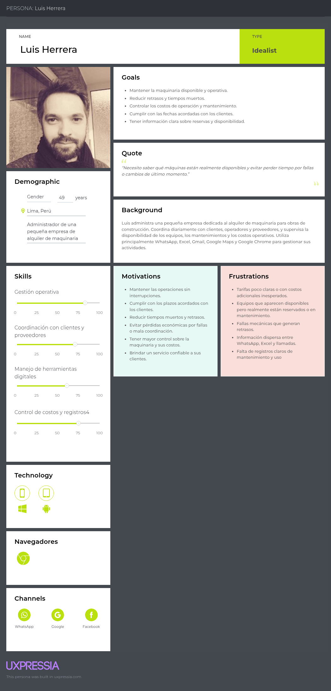

##### User Persona - Coordinador Logístico
##### Harold Angello

Harold Angello representa al contratista responsable de pequeñas obras que necesita asegurar maquinaria disponible y mantener el control operativo de sus proyectos.


#### User Persona Contratistas independientes y responsables de obras de construcción

Renzo Huamán representa al contratista independiente que supervisa varias obras y requiere información confiable sobre disponibilidad de maquinaria, tarifas transparentes y registro digital de horas trabajadas.

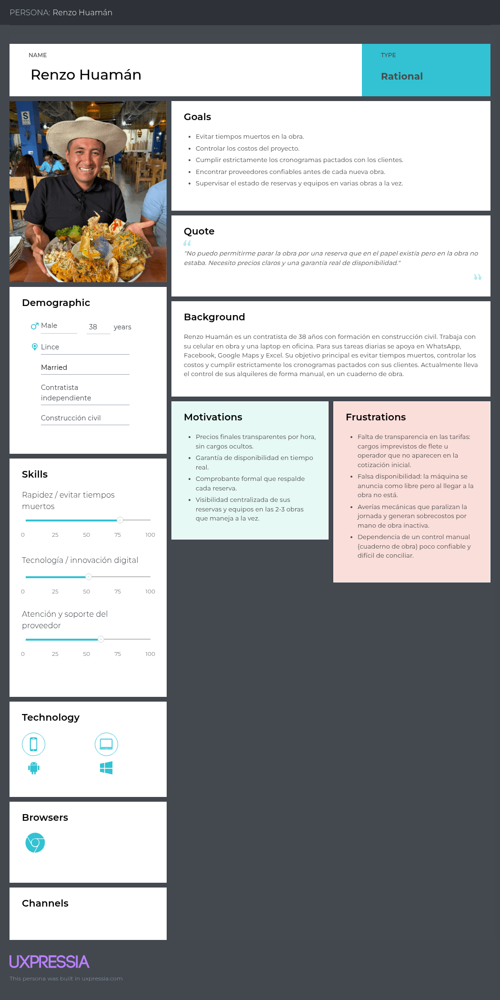

#### 2.3.2. User Task Matrix

La siguiente matriz compara la frecuencia e importancia de las principales tareas realizadas actualmente por los dos User Personas identificados. Las tareas consideradas corresponden a actividades que los usuarios realizan independientemente de la existencia de TechnoLoad.

| Tarea | Administrador de maquinaria - Frecuencia | Administrador de maquinaria - Importancia | Coordinador logístico - Frecuencia | Coordinador logístico - Importancia |
|---|---|---|---|---|
| Revisar disponibilidad de unidades | High | High | High | High |
| Registrar horas de uso o kilometraje | High | High | High | High |
| Coordinar mantenimiento de unidades | Medium | High | Medium | High |
| Revisar historial de mantenimiento | Medium | High | Medium | Medium |
| Coordinar asignación de unidades | Medium | Medium | High | High |
| Coordinar rutas y despachos | Low | Low | High | High |
| Revisar costos operativos | Medium | High | Medium | High |
| Comunicar incidencias operativas | High | High | High | High |

La matriz evidencia que ambos perfiles requieren conocer constantemente la disponibilidad y condición de los activos que administran. Sin embargo, el administrador de maquinaria concentra mayor esfuerzo en el seguimiento de horómetros, mantenimiento y disponibilidad de equipos, mientras que el coordinador logístico prioriza la asignación de vehículos, organización de rutas y coordinación de despachos.

Estas diferencias permiten identificar necesidades particulares para cada segmento y sirven como base para definir posteriormente las funcionalidades de TechnoLoad.

#### 2.3.3. User Journey Mapping

Se elaboraron dos User Journey Maps en su estado actual (*As-Is*), uno para cada User Persona identificado. Estos diagramas representan los procesos que realizan actualmente los usuarios antes de utilizar TechnoLoad, permitiendo identificar dificultades, puntos de contacto y oportunidades de mejora.

##### User Journey Map - Administrador de Flota de Maquinaria Pesada

El journey representa el proceso que sigue actualmente el administrador de flota para supervisar una maquinaria, verificar sus horas de funcionamiento, identificar la necesidad de mantenimiento y coordinar la intervención correspondiente.

De manera general, el proceso actual considera las siguientes etapas:

**Revisar la flota → Verificar horómetros → Identificar necesidad de mantenimiento → Coordinar mantenimiento → Registrar la intervención**

Durante este proceso pueden presentarse dificultades relacionadas con registros manuales, información desactualizada, falta de alertas preventivas y poca visibilidad del estado real de los equipos.

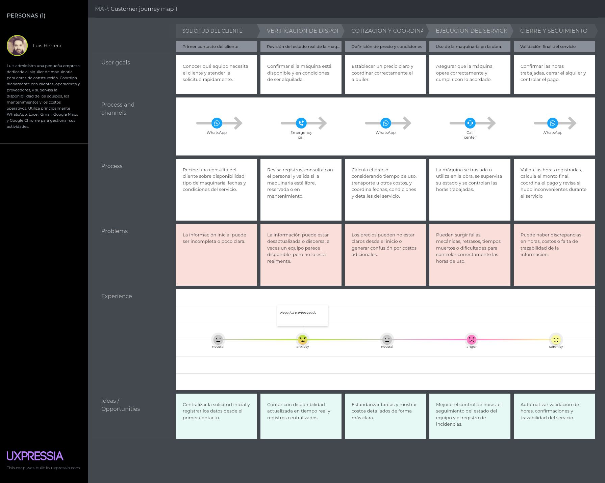


##### User Journey Map - Coordinador Logístico

El journey representa el proceso que sigue actualmente el coordinador logístico desde que recibe una solicitud de transporte hasta que logra asignar una unidad y coordinar el servicio.

De manera general, el proceso actual considera las siguientes etapas:

**Recibir solicitud de transporte → Consultar disponibilidad → Seleccionar unidad → Asignar vehículo → Coordinar ruta → Realizar seguimiento del servicio**

Los principales puntos de fricción se relacionan con la necesidad de consultar diferentes medios para conocer la disponibilidad de las unidades, la comunicación mediante llamadas o mensajería y la falta de información centralizada para tomar decisiones rápidamente.


El siguiente User Journey Map fue elaborado en la plataforma UXPressia para el User Persona Renzo Huamán. El recorrido documenta la experiencia completa en el escenario actual (*As-Is*) cuando Renzo necesita contratar una retroexcavadora para una obra de zanjado y habilitación urbana, enfrentando la falta de transparencia en costos, la informalidad en las reservas y las averías no previstas.

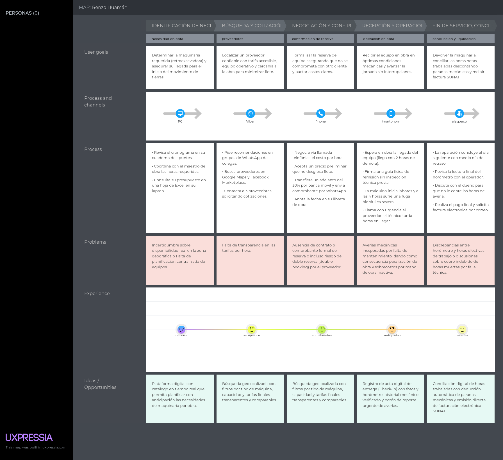

#### 2.3.4. Empathy Mapping

A continuación se presentan los Empathy Mapping de los segmentos objetivos de TechnoLoad..

### Segmento 1: Propietarios y administradores de pequeñas empresas de alquiler de maquinaria

El siguiente Empathy Map representa a Luis Herrera, User Persona del Segmento 1. El artefacto sintetiza los principales comportamientos, necesidades, frustraciones, pensamientos y expectativas identificados a partir de las entrevistas realizadas a usuarios pertenecientes a este segmento.

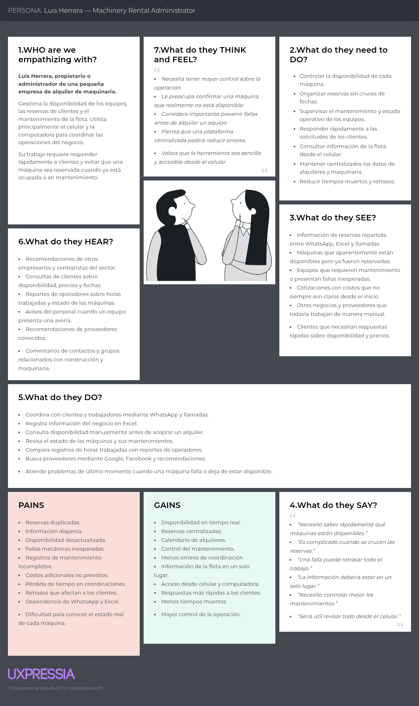

#### Segmento 2: Contratistas independientes y responsables de obras de construcción


| Cuadrante | Descripción y Hallazgos Clave |
| :--- | :--- |
| **¿Qué piensa y siente?** | Piensa en cómo coordinar la logística de sus 2 a 3 obras simultáneas sin paradas. Siente frustración por la doble reserva de equipos y ansiedad por no retrasar los plazos acordados con los clientes. |
| **¿Qué ve?** | Ve paradas de obra por averías mecánicas imprevistas, falta de transparencia en las tarifas finales y reportes diarios de horas recibidos por WhatsApp. |
| **¿Qué escucha?** | Escucha recomendaciones de proveedores en grupos de WhatsApp de ingenieros, promesas incumplidas de stock por parte de alquiladores y reclamos por retrasos en obra. |
| **¿Qué dice y hace?** | Exige visibilidad de todos sus equipos en un solo lugar centralizado. Cotiza proveedores por Google o WhatsApp y transcribe reportes de horas a hojas de Excel en su laptop. |
| **Ganancias (Gains)** | Disponibilidad garantizada en tiempo real, cumplimiento estricto de los plazos de entrega y supervisión centralizada multi-obra de alquileres y costos. |
| **Dolores (Pains)** | Doble reserva de maquinaria por proveedores poco éticos, paradas de obra por fallas mecánicas y dispersión de datos entre múltiples chats de WhatsApp y hojas de cálculo. |

A continuación se presenta el Empathy Map elaborado en UXPressia para el User Persona Renzo Huamán, contratista independiente del Segmento 2. Este artefacto sintetiza sus observaciones, sentimientos, influencias, dolores y metas en el contexto de sus actividades diarias en obra.

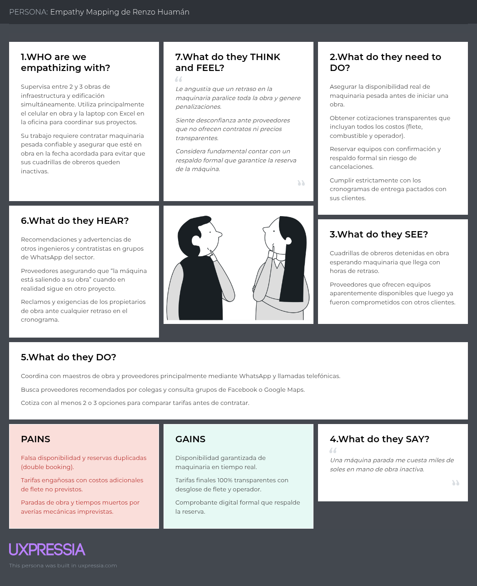

#### 2.3.5. Big Picture Event Storming

El Big Picture Event Storming permite visualizar de manera general los principales procesos del negocio de TechnoLoad, identificando actores, comandos, eventos del dominio, políticas y puntos críticos. En este proyecto se representan los flujos relacionados con la gestión de activos, el mantenimiento preventivo y la coordinación de transporte y logística, con el objetivo de comprender cómo se relacionan las principales actividades del dominio.

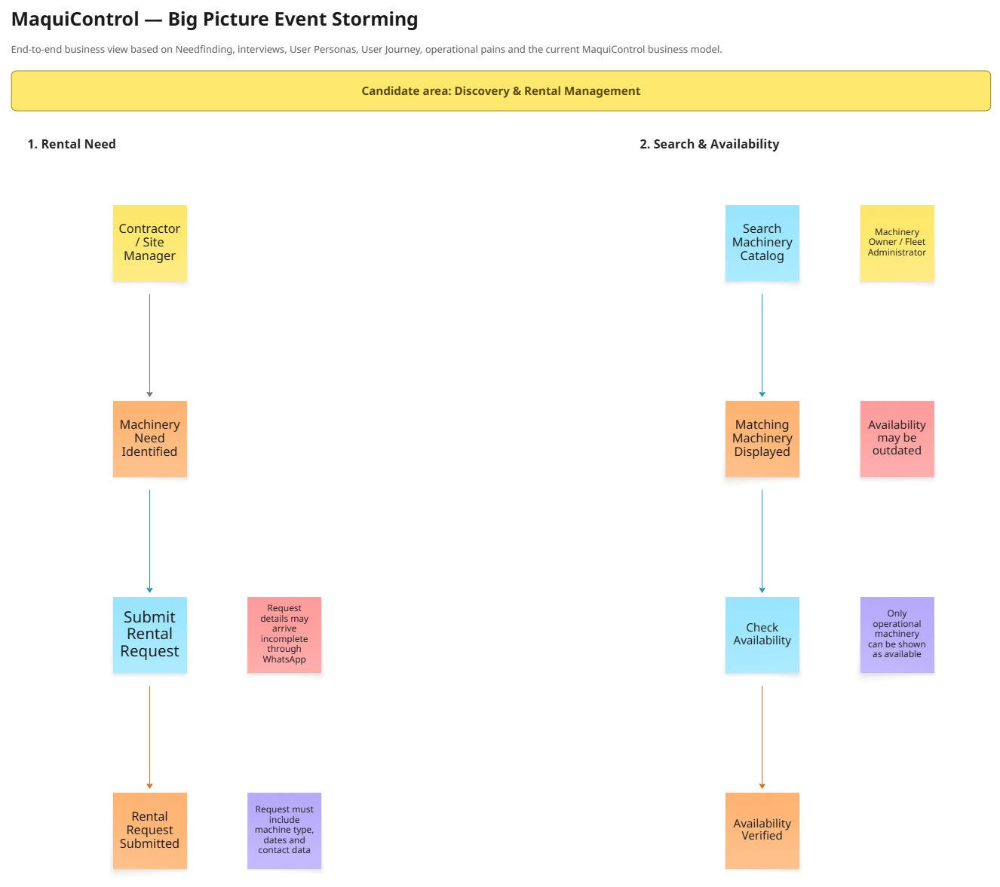
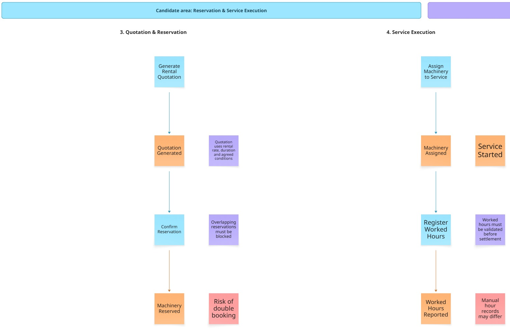
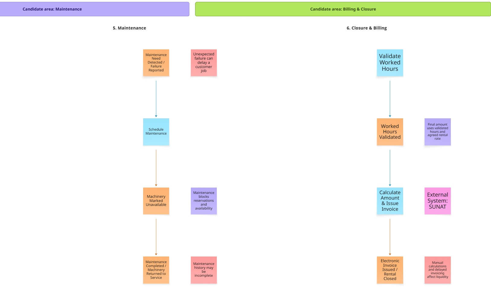
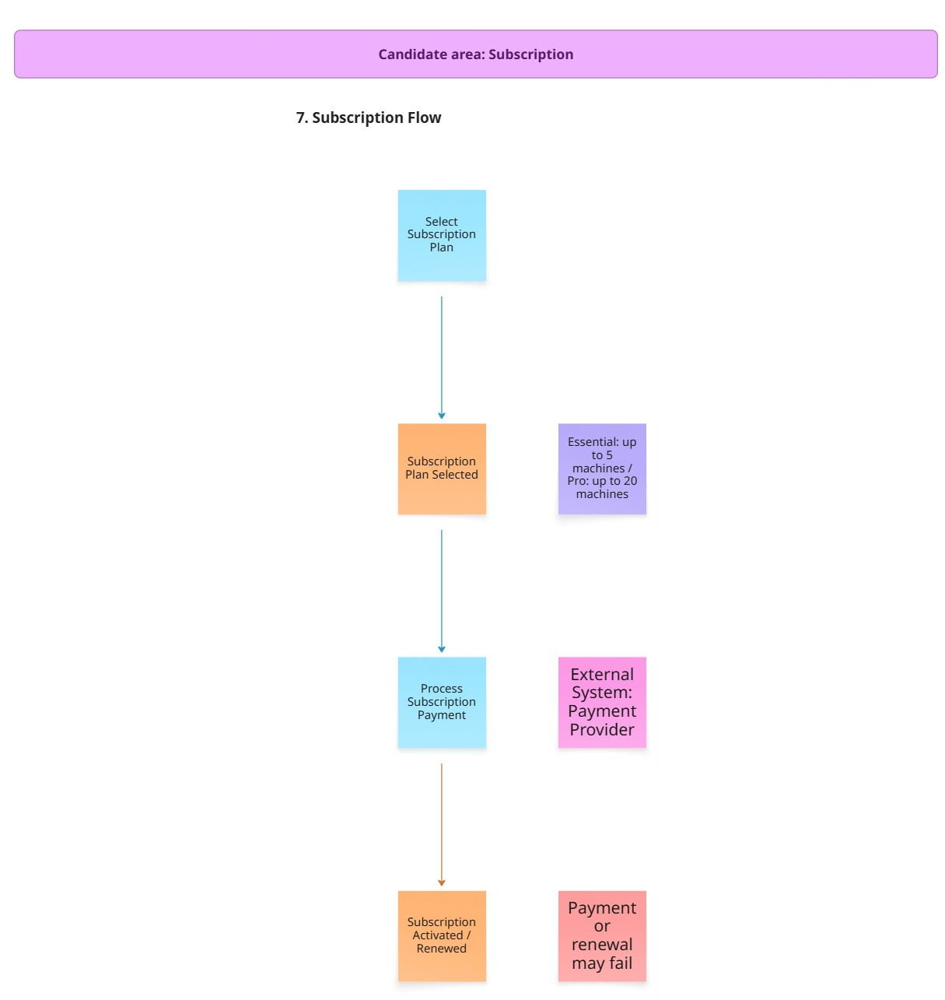
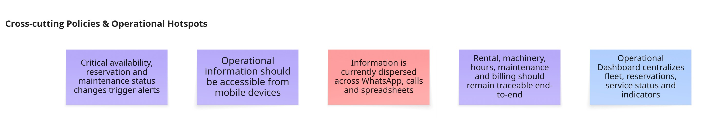
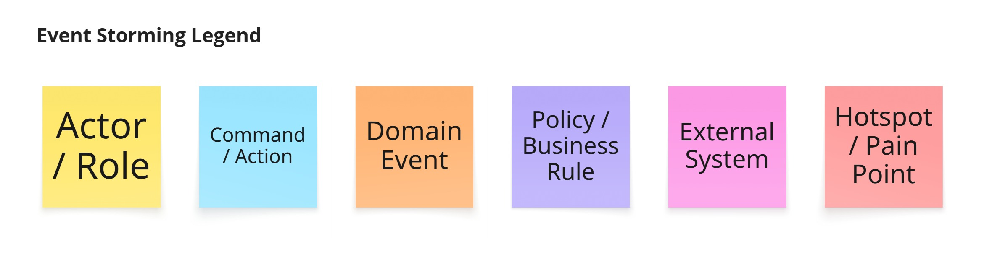
A partir del mapa se reconocen áreas de dominio candidatas como Discovery and Availability, Rental and Reservation Management, Fleet and Maintenance Management, Service Execution and Hour Control, Subscription Management, Billing and SUNAT Compliance, Operational Notifications y Dashboard and Analytics. Estas áreas todavía no representan Bounded Contexts definitivos, ya que su refinamiento se realizará posteriormente mediante Design-Level Event Storming.

Las políticas hacen explícita la reacción del negocio ante un evento de dominio. No son eventos ni comandos: son reglas que, al cumplirse una condición, ordenan la siguiente acción dentro del contexto responsable o mediante una integración controlada.

| Domain Event | Policy / Business Rule | Resulting Command or Integration |
| :--- | :--- | :--- |
| `MeterReadingRecorded` | Si la lectura alcanza o supera el umbral de un plan de mantenimiento activo, se debe generar una intervención preventiva. | `CreateMaintenanceOrder` |
| `MaintenanceOrderScheduled` | Si el mantenimiento está programado dentro del horizonte de alerta, el activo debe dejar de mostrarse como asignable para el periodo intervenido. | `ReserveAssetForMaintenance` |
| `MaintenanceOrderCompleted` | Si la inspección de cierre es satisfactoria, el activo recupera su disponibilidad operativa. | `SetAssetStatus(AVAILABLE)` |
| `BreakdownReported` | Si la avería es crítica, se debe bloquear toda asignación nueva y notificar al responsable de operaciones. | `SetAssetStatus(OUT_OF_SERVICE)` and `SendOperationalNotification` |
| `RentalRequestApproved` | La reserva solo se confirma cuando el activo está disponible y no existen periodos superpuestos. | `ConfirmRental` and `SetAssetStatus(RESERVED)` |
| `SubscriptionPaymentConfirmed` | Cuando un pago de suscripción es confirmado, se habilita o renueva el acceso de la organización. | `ActivateSubscription` |
| `ElectronicInvoiceRequested` | Toda factura aprobada debe enviarse al proveedor de facturación electrónica y conservar su estado de respuesta. | `SubmitElectronicInvoice` |

### 2.4. Ubiquitous Language

En esta sección se presenta el Ubiquitous Language de TechnoLoad, compuesto por términos propios del dominio de gestión de flotas, mantenimiento de maquinaria pesada y transporte de carga. El objetivo es mantener un lenguaje común y sin ambigüedades entre los integrantes del equipo y los stakeholders involucrados en el proyecto.

Los términos se presentan en inglés debido a que serán utilizados de manera consistente durante el modelado del dominio y el desarrollo posterior de la solución.

| Term | Definition |
|---|---|
| **Fleet** | Conjunto de vehículos o maquinaria pertenecientes a una empresa y administrados como parte de sus operaciones. |
| **Heavy Machinery** | Maquinaria pesada utilizada principalmente en actividades de construcción, minería u operaciones industriales. |
| **Vehicle** | Unidad de transporte utilizada para trasladar carga entre diferentes ubicaciones. |
| **Asset** | Recurso perteneciente a una empresa que puede corresponder a una maquinaria pesada o un vehículo de transporte. |
| **Fleet Manager** | Persona responsable de supervisar el estado, disponibilidad, uso y mantenimiento de los activos de una flota. |
| **Logistics Coordinator** | Persona responsable de organizar la asignación de vehículos, rutas y despachos dentro de una operación logística. |
| **Horometer** | Dispositivo o registro utilizado para medir las horas acumuladas de funcionamiento de una maquinaria. |
| **Mileage** | Cantidad de kilómetros acumulados recorridos por un vehículo. |
| **Preventive Maintenance** | Mantenimiento planificado que se realiza antes de que ocurra una falla con el objetivo de conservar el activo en condiciones adecuadas de operación. |
| **Corrective Maintenance** | Mantenimiento realizado después de detectar una falla o avería en un activo. |
| **Maintenance Alert** | Aviso generado cuando una maquinaria o vehículo se aproxima al límite establecido para realizar un mantenimiento. |
| **Maintenance Schedule** | Planificación de las fechas o condiciones bajo las cuales deben realizarse los mantenimientos de un activo. |
| **Maintenance Record** | Registro histórico que almacena información sobre los mantenimientos realizados a una maquinaria o vehículo. |
| **Fleet Availability** | Condición que permite identificar qué activos se encuentran disponibles para realizar una operación. |
| **Available** | Estado de un activo que se encuentra operativo y disponible para ser asignado. |
| **In Operation** | Estado de un activo que actualmente se encuentra ejecutando una operación o servicio. |
| **In Maintenance** | Estado de un activo que temporalmente no se encuentra disponible debido a actividades de mantenimiento. |
| **Transport Request** | Solicitud que requiere la asignación de una unidad para realizar un servicio de transporte de carga. |
| **Dispatch** | Proceso mediante el cual una unidad es seleccionada, asignada y enviada para realizar un servicio. |
| **Route** | Recorrido definido que debe seguir un vehículo para realizar un servicio de transporte. |
| **Downtime** | Periodo durante el cual una maquinaria o vehículo no se encuentra disponible para operar. |
| **Operational Cost** | Costo asociado a la utilización, mantenimiento y operación de una maquinaria o vehículo. |
| **Fleet Status** | Información que representa la condición operativa actual de un activo perteneciente a la flota. |
| **Usage Reading** | Registro de las horas de funcionamiento o kilometraje acumulado de un activo. |

# Capítulo III: Requirements Specification

Este capítulo formaliza los hallazgos del análisis en historias de usuario, criterios de aceptación, relaciones de impacto y backlog priorizado. Los requisitos funcionales cubren activos, lecturas, mantenimiento, alertas, disponibilidad y asignación; los no funcionales establecen seguridad, rendimiento, accesibilidad, internacionalización, trazabilidad y mantenibilidad.

### 3.1. User Stories

A partir del análisis de las entrevistas y de los artefactos de Needfinding, se identificaron las principales necesidades de los usuarios de TechnoLoad. Estas necesidades fueron transformadas en historias de usuario y organizadas según las épicas funcionales del producto.

Las historias de usuario siguen la estructura: **Como [tipo de usuario], deseo [funcionalidad] para [beneficio esperado]**.

| Epic / Story ID | Tipo | Título | User Story | Criterios de aceptación | Relacionado con |
|---|---|---|---|---|---|
| EP-01 | Epic | Gestión de maquinaria y disponibilidad | Permitir la administración del inventario, estado y disponibilidad de las maquinarias de alquiler. | El sistema debe permitir registrar, consultar y actualizar la información de las maquinarias. | — |
| US-001 | User Story | Registrar maquinaria | Como propietario de una empresa de alquiler, quiero registrar una maquinaria con sus características, para mantener actualizado el inventario. | **Given:** el propietario tiene permisos de registro.<br>**When:** registra los datos obligatorios de la maquinaria.<br>**Then:** el sistema guarda la maquinaria y la muestra en el inventario. | EP-01 |
| US-002 | User Story | Consultar disponibilidad | Como administrador, quiero consultar la disponibilidad de una maquinaria por fecha, para evitar reservas duplicadas. | **Given:** existe una maquinaria registrada.<br>**When:** el administrador consulta un periodo determinado.<br>**Then:** el sistema muestra si la maquinaria está disponible, reservada o en mantenimiento. | EP-01 |
| US-003 | User Story | Gestionar mantenimiento | Como propietario, quiero actualizar el estado de mantenimiento de una maquinaria, para evitar que sea reservada cuando no está operativa. | **Given:** existe una maquinaria registrada.<br>**When:** el propietario cambia su estado a mantenimiento.<br>**Then:** el sistema impide nuevas reservas durante dicho estado. | EP-01 |
| US-016 | User Story | Editar datos de maquinaria | Como propietario, quiero modificar los datos técnicos de un equipo, para mantener la información actualizada. | **Given:** la maquinaria está registrada.<br>**When:** el propietario actualiza sus especificaciones.<br>**Then:** el sistema guarda los cambios en el catálogo. | EP-01 |
| US-017 | User Story | Dar de baja maquinaria | Como propietario, quiero desactivar una maquinaria fuera de servicio, para retirarla del inventario activo. | **Given:** el equipo no tiene reservas activas.<br>**When:** el propietario cambia su estado a inactivo.<br>**Then:** el sistema oculta el equipo de las búsquedas. | EP-01 |
| EP-02 | Epic | Gestión de reservas | Permitir la creación, consulta, modificación y cancelación de reservas de maquinaria. | El sistema debe controlar los periodos reservados y evitar conflictos de disponibilidad. | — |
| US-004 | User Story | Crear una reserva | Como contratista, quiero reservar una maquinaria disponible, para utilizarla en mi obra durante el periodo requerido. | **Given:** la maquinaria está disponible.<br>**When:** el contratista registra una reserva válida.<br>**Then:** el sistema confirma la reserva y bloquea el periodo seleccionado. | EP-02 |
| US-005 | User Story | Evitar reservas duplicadas | Como administrador, quiero evitar reservas que se superpongan, para garantizar la disponibilidad correcta de la maquinaria. | **Given:** existe una reserva para un periodo determinado.<br>**When:** se intenta crear otra reserva para el mismo periodo.<br>**Then:** el sistema rechaza la nueva reserva e informa que existe un conflicto. | EP-02 |
| US-006 | User Story | Cancelar una reserva | Como administrador, quiero cancelar una reserva, para liberar la maquinaria cuando ya no sea necesaria. | **Given:** existe una reserva activa.<br>**When:** el administrador cancela la reserva.<br>**Then:** el sistema cambia su estado a cancelada y libera el periodo reservado. | EP-02 |
| US-018 | User Story | Modificar fechas de reserva | Como contratista, quiero solicitar la extensión de una reserva activa, para continuar mis trabajos en obra. | **Given:** existe una reserva en curso y disponibilidad en fechas futuras.<br>**When:** el contratista modifica la fecha fin.<br>**Then:** el sistema actualiza el periodo bloqueado. | EP-02 |
| US-019 | User Story | Aprobar o rechazar reservas | Como administrador, quiero revisar las solicitudes pendientes de alquiler, para confirmar o rechazar contratos. | **Given:** existe una reserva pendiente.<br>**When:** el administrador evalúa y selecciona aprobar/rechazar.<br>**Then:** el sistema actualiza el estado y notifica al contratista. | EP-02 |
| EP-03 | Epic | Consulta y contratación de maquinaria | Facilitar que los contratistas consulten las maquinarias disponibles y sus condiciones de alquiler. | El sistema debe mostrar características, tarifas y disponibilidad de los equipos. | — |
| US-007 | User Story | Consultar catálogo de maquinaria | Como contratista, quiero consultar el catálogo de maquinarias, para elegir el equipo adecuado para mi obra. | **Given:** existen maquinarias registradas.<br>**When:** el contratista consulta el catálogo.<br>**Then:** el sistema muestra las características principales de cada maquinaria. | EP-03 |
| US-008 | User Story | Consultar tarifas | Como contratista, quiero consultar las tarifas de alquiler, para calcular el presupuesto de mi obra. | **Given:** una maquinaria tiene una tarifa registrada.<br>**When:** el contratista consulta sus datos.<br>**Then:** el sistema muestra la tarifa correspondiente y la unidad de cobro. | EP-03 |
| US-009 | User Story | Consultar reservas por obra | Como contratista, quiero consultar las reservas asociadas a mi obra, para organizar el uso de las maquinarias contratadas. | **Given:** el contratista tiene reservas registradas.<br>**When:** consulta las reservas de una obra.<br>**Then:** el sistema muestra la maquinaria, el periodo y el estado de cada reserva. | EP-03 |
| US-020 | User Story | Filtrar maquinaria por categoría | Como contratista, quiero filtrar equipos por tipo de máquina, para agilizar la búsqueda de equipos específicos. | **Given:** el usuario está en el catálogo.<br>**When:** selecciona una categoría.<br>**Then:** el sistema lista únicamente los equipos pertenecientes a dicho tipo. | EP-03 |
| US-021 | User Story | Buscar maquinaria por ubicación | Como contratista, quiero buscar equipos según su ubicación, para reducir costos de flete. | **Given:** existen equipos registrados en distintas sedes.<br>**When:** el usuario ingresa su ciudad/obra.<br>**Then:** el sistema muestra los equipos más cercanos. | EP-03 |
| EP-04 | Epic | Control de horas y facturación | Permitir el registro de horas trabajadas y la generación de información para el control de cobros. | El sistema debe relacionar las horas trabajadas con las reservas y los importes correspondientes. | — |
| US-010 | User Story | Registrar horas trabajadas | Como administrador, quiero registrar las horas trabajadas por cada maquinaria, para calcular correctamente el costo del servicio. | **Given:** existe una reserva activa o finalizada.<br>**When:** el administrador registra las horas trabajadas.<br>**Then:** el sistema guarda las horas y calcula el importe correspondiente. | EP-04 |
| US-011 | User Story | Validar horas trabajadas | Como propietario, quiero validar las horas registradas, para asegurar que los cobros se basen en información correcta. | **Given:** existen horas registradas para una reserva.<br>**When:** el propietario revisa los datos.<br>**Then:** el sistema permite aprobarlas o indicar que requieren corrección. | EP-04 |
| US-012 | User Story | Generar resumen de facturación | Como propietario, quiero obtener un resumen de facturación, para controlar los ingresos generados por los alquileres. | **Given:** existen reservas finalizadas y horas validadas.<br>**When:** el propietario solicita el resumen.<br>**Then:** el sistema muestra el cliente, la maquinaria, las horas y el importe total. | EP-04 |
| US-022 | User Story | Emitir comprobante de pago | Como propietario, quiero generar comprobantes electrónicos, para cumplir con los requerimientos fiscales. | **Given:** las horas trabajadas están validadas.<br>**When:** el propietario presiona emitir comprobante.<br>**Then:** el sistema genera la factura con los datos del contrato. | EP-04 |
| US-023 | User Story | Aplicar penalizaciones por mora | Como propietario, quiero aplicar cargos por entrega tardía, para compensar retrasos no acordados. | **Given:** el equipo es devuelto fuera del tiempo pactado.<br>**When:** se liquida la reserva.<br>**Then:** el sistema añade el recargo por mora al importe final. | EP-04 |
| EP-05 | Epic | Landing Page de MaquiControl | Presentar la propuesta de valor y los servicios de MaquiControl a visitantes interesados. | El sitio debe mostrar información clara para empresas de alquiler y contratistas. | — |
| US-013 | User Story | Mostrar propuesta de valor | Como visitante, quiero conocer la propuesta de valor de MaquiControl, para identificar cómo puede ayudar a mi empresa. | **Given:** el visitante accede a la Landing Page.<br>**When:** consulta el contenido principal.<br>**Then:** el sitio presenta los beneficios y servicios de MaquiControl. | EP-05 |
| US-014 | User Story | Mostrar información por segmento | Como visitante, quiero consultar información relacionada con mi tipo de negocio, para determinar si MaquiControl se adapta a mis necesidades. | **Given:** el visitante accede al contenido del sitio.<br>**When:** consulta la información de los segmentos.<br>**Then:** el sitio presenta información para empresas de alquiler y contratistas. | EP-05 |
| US-015 | User Story | Solicitar contacto o demostración | Como visitante, quiero enviar una solicitud de contacto, para obtener más información sobre MaquiControl. | **Given:** el visitante desea recibir información adicional.<br>**When:** envía sus datos de contacto válidos.<br>**Then:** el sistema registra la solicitud y confirma su recepción. | EP-05 |
| US-024 | User Story | Calculadora de ahorro / ROI | Como visitante, quiero simular mi ahorro operativo según el tamaño de mi flota, para evaluar la compra del SaaS. | **Given:** el visitante ingresa a la sección comercial.<br>**When:** ingresa el número de maquinarias que gestiona.<br>**Then:** el sistema despliega el cálculo de horas y costos ahorrados. | EP-05 |
| US-025 | User Story | Chat de soporte comercial | Como visitante, quiero enviar preguntas directas en la landing, para resolver dudas antes de registrarme. | **Given:** el visitante explora la web.<br>**When:** interactúa con el widget de chat.<br>**Then:** el sistema conecta la conversación con un asesor comercial. | EP-05 |
| EP-06 | Epic | Gestión de usuarios y acceso | Gestionar el ciclo de vida de las cuentas de usuario y la seguridad de acceso a la plataforma. | Controlar la autenticación y los permisos por rol dentro del sistema. | — |
| US-026 | User Story | Registrar cuenta de usuario | Como usuario nuevo, quiero crear una cuenta en el sistema, para acceder a las funciones del software. | **Given:** el usuario no posee cuenta previa.<br>**When:** completa el formulario con datos válidos.<br>**Then:** el sistema guarda la cuenta y envía correo de confirmación. | EP-06 |
| US-027 | User Story | Iniciar sesión | Como usuario registrado, quiero autenticarme en el sistema, para acceder a mi panel personalizado. | **Given:** la cuenta está activa.<br>**When:** se ingresan credenciales correctas.<br>**Then:** el sistema concede acceso a la plataforma. | EP-06 |
| US-028 | User Story | Recuperar contraseña | Como usuario, quiero solicitar el restablecimiento de clave, para recuperar el acceso en caso de olvido. | **Given:** el usuario no recuerda su contraseña.<br>**When:** ingresa su correo registrado.<br>**Then:** el sistema envía un enlace seguro para restablecerla. | EP-06 |
| US-029 | User Story | Gestionar roles de usuario | Como administrador, quiero asignar roles (propietario, contratista, operador), para restringir accesos. | **Given:** existe un usuario registrado.<br>**When:** el administrador modifica sus permisos.<br>**Then:** el sistema actualiza el acceso a los módulos. | EP-06 |
| US-030 | User Story | Actualizar perfil | Como usuario, quiero modificar mis datos personales, para mantener actualizada mi información. | **Given:** el usuario inició sesión.<br>**When:** actualiza sus datos de perfil.<br>**Then:** el sistema guarda los cambios efectuados. | EP-06 |
| EP-07 | Epic | Mantenimiento preventivo y correctivo | Controlar los programas de mantenimiento, reparaciones y la hoja de vida técnica de los equipos. | Registrar intervenciones mecánicas para asegurar la continuidad operativa de los equipos. | — |
| US-031 | User Story | Programar mantenimientos preventivos | Como propietario, quiero agendar alertas periódicas por horas uso, para prevenir fallas mayores. | **Given:** el equipo acumula horas de trabajo.<br>**When:** alcanza el umbral configurado.<br>**Then:** el sistema emite una alerta de mantenimiento obligatorio. | EP-07 |
| US-032 | User Story | Registrar orden de reparación | Como técnico, quiero ingresar los detalles de reparaciones efectuadas, para mantener la ficha técnica del equipo. | **Given:** un equipo estuvo en revisión.<br>**When:** el técnico llena la orden de trabajo.<br>**Then:** el sistema anexa la reparación al historial de la máquina. | EP-07 |
| US-033 | User Story | Consultar historial mecánico | Como contratista, quiero ver el registro de mantenimientos de un equipo, para validar su estado antes de rentarlo. | **Given:** una máquina está publicada en catálogo.<br>**When:** el contratista solicita su historial.<br>**Then:** el sistema despliega las fichas técnicas y revisiones. | EP-07 |
| US-034 | User Story | Reportar avería en obra | Como contratista, quiero reportar una falla mecánica durante el uso, para solicitar soporte urgente. | **Given:** la reserva está activa.<br>**When:** el contratista envía un reporte de avería.<br>**Then:** el sistema notifica al administrador para asistencia inmediata. | EP-07 |
| EP-08 | Epic | Operaciones de campo y seguimiento | Monitorear el estado físico de la maquinaria mediante los registros de entrega, devolución y lecturas. | Garantizar la trazabilidad de la máquina desde la salida del depósito hasta su retorno. | — |
| US-035 | User Story | Registrar check-in de entrega | Como operador, quiero registrar el estado inicial del equipo al entregarlo en obra, para evitar disputas por daños. | **Given:** se entrega la maquinaria al cliente.<br>**When:** el operador registra horómetro inicial y fotos.<br>**Then:** el sistema crea el acta de entrega digital. | EP-08 |
| US-036 | User Story | Registrar check-out de devolución | Como operador, quiero registrar el estado del equipo al ser devuelto, para verificar su condición final. | **Given:** finaliza el periodo de reserva.<br>**When:** el operador toma las fotos y lectura final.<br>**Then:** el sistema cierra la recepción y habilita la facturación. | EP-08 |
| US-037 | User Story | Reasignar equipo por falla | Como administrador, quiero asignar una máquina de reemplazo, para evitar detener los trabajos del cliente. | **Given:** un equipo sufre avería en obra.<br>**When:** se selecciona un sustituto disponible.<br>**Then:** el sistema traslada los días restantes al nuevo equipo. | EP-08 |
| EP-09 | Epic | Reportes y analítica de negocio | Proporcionar paneles e informes financieros y operativos sobre la flota de alquiler. | Generar visualizaciones sobre el uso, rentabilidad e indicadores claves de rendimiento. | — |
| US-038 | User Story | Consultar reporte de utilización | Como propietario, quiero visualizar el porcentaje de uso de mi flota, para identificar los equipos más rentables. | **Given:** existen reservas acumuladas.<br>**When:** se accede al módulo de analítica.<br>**Then:** el sistema calcula el ratio de ocupación por maquinaria. | EP-09 |
| US-039 | User Story | Exportar reportes en Excel/PDF | Como administrador, quiero descargar la lista de reservas y facturas, para realizar auditorías externas. | **Given:** se genera una consulta en pantalla.<br>**When:** se selecciona exportar a Excel/PDF.<br>**Then:** el sistema entrega el archivo en el formato deseado. | EP-09 |
| US-040 | User Story | Calificar servicio y maquinaria | Como contratista, quiero puntuar el desempeño del equipo rentado, para retroalimentar la calidad del servicio. | **Given:** la reserva está finalizada.<br>**When:** el usuario califica del 1 al 5 y comenta.<br>**Then:** el sistema registra la valoración en el perfil de la máquina. | EP-09 |
| EP-10 | Epic | API RESTful de MaquiControl | Proporcionar servicios REST para que otros sistemas puedan consultar y gestionar información de MaquiControl. | La API debe validar solicitudes, devolver respuestas estructuradas y utilizar códigos HTTP adecuados. | — |
| TS-001 | Technical Story | Consultar maquinarias mediante API | Como desarrollador, quiero consultar las maquinarias mediante `GET /api/machinery`, para integrar el inventario con otros sistemas. | **Given:** existen maquinarias registradas.<br>**When:** se realiza una solicitud válida a `GET /api/machinery`.<br>**Then:** la API responde con código `200` y una lista de maquinarias. | EP-10 |
| TS-002 | Technical Story | Registrar reservas mediante API | Como desarrollador, quiero registrar reservas mediante `POST /api/reservations`, para permitir que otros sistemas creen reservas. | **Given:** se envían datos válidos y no existe conflicto de fechas.<br>**When:** se realiza una solicitud `POST /api/reservations`.<br>**Then:** la API crea la reserva y responde con código `201`. | EP-10 |
| TS-003 | Technical Story | Validar conflictos de reservas en la API | Como desarrollador, quiero validar los conflictos de fechas en la API, para mantener la consistencia de la disponibilidad. | **Given:** ya existe una reserva para el periodo solicitado.<br>**When:** se envía una solicitud para reservar el mismo periodo.<br>**Then:** la API rechaza la solicitud y responde con código `409`. | EP-10 |
| TS-004 | Technical Story | Validar datos incorrectos en la API | Como desarrollador, quiero validar los datos recibidos por la API, para evitar registros incompletos o incorrectos. | **Given:** la solicitud contiene datos obligatorios inválidos o incompletos.<br>**When:** la API procesa la solicitud.<br>**Then:** responde con código `400` y detalla los errores encontrados. | EP-10 |
| TS-005 | Technical Story | Autenticación basada en JWT | Como desarrollador, quiero asegurar los endpoints con JWT, para proteger las rutas privadas de la API. | **Given:** el cliente envía peticiones a la API.<br>**When:** no incluye o envía un token inválido en el header.<br>**Then:** la API rechaza la petición con código `401 Unauthorized`. | EP-10 |
| TS-006 | Technical Story | Registro masivo de horómetros | Como desarrollador, quiero procesar lotes de lecturas mediante `POST /api/horometers/batch`, para sincronización móvil offline. | **Given:** una lista de datos de horómetro capturada sin conexión.<br>**When:** el cliente envía la petición en lote.<br>**Then:** la API actualiza los datos y responde `200 OK`. | EP-10 |
| TS-007 | Technical Story | Endpoint para facturación fiscal | Como desarrollador, quiero integrar la API con el WebService del PSE/SUNAT, para tramitar la emisión de facturas. | **Given:** la solicitud de facturación incluye RUC y datos válidos.<br>**When:** se ejecuta `POST /api/invoices/issue`.<br>**Then:** la API responde con código `200` y el CDR firmado. | EP-10 |
| TS-008 | Technical Story | Webhooks de eventos de reserva | Como desarrollador, quiero notificar eventos vía Webhook, para mantener sincronizados sistemas externos. | **Given:** una reserva cambia de estado.<br>**When:** el evento ocurre en el sistema.<br>**Then:** la API realiza un callback HTTP POST a los endpoints suscritos. | EP-10 |
| EP-11 | Epic | Gestión de suscripciones y pagos | Permitir que los propietarios contraten, paguen y administren su plan de suscripción a MaquiControl. | El sistema debe gestionar los planes disponibles, el estado de la suscripción y el procesamiento de pagos mediante el proveedor externo. | — |
| US-041 | User Story | Consultar planes de suscripción | Como propietario, quiero ver los planes de suscripción disponibles (Essential, Pro), para elegir el que se ajuste al tamaño de mi flota. | **Given:** el propietario no tiene una suscripción activa.<br>**When:** consulta los planes disponibles.<br>**Then:** el sistema muestra el límite de maquinarias y el precio de cada plan. | EP-11 |
| US-042 | User Story | Contratar un plan de suscripción | Como propietario, quiero seleccionar y pagar un plan de suscripción mediante el proveedor de pagos, para habilitar la gestión de mi flota en MaquiControl. | **Given:** el propietario seleccionó un plan.<br>**When:** completa el pago a través del proveedor de pagos (sandbox).<br>**Then:** el sistema activa la suscripción y la vincula a la organización del propietario. | EP-11 |
| US-043 | User Story | Renovar suscripción | Como propietario, quiero que mi suscripción se renueve automáticamente al vencer el periodo contratado, para mantener el acceso sin interrupciones. | **Given:** la suscripción está próxima a vencer.<br>**When:** el proveedor de pagos aprueba el cobro de renovación.<br>**Then:** el sistema extiende la fecha de vencimiento de la suscripción. | EP-11 |
| US-044 | User Story | Consultar estado de la suscripción | Como propietario, quiero consultar el estado y el historial de pagos de mi suscripción, para verificar mi situación con la plataforma. | **Given:** el propietario tiene una suscripción registrada.<br>**When:** consulta su panel de cuenta.<br>**Then:** el sistema muestra el plan activo, la fecha de vencimiento y los pagos realizados. | EP-11 |
| US-045 | User Story | Bloquear registro de maquinaria al superar el límite del plan | Como sistema, quiero impedir que un propietario registre más maquinarias que las permitidas por su plan, para hacer cumplir los límites comerciales de la suscripción. | **Given:** el propietario alcanzó el límite de maquinarias de su plan.<br>**When:** intenta registrar una maquinaria adicional.<br>**Then:** el sistema rechaza el registro e indica que debe actualizar su plan. | EP-11 |

### 3.2. Impact Mapping

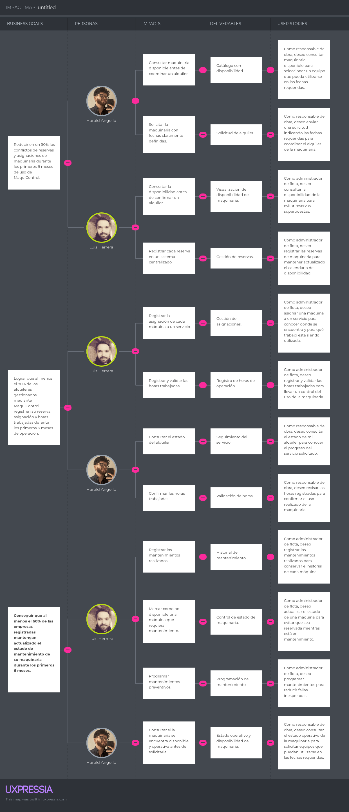

### 3.3. Product Backlog

| Orden | User Story ID | Título | Descripción | Story Points |
| :---: | :---: | :--- | :--- | :---: |
| 1 | **US-001** | Registrar maquinaria | Como propietario de una empresa de alquiler, quiero registrar una maquinaria con sus características, para mantener actualizado el inventario. | 2 |
| 2 | **US-002** | Consultar disponibilidad | Como administrador, quiero consultar la disponibilidad de una maquinaria por fecha, para evitar reservas duplicadas. | 2 |
| 3 | **US-003** | Gestionar mantenimiento | Como propietario, quiero actualizar el estado de mantenimiento de una maquinaria, para evitar que sea reservada cuando no está operativa. | 3 |
| 4 | **US-004** | Crear una reserva | Como contratista, quiero reservar una maquinaria disponible, para utilizarla en mi obra durante el periodo requerido. | 3 |
| 5 | **US-005** | Evitar reservas duplicadas | Como administrador, quiero evitar reservas que se superpongan, para garantizar la disponibilidad correcta de la maquinaria. | 3 |
| 6 | **US-006** | Cancelar una reserva | Como administrador, quiero cancelar una reserva, para liberar la maquinaria cuando ya no sea necesaria. | 2 |
| 7 | **US-007** | Consultar catálogo de maquinaria | Como contratista, quiero consultar el catálogo de maquinarias, para elegir el equipo adecuado para mi obra. | 1 |
| 8 | **US-008** | Consultar tarifas | Como contratista, quiero consultar las tarifas de alquiler, para calcular el presupuesto de mi obra. | 1 |
| 9 | **US-009** | Consultar reservas por obra | Como contratista, quiero consultar las reservas asociadas a mi obra, para organizar el uso de las maquinarias contratadas. | 2 |
| 10 | **US-010** | Registrar horas trabajadas | Como administrador, quiero registrar las horas trabajadas por cada maquinaria, para calcular correctamente el costo del servicio. | 3 |
| 11 | **US-011** | Validar horas trabajadas | Como propietario, quiero validar las horas registradas, para asegurar que los cobros se basen en información correcta. | 3 |
| 12 | **US-012** | Generar resumen de facturación | Como propietario, quiero obtener un resumen de facturación, para controlar los ingresos generados por los alquileres. | 3 |
| 13 | **US-013** | Mostrar propuesta de valor | Como visitante, quiero conocer la propuesta de valor de MaquiControl, para identificar cómo puede ayudar a mi empresa. | 1 |
| 14 | **US-014** | Mostrar información por segmento | Como visitante, quiero consultar información relacionada con mi tipo de negocio, para determinar si MaquiControl se adapta a mis necesidades. | 1 |
| 15 | **US-015** | Solicitar contacto o demostración | Como visitante, quiero enviar una solicitud de contacto, para obtener más información sobre MaquiControl. | 1 |
| 16 | **US-016** | Editar datos de maquinaria | Como propietario, quiero modificar los datos técnicos de un equipo, para mantener la información actualizada. | 2 |
| 17 | **US-017** | Dar de baja maquinaria | Como propietario, quiero desactivar una maquinaria fuera de servicio, para retirarla del inventario activo. | 1 |
| 18 | **US-018** | Modificar fechas de reserva | Como contratista, quiero solicitar la extensión de una reserva activa, para continuar mis trabajos en obra. | 3 |
| 19 | **US-019** | Aprobar o rechazar reservas | Como administrador, quiero revisar las solicitudes pendientes de alquiler, para confirmar o rechazar contratos. | 2 |
| 20 | **US-020** | Filtrar maquinaria por categoría | Como contratista, quiero filtrar equipos por tipo de máquina, para agilizar la búsqueda de equipos específicos. | 1 |
| 21 | **US-021** | Buscar maquinaria por ubicación | Como contratista, quiero buscar equipos según su ubicación, para reducir costos de flete. | 2 |
| 22 | **US-022** | Emitir comprobante de pago | Como propietario, quiero generar comprobantes electrónicos, para cumplir con los requerimientos fiscales. | 3 |
| 23 | **US-023** | Aplicar penalizaciones por mora | Como propietario, quiero aplicar cargos por entrega tardía, para compensar retrasos no acordados. | 2 |
| 24 | **US-024** | Calculadora de ahorro / ROI | Como visitante, quiero simular mi ahorro operativo según el tamaño de mi flota, para evaluar la compra del SaaS. | 2 |
| 25 | **US-025** | Chat de soporte comercial | Como visitante, quiero enviar preguntas directas en la Landing Page, para resolver dudas antes de registrarme. | 2 |
| 26 | **US-026** | Registrar cuenta de usuario | Como usuario nuevo, quiero crear una cuenta en el sistema, para acceder a las funciones del software. | 2 |
| 27 | **US-027** | Iniciar sesión | Como usuario registrado, quiero autenticarme en el sistema, para acceder a mi panel personalizado. | 2 |
| 28 | **US-028** | Recuperar contraseña | Como usuario, quiero solicitar el restablecimiento de clave, para recuperar el acceso en caso de olvido. | 2 |
| 29 | **US-029** | Gestionar roles de usuario | Como administrador, quiero asignar roles de propietario, contratista u operador, para restringir los accesos correspondientes. | 2 |
| 30 | **US-030** | Actualizar perfil | Como usuario, quiero modificar mis datos personales, para mantener actualizada mi información. | 1 |
| 31 | **US-031** | Programar mantenimientos preventivos | Como propietario, quiero agendar alertas periódicas por horas de uso, para prevenir fallas mayores. | 3 |
| 32 | **US-032** | Registrar orden de reparación | Como técnico, quiero ingresar los detalles de las reparaciones efectuadas, para mantener la ficha técnica del equipo. | 2 |
| 33 | **US-033** | Consultar historial mecánico | Como contratista, quiero consultar el registro de mantenimientos de un equipo, para validar su estado antes de alquilarlo. | 2 |
| 34 | **US-034** | Reportar avería en obra | Como contratista, quiero reportar una falla mecánica durante el uso, para solicitar soporte urgente. | 2 |
| 35 | **US-035** | Registrar check-in de entrega | Como operador, quiero registrar el estado inicial del equipo al entregarlo en obra, para evitar disputas por daños. | 2 |
| 36 | **US-036** | Registrar check-out de devolución | Como operador, quiero registrar el estado del equipo al ser devuelto, para verificar su condición final. | 2 |
| 37 | **US-037** | Reasignar equipo por falla | Como administrador, quiero asignar una máquina de reemplazo, para evitar detener los trabajos del cliente. | 3 |
| 38 | **US-038** | Consultar reporte de utilización | Como propietario, quiero visualizar el porcentaje de uso de mi flota, para identificar los equipos más rentables. | 2 |
| 39 | **US-039** | Exportar reportes en Excel/PDF | Como administrador, quiero descargar la lista de reservas y facturas, para realizar auditorías externas. | 2 |
| 40 | **US-040** | Calificar servicio y maquinaria | Como contratista, quiero puntuar el desempeño del equipo alquilado, para retroalimentar la calidad del servicio. | 1 |
| 41 | **TS-001** | Consultar maquinarias mediante API | Como desarrollador, quiero consultar las maquinarias mediante `GET /api/machinery`, para integrar el inventario con otros sistemas. | 2 |
| 42 | **TS-002** | Registrar reservas mediante API | Como desarrollador, quiero registrar reservas mediante `POST /api/reservations`, para permitir que otros sistemas creen reservas. | 3 |
| 43 | **TS-003** | Validar conflictos de reservas en la API | Como desarrollador, quiero validar los conflictos de fechas en la API, para mantener la consistencia de la disponibilidad. | 3 |
| 44 | **TS-004** | Validar datos incorrectos en la API | Como desarrollador, quiero validar los datos recibidos por la API, para evitar registros incompletos o incorrectos. | 2 |
| 45 | **TS-005** | Autenticación basada en JWT | Como desarrollador, quiero asegurar los endpoints con JWT, para proteger las rutas privadas de la API. | 3 |
| 46 | **TS-006** | Registro masivo de horómetros | Como desarrollador, quiero procesar lotes de lecturas mediante `POST /api/horometers/batch`, para permitir la sincronización móvil. | 3 |
| 47 | **TS-007** | Endpoint para facturación fiscal | Como desarrollador, quiero integrar la API con el servicio del PSE/SUNAT, para tramitar la emisión de facturas. | 3 |
| 48 | **TS-008** | Webhooks de eventos de reserva | Como desarrollador, quiero notificar eventos mediante webhooks, para mantener sincronizados los sistemas externos. | 3 |
| 49 | **US-041** | Consultar planes de suscripción | Como propietario, quiero ver los planes de suscripción disponibles (Essential, Pro), para elegir el que se ajuste al tamaño de mi flota. | 1 |
| 50 | **US-042** | Contratar un plan de suscripción | Como propietario, quiero seleccionar y pagar un plan de suscripción mediante el proveedor de pagos, para habilitar la gestión de mi flota en MaquiControl. | 3 |
| 51 | **US-043** | Renovar suscripción | Como propietario, quiero que mi suscripción se renueve automáticamente al vencer el periodo contratado, para mantener el acceso sin interrupciones. | 3 |
| 52 | **US-044** | Consultar estado de la suscripción | Como propietario, quiero consultar el estado y el historial de pagos de mi suscripción, para verificar mi situación con la plataforma. | 2 |
| 53 | **US-045** | Bloquear registro de maquinaria al superar el límite del plan | Como sistema, quiero impedir que un propietario registre más maquinarias que las permitidas por su plan, para hacer cumplir los límites comerciales de la suscripción. | 2 |

## Capítulo IV: Product Design

## 4.1. Style Guidelines

Esta sección define las decisiones visuales y de interacción que mantienen una experiencia coherente en TechnoLoad. El sistema de diseño se orienta a operaciones de flota: debe permitir identificar el estado de un activo, detectar una excepción y ejecutar una acción sin ambigüedad, tanto desde escritorio como desde un dispositivo móvil.

### 4.1.1. General Style Guidelines

La identidad visual de TechnoLoad busca transmitir una imagen profesional, tecnológica y orientada a la gestión operativa de flotas de maquinaria pesada y transporte de carga por carretera.

La interfaz utiliza principalmente una paleta clara y contrastada acompañada de elementos en color azul y naranja para resaltar acciones importantes, estados de activos y componentes interactivos.

Los principales colores utilizados son:

#### Color Palette

TechnoLoad utiliza una paleta de colores de alto contraste que combina superficies limpias con colores de acento bien definidos para destacar acciones importantes y estados de la flota.

| Token | Código HEX | Uso en TechnoLoad |
| :--- | :---: | :--- |
| **Primary** | `#0F3D5E` | Navegación, encabezados y confianza operativa |
| **Action** | `#1976D2` | Botones primarios, enlaces y focos activos |
| **Accent** | `#FF8F00` | CTA, alertas de atención y priorización de mantenimientos |
| **Success** | `#2E7D32` | Activo disponible, rutas activas y confirmaciones |
| **Error** | `#C62828` | Validación, fallos críticos de máquina y acciones bloqueadas |
| **Neutral 50–900** | `#F6F8FB`–`#17324D` | Superficies, bordes y jerarquía de texto |

---

#### Typography

La tipografía principal utilizada es `Inter`, con fuentes alternativas Arial, Helvetica y sans-serif por su alta legibilidad en dashboards, tablas de horómetros e indicadores logísticos.

La jerarquía visual se establece mediante diferentes tamaños y pesos tipográficos, utilizando títulos grandes para comunicar métricas clave y textos secundarios con menor contraste para información complementaria.

| Elemento | Tipografía | Peso aproximado | Aplicación |
| :--- | :---: | :---: | :--- |
| **Main Headings** | Inter | Bold / 700 | Hero y títulos principales |
| **Section Headings** | Inter | Bold / 700 | Títulos de secciones y módulos |
| **Card Titles** | Inter | Semi Bold / 600 | Métrica de activos, tarjetas de flota y pasos |
| **Body Text** | Inter | Regular / 400 | Descripciones, lecturas de horómetros y contenido |
| **Buttons** | Inter | Semi Bold / 600 | Call to Action y botones de comando |
| **Navigation** | Inter | Regular / 400–500 | Enlaces de navegación y pestañas |

La jerarquía tipográfica se mantiene mediante variaciones de tamaño (escala de 12, 14, 16, 20, 24, 32 y 40 px) y peso, permitiendo distinguir claramente títulos, subtítulos, textos descriptivos y acciones.

---

#### Component Mapping & Spacing Rules

La escala de espaciado se compone de 4, 8, 12, 16, 24, 32 y 48 px. Las tarjetas usan un radio de borde de 12 px, una sombra tenue y separación interna mínima de 16 px. El color de estado siempre se acompaña con una etiqueta, icono o texto descriptivo.

| Elemento Figma | Equivalente PrimeVue | Estados documentados |
| :--- | :---: | :--- |
| **Primary / secondary button** | `pv-button` | default, hover, focus, disabled, loading |
| **Campo de formulario** | `pv-input-text` | default, focus, error, disabled |
| **Tarjeta de activo** | `pv-card` | default, hover, loading |
| **Tabla operativa** | `pv-data-table` | loading, empty, selected, error |
| **Estado de activo** | `pv-tag` | disponible, mantenimiento, crítico |
| **Confirmación y error** | `pv-toast` | success, warn, error, info |
| **Carga de contenido** | `pv-skeleton` | tarjeta, fila y detalle |

### 4.1.2. Web Style Guidelines

Las Web Style Guidelines de TechnoLoad establecen los criterios visuales y de interacción que serán aplicados tanto en la Landing Page como en la Web Application, buscando mantener una experiencia consistente, responsive y accesible en diferentes tamaños de pantalla.

La interfaz utiliza un enfoque responsive basado en una grilla flexible que permite adaptar el contenido a computadoras, tablets y dispositivos móviles. En pantallas de escritorio se utiliza una distribución de hasta 12 columnas, mientras que en dispositivos móviles los elementos se reorganizan verticalmente para facilitar su lectura e interacción.

Los principales breakpoints considerados son:

| Dispositivo | Resolución de referencia | Comportamiento |
|---|---|---|
| Mobile | 375 px – 767 px | Una columna, navegación mediante menú desplegable y componentes apilados. |
| Tablet | 768 px – 1023 px | Distribución intermedia con reducción de columnas y espacios. |
| Desktop | 1024 px o superior | Navegación completa, múltiples columnas y visualización ampliada de tablas y dashboards. |

Los componentes interactivos mantienen estados visuales claramente diferenciados.

| Componente | Estados considerados |
|---|---|
| Buttons | Default, Hover, Focus, Disabled y Loading |
| Input Fields | Default, Focus, Error y Disabled |
| Cards | Default, Hover y Selected |
| Tables | Loading, Empty, Selected y Error |
| Alerts | Info, Success, Warning y Error |
| Navigation Items | Default, Hover, Active y Focus |

Los botones principales utilizan el color de acción definido en el Design System, mientras que las acciones secundarias emplean estilos con menor jerarquía visual. Los estados de error, advertencia y éxito utilizan colores acompañados de iconos o textos, evitando depender únicamente del color para transmitir información.

En dispositivos móviles, el menú lateral de la Web Application se transforma en un Drawer que puede abrirse mediante un botón de navegación. Las tablas que contienen gran cantidad de información permiten desplazamiento horizontal o presentan una versión simplificada para conservar la legibilidad.

Las interfaces mantienen áreas de interacción suficientemente amplias y controles accesibles mediante teclado. Los formularios proporcionan mensajes de validación cercanos al campo correspondiente y muestran claramente los errores detectados.

TechnoLoad utiliza componentes de PrimeVue para mantener consistencia visual y de comportamiento entre las diferentes vistas de la aplicación. Entre los componentes principales se consideran `Button`, `InputText`, `DataTable`, `Card`, `Tag`, `Dialog`, `Toast`, `Drawer` y `Skeleton`.

## 4.2. Information Architecture

La arquitectura de información de TechnoLoad organiza de forma progresiva los contenidos relativos a activos, mantenimiento y operaciones de carga. La experiencia parte de la propuesta de valor y conduce al visitante por beneficios, perfiles objetivo, funcionamiento y mecanismos de navegación, con el propósito de reducir la carga cognitiva y orientar cada interacción hacia una decisión operativa verificable.

### 4.2.1. Organization Systems

La arquitectura de información de TechnoLoad utiliza diferentes sistemas de organización dependiendo del tipo de contenido y del objetivo que debe cumplir el usuario.

#### Organización jerárquica

La organización jerárquica se utiliza principalmente en la Web Application, donde la información se estructura desde módulos generales hasta información específica.

La jerarquía principal es:

**Dashboard → Módulos → Listados → Detalle → Acciones**

Los módulos principales considerados son:

- Dashboard
- Assets
- Maintenance
- Operations
- Reservations
- Profile

Por ejemplo, un administrador puede ingresar al módulo de activos, seleccionar una maquinaria específica y posteriormente consultar su información detallada, historial de uso o mantenimiento.

#### Organización secuencial

La organización secuencial se utiliza cuando el usuario debe completar un conjunto ordenado de pasos para alcanzar un objetivo.

Ejemplos:

**Seleccionar activo → Registrar lectura → Validar información → Confirmar registro**

**Seleccionar activo → Programar mantenimiento → Definir fecha y prioridad → Confirmar mantenimiento**

**Consultar disponibilidad → Seleccionar unidad → Asignar operación → Confirmar asignación**

Este sistema permite que los procesos transaccionales sean fáciles de comprender y reduzcan errores durante su ejecución.

#### Organización por tópicos

El contenido se agrupa según las principales áreas funcionales del dominio de TechnoLoad:

- Gestión de activos.
- Control de horómetros y kilometraje.
- Gestión de mantenimiento.
- Disponibilidad de unidades.
- Operaciones.
- Reservas.
- Reportes y análisis.

#### Organización según audiencia

La información también se organiza de acuerdo con los principales tipos de usuario.

**Fleet Manager:** accede principalmente a información relacionada con activos, lecturas, disponibilidad y mantenimiento.

**Operations Manager:** accede a indicadores de utilización, costos y rendimiento de la flota.

**Logistics Coordinator:** accede a disponibilidad de unidades, asignaciones y operaciones.

**Visitor:** accede al Landing Page para conocer la propuesta de valor, características y mecanismos de contacto de TechnoLoad.

De esta manera, la organización del contenido permite reducir la cantidad de información innecesaria presentada a cada usuario.

### 4.2.2. Labeling Systems

El sistema de etiquetado de TechnoLoad utiliza términos breves, comprensibles y consistentes con el Ubiquitous Language definido para el dominio.

Se busca evitar etiquetas ambiguas o excesivamente técnicas y utilizar nombres que permitan al usuario comprender rápidamente la función de cada elemento.

#### Navigation Labels

| Label | Propósito |
|---|---|
| Home | Página principal de la Landing Page. |
| Features | Presenta las principales características de TechnoLoad. |
| Solutions | Presenta los beneficios de la plataforma para cada segmento. |
| Contact | Permite acceder a los medios de contacto. |
| Dashboard | Presenta una visión general de la operación. |
| Assets | Permite administrar maquinaria y vehículos. |
| Maintenance | Permite consultar y gestionar mantenimientos. |
| Operations | Permite gestionar las operaciones de las unidades. |
| Reservations | Permite consultar y administrar reservas. |
| Profile | Permite gestionar la información del usuario. |

#### Action Labels

Las acciones utilizan verbos que describen directamente lo que realizará el usuario.

- Register Asset
- Edit Asset
- Register Reading
- Schedule Maintenance
- Assign Unit
- Create Reservation
- Cancel Reservation
- View Details
- Save
- Confirm
- Cancel

#### Status Labels

Los estados utilizados para representar la situación actual de los activos son:

- Available
- Assigned
- In Operation
- In Maintenance
- Inactive

Los mantenimientos podrán utilizar estados como:

- Scheduled
- In Progress
- Completed
- Cancelled

Las etiquetas mantendrán la misma terminología en toda la plataforma para evitar que un mismo concepto sea representado con diferentes palabras.

Además, los textos visibles serán administrados mediante internacionalización, permitiendo presentar la interfaz en `en_US` y `es_419`.

### 4.2.3. SEO Tags and Meta Tags

La Landing Page de TechnoLoad incorpora etiquetas HTML orientadas a mejorar la identificación del sitio por los motores de búsqueda y proporcionar información básica sobre el contenido de la página.

En el elemento `<head>` se han implementado las siguientes etiquetas:

* **Title:** `TechnoLoad | Intelligent Fleet Management`
* **Description:** describe a TechnoLoad como una plataforma para la gestión de flotas, control de mantenimientos preventivos, horómetros y optimización de rutas para maquinaria pesada y transporte.
* **Keywords:** incluye términos relacionados con gestión de flotas, mantenimiento preventivo, maquinaria pesada, logística, transporte de carga y TechnoLoad.
* **Author:** identifica a `TechnoLoad Team` como autor del sitio.

Además, se incluyen etiquetas técnicas necesarias para una correcta visualización y optimización en redes sociales:

* `charset="UTF-8"` para la codificación de caracteres.
* `viewport` para adaptar correctamente la página a dispositivos móviles.
* Etiquetas `OpenGraph` para estandarizar el título, descripción, imagen y URL al compartir la página.

La configuración implementada en la Landing Page es la siguiente:

```html
`<meta charset="UTF-8">`

`<meta name="viewport" content="width=device-width, initial-scale=1.0">`

`<meta name="description" content="TechnoLoad centraliza activos, mantenimiento y operaciones de transporte de carga y maquinaria pesada en una sola plataforma.">`

`<meta name="keywords" content="fleet management, maintenance, machinery, logistics, TechnoLoad">`

`<meta name="author" content="TechnoLoad Team">`

`<title>TechnoLoad | Intelligent Fleet Management</title>`
```

### 4.2.4. Searching Systems

La Landing Page no requiere un buscador interno: su objetivo es comunicar y convertir mediante llamadas a la acción directas hacia la Web App. En la aplicación autenticada, la búsqueda usa debounce de 300 ms, filtros combinables por estado, tipo y prioridad, parámetros conservados en la URL y paginación de servidor. Los estados vacíos explican la causa, ofrecen restablecer filtros y presentan un CTA contextual cuando el rol lo permite.

### 4.2.5. Navigation Systems

La navegación pública es lineal por anclas: el Header contiene enlaces a secciones y un botón de acceso a plataforma; en móvil se contrae a un menú compacto. La aplicación autenticada usa Sidebar o Drawer, Topbar, Breadcrumbs dinámicos y CTAs contextuales. Esta combinación conserva orientación espacial al pasar de listados a detalle y a formularios.

## 4.3. Landing Page UI Design

La Landing Page aplica Primary `#0F3D5E`, Secondary `#FF8F00` e Inter para comunicar confiabilidad, actividad y claridad. La composición dirige la mirada del titular a la propuesta de valor, luego a los módulos y finalmente a la conversión.

### 4.3.1. Landing Page Wireframes

El wireframe de baja fidelidad define Navbar, Hero de dos columnas, beneficios, módulos, proceso, CTA y Footer. Las estructuras se validan antes de aplicar estilo visual y responden a desktop y móvil.

La arquitectura de información prioriza una secuencia de conversión clara: propuesta de valor, evidencia de beneficio, módulos, segmentos, planes y llamada a la acción. Esta jerarquía reduce la carga cognitiva y permite que el visitante identifique rápidamente el propósito de la plataforma y el siguiente paso.

| Breakpoint | Composición | Decisión de Responsive Web Design |
| :--- | :--- | :--- |
| **Desktop (≥ 1024 px)** | Hero en dos columnas, navegación horizontal y grillas de tres tarjetas. | Aprovecha el ancho disponible para comparar módulos y mantener CTAs visibles. |
| **Tablet (768–1023 px)** | Hero con columnas reducidas y grillas de dos tarjetas. | Conserva la jerarquía visual sin requerir desplazamiento horizontal. |
| **Mobile (< 768 px)** | Una columna, menú compacto, CTAs apilados y tarjetas secuenciales. | Prioriza legibilidad, objetivos táctiles de al menos 44 px y contenido esencial. |

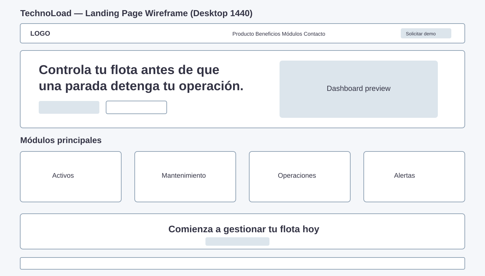

### 4.3.2. Landing Page Mock-ups

En esta sección se presentan los mockups de alta fidelidad de la Landing Page de TechnoLoad.

Los mockups aplican la identidad visual definida previamente, incluyendo colores, tipografía, componentes, botones, tarjetas, iconografía y distribución responsive.

La interfaz final está compuesta por las siguientes secciones:

* **Header.**
* **Hero Section.**
* **Benefits Section.**
* **Target Segments Section.**
* **How It Works Section.**
* **Value Proposition.**
* **Pricing Section.**
* **Final Call to Action.**
* **Footer.**

El mock-up de alta fidelidad aplica la jerarquía Inter, superficies claras, cards con bordes suaves y CTAs contrastantes. El copy principal, “Controla tu flota antes de que una parada detenga tu operación”, se acompaña de “Solicitar una demostración” y “Conocer los módulos”.

---

#### **Vista Desktop**

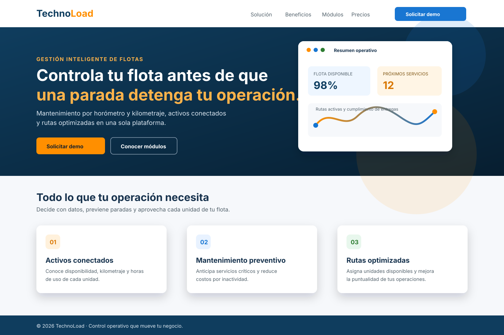

<!-- SVG embebido anterior conservado solo como referencia de diseño; la imagen local anterior es la representación visible.
<svg xmlns="http://www.w3.org/2000/svg" viewBox="0 0 1200 800" width="100%" style="background:#0F1115; border-radius:8px; font-family:'Inter', sans-serif;">
  <!-- Header -->
  <rect x="0" y="0" width="1200" height="70" fill="#171A20"/>
  <text x="40" y="42" fill="#F5F5F5" font-size="20" font-weight="bold">TechnoLoad</text>
  <text x="750" y="42" fill="#A8ADB8" font-size="14">Inicio</text>
  <text x="820" y="42" fill="#A8ADB8" font-size="14">Servicios</text>
  <text x="910" y="42" fill="#A8ADB8" font-size="14">Planes</text>
  <rect x="1000" y="20" width="160" height="36" rx="6" fill="#FF8F00"/>
  <text x="1035" y="43" fill="#FFFFFF" font-size="13" font-weight="bold">Ir a la Plataforma</text>

  <!-- Hero Section -->
  <text x="80" y="160" fill="#FFFFFF" font-size="38" font-weight="bold">Controla tu flota antes de que</text>
  <text x="80" y="210" fill="#FF8F00" font-size="38" font-weight="bold">una parada detenga tu operación.</text>
  <text x="80" y="260" fill="#A8ADB8" font-size="16">Monitoreo de horómetros, mantenimiento preventivo y gestión logística en tiempo real.</text>

  <rect x="80" y="300" width="200" height="48" rx="6" fill="#1976D2"/>
  <text x="110" y="330" fill="#FFFFFF" font-size="15" font-weight="bold">Solicitar Demostración</text>

  <rect x="300" y="300" width="180" height="48" rx="6" fill="none" stroke="#2A2F38" stroke-width="2"/>
  <text x="335" y="330" fill="#F5F5F5" font-size="15">Conocer Módulos</text>

  <!-- Hero Card Graphic -->
  <rect x="680" y="130" width="440" height="260" rx="12" fill="#171A20" stroke="#2A2F38" stroke-width="2"/>
  <rect x="710" y="160" width="380" height="130" rx="8" fill="#0F3D5E"/>
  <circle cx="800" cy="225" r="30" fill="#FF8F00"/>
  <rect x="850" y="210" width="180" height="12" rx="4" fill="#FFFFFF"/>
  <rect x="850" y="232" width="120" height="10" rx="4" fill="#A8ADB8"/>
  <rect x="710" y="310" width="140" height="32" rx="16" fill="#2E7D32"/>
  <text x="735" y="331" fill="#FFFFFF" font-size="12" font-weight="bold">● Flota Operativa 98%</text>

  <!-- Cards Grid -->
  <rect x="80" y="440" width="320" height="280" rx="10" fill="#171A20" stroke="#2A2F38"/>
  <rect x="110" y="470" width="40" height="40" rx="8" fill="#FF8F00"/>
  <text x="123" y="496" fill="#FFFFFF" font-size="18" font-weight="bold">01</text>
  <text x="110" y="545" fill="#FFFFFF" font-size="20" font-weight="bold">Maquinaria Pesada</text>
  <text x="110" y="580" fill="#A8ADB8" font-size="14">Control automático de horómetros,</text>
  <text x="110" y="605" fill="#A8ADB8" font-size="14">alertas de servicios preventivos y</text>
  <text x="110" y="630" fill="#A8ADB8" font-size="14">reportes de costos operativos en obra.</text>

  <rect x="440" y="440" width="320" height="280" rx="10" fill="#171A20" stroke="#2A2F38"/>
  <rect x="470" y="470" width="40" height="40" rx="8" fill="#1976D2"/>
  <text x="483" y="496" fill="#FFFFFF" font-size="18" font-weight="bold">02</text>
  <text x="470" y="545" fill="#FFFFFF" font-size="20" font-weight="bold">Transporte y Carga</text>
  <text x="470" y="580" fill="#A8ADB8" font-size="14">Asignación eficiente de rutas,</text>
  <text x="470" y="605" fill="#A8ADB8" font-size="14">seguimiento de kilometraje y</text>
  <text x="470" y="630" fill="#A8ADB8" font-size="14">reducción de tiempos muertos.</text>

  <rect x="800" y="440" width="320" height="280" rx="10" fill="#171A20" stroke="#2A2F38"/>
  <rect x="830" y="470" width="40" height="40" rx="8" fill="#2E7D32"/>
  <text x="843" y="496" fill="#FFFFFF" font-size="18" font-weight="bold">03</text>
  <text x="830" y="545" fill="#FFFFFF" font-size="20" font-weight="bold">Mantenimiento</text>
  <text x="830" y="580" fill="#A8ADB8" font-size="14">Planificación centralizada para</text>
  <text x="830" y="605" fill="#A8ADB8" font-size="14">evitar averías críticas y reducir</text>
  <text x="830" y="630" fill="#A8ADB8" font-size="14">penalizaciones contractuales.</text>
</svg>
-->

---

#### **Vista Mobile**

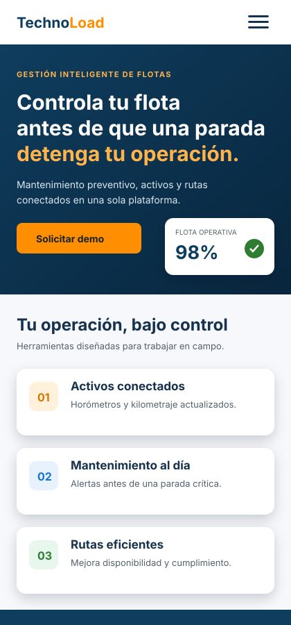

### 4.4. Web Applications UX/UI Design

El Dashboard y la Web App se diseñan a partir de los User Personas y User Stories. El administrador requiere visibilidad de activos y mantenimiento; el coordinador necesita conocer disponibilidad y asignar unidades sin perder trazabilidad.

### 4.4.1. Web Applications Wireframes

Los wireframes de TechnoLoad representan la estructura inicial de las principales vistas de la Web Application antes de aplicar los estilos visuales definitivos.

Estos diseños de baja fidelidad permiten establecer la distribución de los componentes, la jerarquía de la información y la ubicación de los principales elementos de interacción.

Los wireframes fueron elaborados considerando los principales procesos de la plataforma, permitiendo validar la organización de las vistas antes de desarrollar los mock-ups de alta fidelidad.

La estructura responde a una arquitectura de información por tareas: el Dashboard resume alertas y métricas; los módulos Assets, Maintenance, Rentals, Operations y Billing agrupan acciones relacionadas; y el detalle de cada entidad concentra historial, estado y acciones contextuales. En desktop se usa sidebar persistente y tablas con filtros; en tablet el sidebar se contrae; y en móvil se convierte en drawer, las tablas se muestran como tarjetas y los formularios se presentan en una columna.

A continuación, se presentan los wireframes correspondientes a las principales interfaces de la Web Application de TechnoLoad.

---

#### **14 Vistas Prioritarias del MVP**

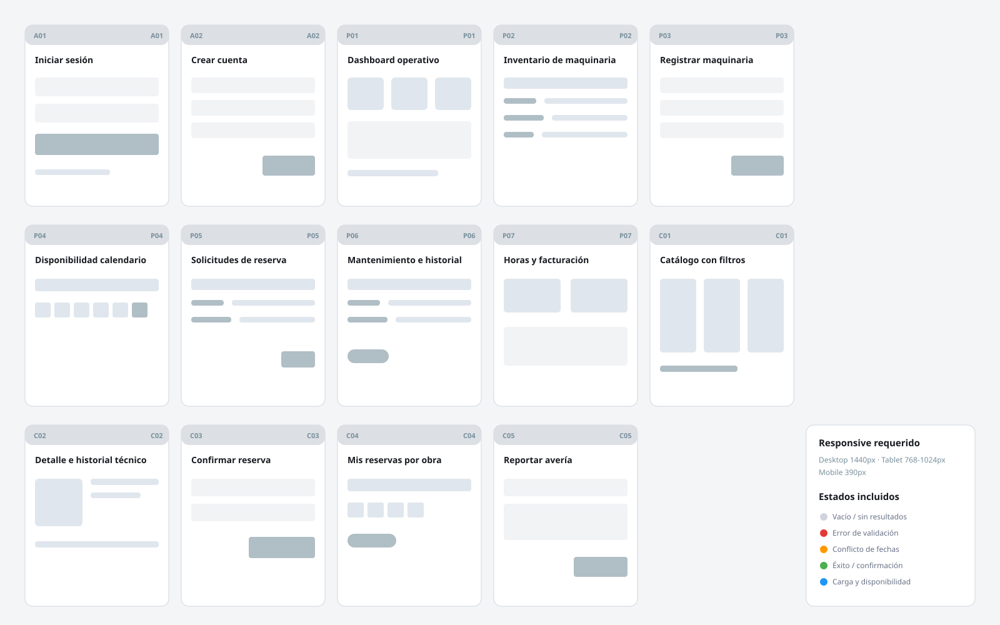

### 4.4.2. Web Applications Wireflow Diagrams

Los Wireflow Diagrams permiten representar la relación entre los wireframes y las acciones que conectan las diferentes vistas de la Web Application de TechnoLoad.

Estos diagramas muestran cómo el usuario puede desplazarse entre las interfaces para completar determinadas tareas, combinando la representación visual de las pantallas con las conexiones que describen el flujo de navegación.

Los wireflows permiten validar la continuidad de la experiencia y detectar posibles problemas de navegación antes de la implementación de la aplicación.

A continuación, se presentan los principales Wireflow Diagrams de TechnoLoad.

---

#### **Seis Wireflows Priorizados**

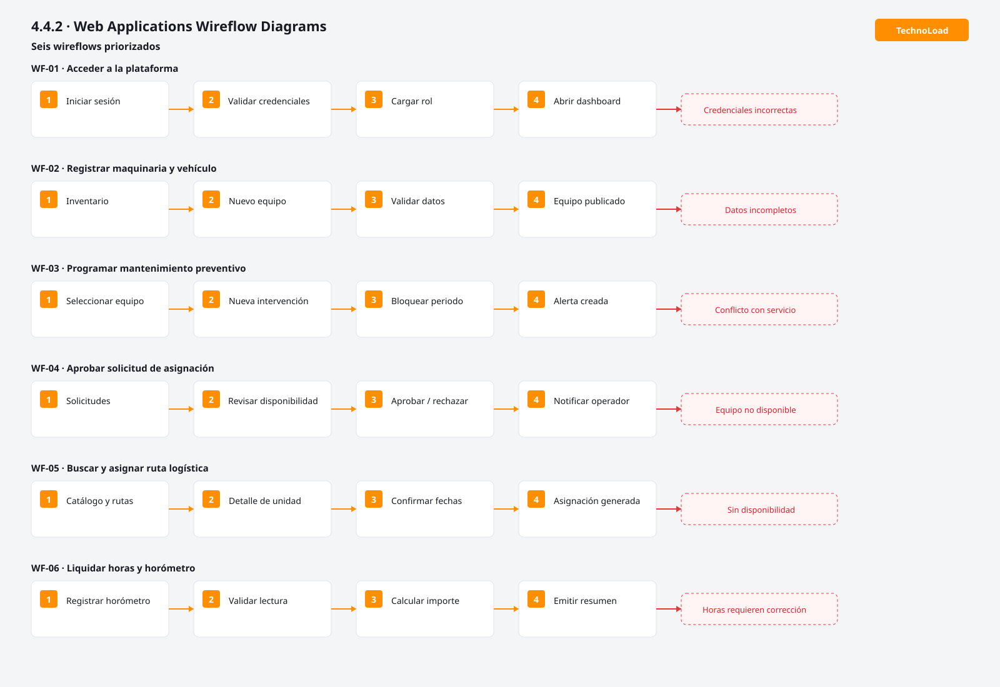

### 4.4.3. Web Applications Mock-ups

Los mock-ups presentan la propuesta visual de alta fidelidad de la Web Application de TechnoLoad.

A diferencia de los wireframes, estas interfaces incorporan la identidad visual definida en las Style Guidelines, incluyendo colores, tipografía, iconografía, componentes, botones, tarjetas, estados visuales y jerarquías de información.

Los mock-ups permiten representar de manera más cercana la apariencia final de la aplicación y sirven como referencia visual para la etapa de implementación.

La propuesta visual aplica contraste suficiente entre texto y superficies, color semántico para estados operativos, jerarquía tipográfica para distinguir indicadores y acciones, y retroalimentación visible para carga, éxito, error y ausencia de datos. Los componentes mantienen tamaños táctiles adecuados en móvil y no dependen exclusivamente del color para comunicar un estado.

A continuación, se presentan los mock-ups correspondientes a las principales vistas de la Web Application de TechnoLoad.

---

#### **Mock-ups de Alta Fidelidad**

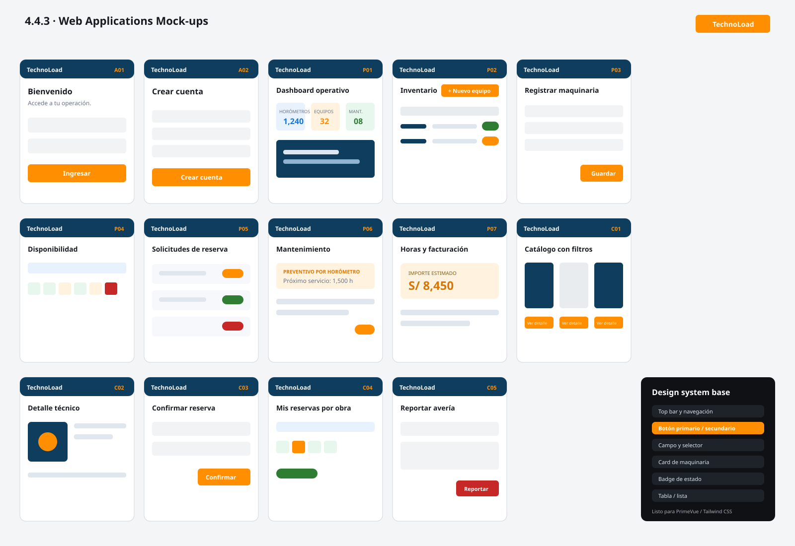

### 4.4.4. Web Applications User Flow Diagrams

Los User Flow Diagrams representan los recorridos que realizan los usuarios para completar las principales tareas dentro de la Web Application de TechnoLoad.

Estos diagramas muestran las acciones, decisiones y transiciones entre diferentes vistas, permitiendo comprender cómo cada tipo de usuario interactúa con la plataforma para alcanzar un objetivo determinado.

Los flujos fueron definidos tomando como referencia las User Stories y las necesidades identificadas para los User Personas de TechnoLoad.

A continuación, se presentan los principales User Flow Diagrams de la aplicación.

---

#### **Seis User Flows**

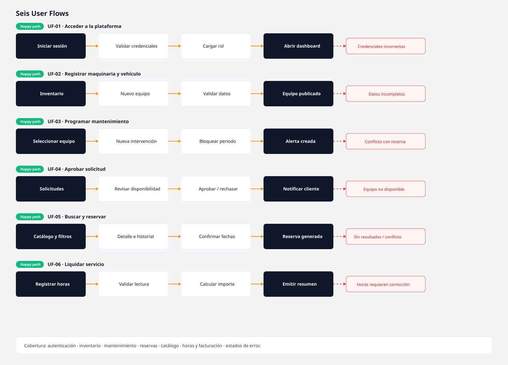

Los siguientes diagramas complementan el artefacto visual existente. Cada flujo documenta el recorrido principal y alternativas que el sistema debe resolver sin perder el trabajo del usuario.

#### Registro de maquinaria

```mermaid
flowchart TD
  start([Start]) --> assets["Open Assets module"]
  assets --> permission{"Has create permission?"}
  permission -->|No| denied["Show access denied and request access"] --> endDenied([End])
  permission -->|Yes| form["Open New Asset form"]
  form --> fill["Enter identification, type and status"]
  fill --> complete{"Required data complete?"}
  complete -->|No| validation["Highlight fields and preserve entered data"] --> fill
  complete -->|Yes| save["Save asset"]
  save --> connection{"Connection available?"}
  connection -->|No| offline["Show retry option; keep draft locally"] --> retry{"Retry now?"}
  retry -->|Yes| save
  retry -->|No| endDraft([Draft retained])
  connection -->|Yes| duplicate{"Asset code already exists?"}
  duplicate -->|Yes| duplicateError["Show duplicate-code error"] --> fill
  duplicate -->|No| created["Show success and asset detail"] --> end([End])
  classDef decision fill:#FFF3CD,stroke:#B7791F,color:#5F370E
  classDef error fill:#FDE2E2,stroke:#C53030,color:#742A2A
  class permission,complete,connection,retry,duplicate decision
  class denied,validation,offline,duplicateError error
```

#### Asignación de unidad a una operación

```mermaid
flowchart TD
  start([Start]) --> operations["Open Operations module"]
  operations --> selectOperation["Select planned operation"]
  selectOperation --> permission{"Has assignment permission?"}
  permission -->|No| denied["Show access denied"] --> endDenied([End])
  permission -->|Yes| availability["View available assets"]
  availability --> assetsFound{"Available asset found?"}
  assetsFound -->|No| noAsset["Show alternatives or reschedule option"] --> reschedule{"Reschedule operation?"}
  reschedule -->|Yes| selectOperation
  reschedule -->|No| cancelled([Operation unchanged])
  assetsFound -->|Yes| choose["Select asset and confirm assignment"]
  choose --> cancel{"Cancel assignment?"}
  cancel -->|Yes| cancelled
  cancel -->|No| connection{"Connection available?"}
  connection -->|No| offline["Show retry; do not create assignment"] --> choose
  connection -->|Yes| conflict{"Asset still available?"}
  conflict -->|No| conflictError["Show conflict and refresh availability"] --> availability
  conflict -->|Yes| assigned["Create assignment and show confirmation"] --> end([End])
  classDef decision fill:#FFF3CD,stroke:#B7791F,color:#5F370E
  classDef error fill:#FDE2E2,stroke:#C53030,color:#742A2A
  class permission,assetsFound,reschedule,cancel,connection,conflict decision
  class denied,noAsset,offline,conflictError error
```

#### Reporte de mantenimiento

```mermaid
flowchart TD
  start([Start]) --> maintenance["Open Maintenance module"]
  maintenance --> report["Select Report Maintenance"]
  report --> permission{"Has maintenance permission?"}
  permission -->|No| denied["Show access denied"] --> endDenied([End])
  permission -->|Yes| selectAsset["Select asset and enter report"]
  selectAsset --> valid{"Data complete and valid?"}
  valid -->|No| validation["Show inline validation and preserve draft"] --> selectAsset
  valid -->|Yes| severity{"Critical severity?"}
  severity -->|Yes| lock["Mark asset out of service"] --> notify["Notify operations coordinator"]
  severity -->|No| submit["Create maintenance order"]
  notify --> submit
  submit --> connection{"Connection available?"}
  connection -->|No| offline["Keep draft and offer retry"] --> submit
  connection -->|Yes| created["Show maintenance order and status"] --> end([End])
  classDef decision fill:#FFF3CD,stroke:#B7791F,color:#5F370E
  classDef error fill:#FDE2E2,stroke:#C53030,color:#742A2A
  class permission,valid,severity,connection decision
  class denied,validation,offline error
```

#### Facturación electrónica

```mermaid
flowchart TD
  start([Start]) --> completed["Open completed service operation"]
  completed --> permission{"Has billing permission?"}
  permission -->|No| denied["Show access denied"] --> endDenied([End])
  permission -->|Yes| review["Review customer, tax and amount data"]
  review --> valid{"Invoice data valid?"}
  valid -->|No| correction["Show validation errors and edit data"] --> review
  valid -->|Yes| confirm{"Confirm electronic invoice?"}
  confirm -->|No| draft["Save draft or cancel"] --> endDraft([End])
  confirm -->|Yes| connection{"Connection available?"}
  connection -->|No| offline["Queue request and show pending status"] --> endPending([Pending])
  connection -->|Yes| sunat["Submit to electronic invoicing service"]
  sunat --> accepted{"Accepted by SUNAT?"}
  accepted -->|Yes| success["Store reference and show invoice"] --> end([End])
  accepted -->|No| rejected["Show rejection reason and retry option"] --> review
  classDef decision fill:#FFF3CD,stroke:#B7791F,color:#5F370E
  classDef error fill:#FDE2E2,stroke:#C53030,color:#742A2A
  class permission,valid,confirm,connection,accepted decision
  class denied,correction,offline,rejected error
```

### 4.5 Web Applications Prototyping

En esta sección se presenta el prototipo interactivo de la Web Application de TechnoLoad, desarrollado a partir de los mock-ups y User Flow Diagrams definidos previamente.

El prototipo permite simular la navegación entre las principales vistas de la aplicación y validar la secuencia de interacción que siguen los usuarios para completar sus tareas principales. Las conexiones entre pantallas fueron definidas considerando los recorridos planteados en los User Flows y el sistema de navegación establecido para la aplicación.

Las imágenes del prototipo y de los mock-ups utilizan rutas relativas verificadas dentro de `assets/`, por lo que se renderizan tanto en GitHub como en WebStorm. El repositorio no incluye una URL pública de Figma; por ello, se conserva la evidencia visual versionada y no se declara un enlace externo no verificable.

Se consideraron las principales funcionalidades de TechnoLoad, como el acceso a la plataforma, visualización del dashboard, consulta y gestión de maquinaria, reservas, mantenimiento, disponibilidad y seguimiento de servicios.

A continuación, se presenta una captura del prototipo en funcionamiento y el enlace al video de demostración, donde se muestran los principales flujos de navegación e interacción de la aplicación.

---

#### **Prototipo Interactivo en Figma**

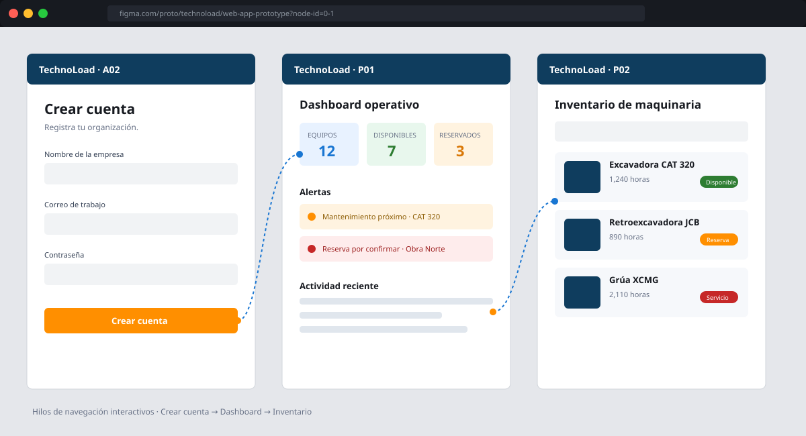

## 4.6. Domain-Driven Software Architecture

En esta sección se presenta la arquitectura de software de TechnoLoad desde una perspectiva orientada al dominio.

La propuesta arquitectónica toma como referencia los procesos de negocio identificados previamente, el Ubiquitous Language, el Big Picture Event Storming y los principales requerimientos funcionales de la plataforma.

A partir de estos elementos se identifican los principales límites del dominio, las responsabilidades del sistema y las relaciones entre los diferentes componentes que conforman la solución.

La arquitectura se documenta mediante Design-Level Event Storming y diagramas C4 a nivel de Context, Container y Component.

### 4.6.1. Design-Level Event Storming

En esta sección se presenta el Design-Level Event Storming de TechnoLoad, desarrollado a partir del Big Picture Event Storming realizado previamente.

El objetivo de esta etapa es profundizar en el dominio del problema e identificar los principales Bounded Contexts, Aggregates, Commands, Domain Events, Queries y Read Models de la solución.

A partir del análisis realizado se identificaron los siguientes Bounded Contexts principales: Fleet Management, Rental Management, Maintenance Management, Operations Management, Identity & Access Management y Profiles Management.

#### Fleet Management Bounded Context

Este Bounded Context concentra las responsabilidades relacionadas con la gestión de la maquinaria, incluyendo su registro, actualización de información, cambio de estado, consulta de inventario y disponibilidad.

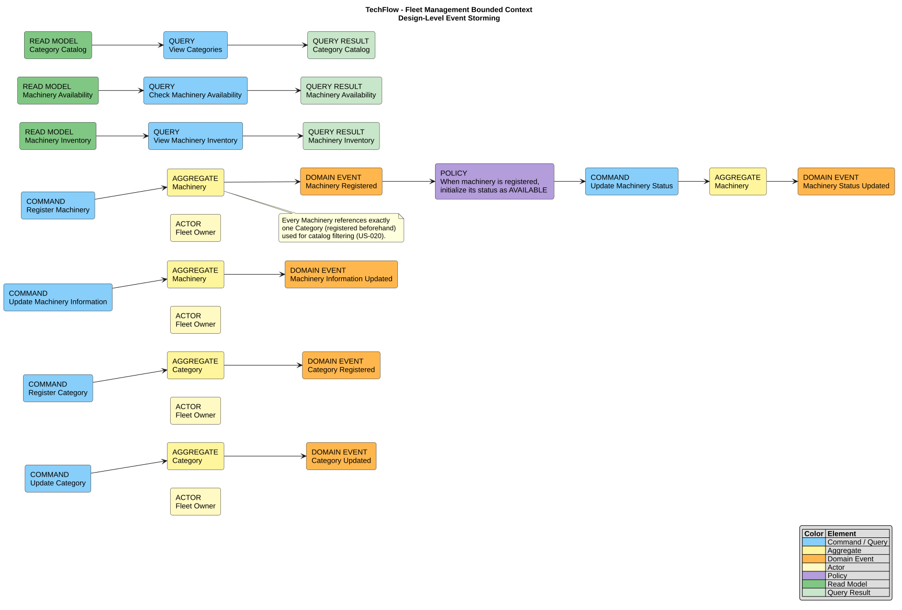

#### Rental Management Bounded Context

Este Bounded Context gestiona las solicitudes y reservas de maquinaria, incluyendo la creación de solicitudes, confirmación, cancelación y actualización de las fechas asociadas al alquiler.

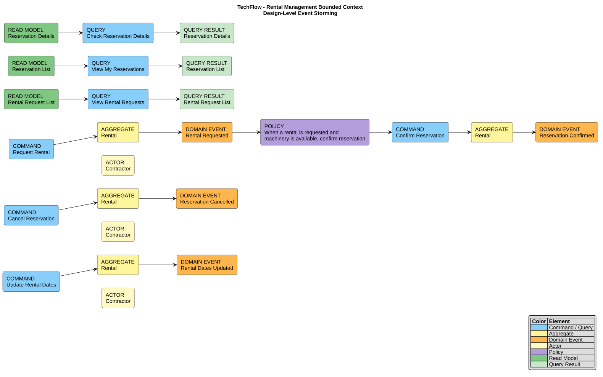

#### Maintenance Management Bounded Context

Este Bounded Context agrupa las responsabilidades relacionadas con el mantenimiento de la maquinaria. Incluye la programación y finalización de mantenimientos, el reporte de averías y la actualización del estado de mantenimiento. Su agregado principal es Maintenance y permite además consultar el historial, los mantenimientos pendientes y el detalle de cada intervención realizada.

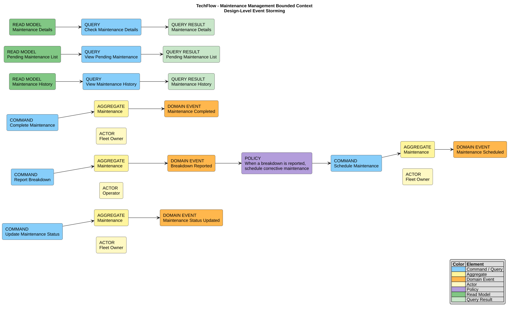

#### Operations Management Bounded Context

Este Bounded Context representa la ejecución operativa de los servicios realizados con la maquinaria. Incluye el inicio y finalización de un servicio, el registro de horas trabajadas y la validación de dichas horas. Su agregado principal es Service Operation y permite consultar el estado del servicio, el resumen de horas trabajadas y el historial de operaciones.

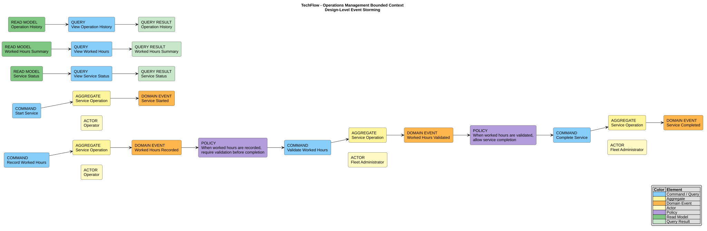

#### Identity & Access Management Bounded Context

Este Bounded Context se encarga de la gestión de identidad, autenticación y control de acceso de los usuarios de TechnoLoad. Incluye el registro de cuentas, la autenticación, la asignación de roles y el cambio de contraseñas. Su agregado principal es User Account y permite consultar los datos de la cuenta, los roles asignados y el estado de autenticación.

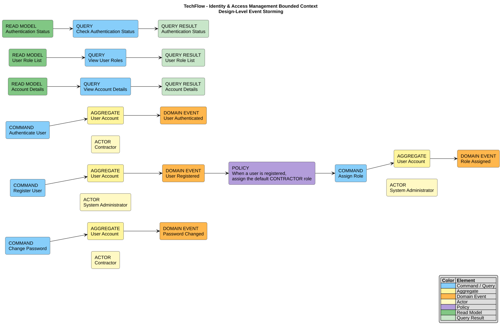

#### Profiles Management Bounded Context

Este Bounded Context gestiona la información asociada a los perfiles de los usuarios. Incluye la creación y actualización de perfiles, datos de contacto e información de la organización. Su agregado principal es Profile y permite consultar la información personal, de contacto y organizacional asociada a cada usuario.

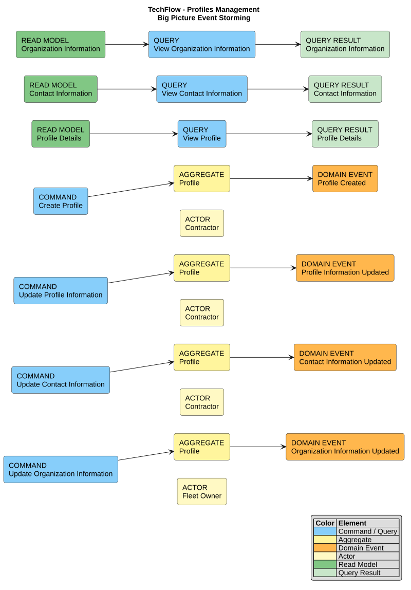

#### Policies and Business Rules

Las siguientes políticas completan el Design-Level Event Storming y definen la automatización reactiva entre agregados. Los comandos se ejecutan de forma idempotente y conservan la referencia del evento que los originó para asegurar trazabilidad.

| Triggering Domain Event | Policy | Action | Owning Bounded Context |
| :--- | :--- | :--- | :--- |
| `MeterReadingRecorded` | EvaluateMaintenanceThreshold | Crear una orden preventiva si la lectura alcanza el umbral configurado. | Maintenance Management |
| `MaintenanceOrderStarted` | LockAssetForMaintenance | Cambiar el estado del activo a `IN_MAINTENANCE` e impedir su asignación. | Fleet Management |
| `MaintenanceOrderCompleted` | RestoreAssetAvailability | Cambiar el activo a `AVAILABLE` solo si no tiene reserva ni otra intervención activa. | Fleet Management |
| `RentalRequestSubmitted` | ValidateRentalAvailability | Rechazar o aprobar la solicitud según disponibilidad y periodos superpuestos. | Rental Management |
| `RentalConfirmed` | CreateServiceOperation | Crear una operación programada asociada a la reserva confirmada. | Operations Management |
| `ServiceOperationCompleted` | RequestElectronicInvoice | Solicitar la emisión de la factura electrónica correspondiente al servicio cerrado. | Billing and Compliance |
| `PaymentConfirmed` | ActivateOrganizationSubscription | Activar o renovar la suscripción de la organización cliente. | Subscription Management |

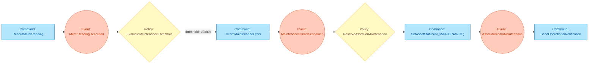
```mermaid
flowchart LR
  recordReading["Command: RecordMeterReading"] --> readingRecorded(("Event: MeterReadingRecorded"))
  readingRecorded --> thresholdPolicy{"Policy: EvaluateMaintenanceThreshold"}
  thresholdPolicy -->|threshold reached| createOrder["Command: CreateMaintenanceOrder"]
  createOrder --> orderScheduled(("Event: MaintenanceOrderScheduled"))
  orderScheduled --> reservePolicy{"Policy: ReserveAssetForMaintenance"}
  reservePolicy --> reserveAsset["Command: SetAssetStatus(IN_MAINTENANCE)"]
  reserveAsset --> assetUnavailable(("Event: AssetMarkedInMaintenance"))
  assetUnavailable --> notify["Command: SendOperationalNotification"]
  classDef command fill:#B3E5FC,stroke:#0277BD,color:#01579B
  classDef event fill:#FFCCBC,stroke:#D84315,color:#BF360C
  classDef policy fill:#FFF9C4,stroke:#F9A825,color:#6D4C41
  class recordReading,createOrder,reserveAsset,notify command
  class readingRecorded,orderScheduled,assetUnavailable event
  class thresholdPolicy,reservePolicy policy
```

### 4.6.2. Software Architecture Context Diagram

El Software Architecture Context Diagram presenta a TechnoLoad como el sistema principal y muestra su relación con los principales tipos de usuario identificados en el proyecto.

El Fleet Administrator utiliza TechnoLoad para gestionar la maquinaria, reservas, mantenimiento y operaciones asociadas al servicio. Por otro lado, el Contractor o Site Manager utiliza la plataforma para consultar maquinaria disponible, solicitar alquileres y realizar seguimiento de los servicios contratados.

Este nivel del modelo C4 permite visualizar el alcance general de TechnoLoad y las principales interacciones entre el sistema y sus usuarios.

---

#### **Diagrama de Contexto (Modelo C4 - Nivel 1)**

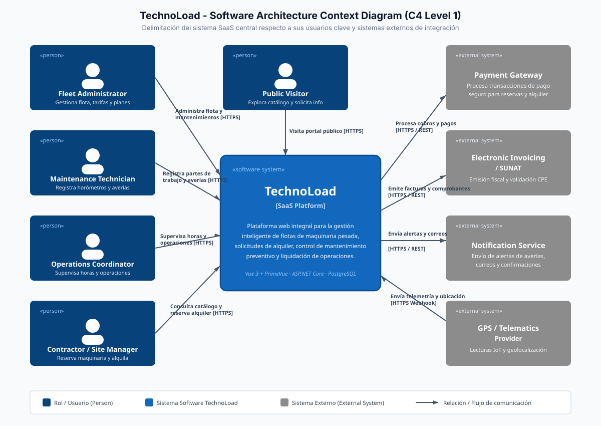

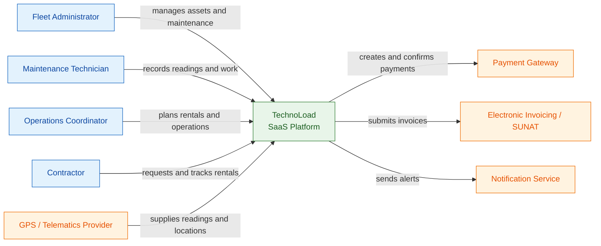
```mermaid
flowchart LR
  fleetAdmin["Fleet Administrator"] -->|manages assets and maintenance| technoLoad["TechnoLoad<br/>SaaS Platform"]
  technician["Maintenance Technician"] -->|records readings and work| technoLoad
  coordinator["Operations Coordinator"] -->|plans rentals and operations| technoLoad
  contractor["Contractor"] -->|requests and tracks rentals| technoLoad
  technoLoad -->|creates and confirms payments| paymentGateway["Payment Gateway"]
  technoLoad -->|submits invoices| sunat["Electronic Invoicing / SUNAT"]
  technoLoad -->|sends alerts| notificationService["Notification Service"]
  telemetryProvider["GPS / Telematics Provider"] -->|supplies readings and locations| technoLoad
  classDef person fill:#E3F2FD,stroke:#1565C0,color:#0D47A1
  classDef system fill:#E8F5E9,stroke:#2E7D32,color:#1B5E20
  classDef external fill:#FFF3E0,stroke:#EF6C00,color:#E65100
  class fleetAdmin,technician,coordinator,contractor person
  class technoLoad system
  class paymentGateway,sunat,notificationService,telemetryProvider external
```

### 4.6.3. Software Architecture Container Diagram

El Software Architecture Container Diagram muestra la estructura de alto nivel de TechnoLoad y la distribución de responsabilidades entre los principales elementos de la solución.

La solución separa la Landing Web Application, destinada a contenido público y captación comercial, de la Single Page Application (SPA), destinada a usuarios autenticados. Ambas consumen una REST API implementada con ASP.NET Core; la API persiste la información en PostgreSQL y se integra con los servicios externos requeridos por el dominio.

Los usuarios interactúan con la aplicación web mediante un navegador. La Single Page Application consume los servicios proporcionados por la REST API utilizando HTTPS y JSON. A su vez, la API gestiona el acceso a la información persistida mediante Spring Data JPA.

Este nivel del modelo C4 permite visualizar las principales decisiones tecnológicas de la solución y la comunicación entre los containers que conforman TechnoLoad.

---

#### **Diagrama de Contenedores (Modelo C4 - Nivel 2)**

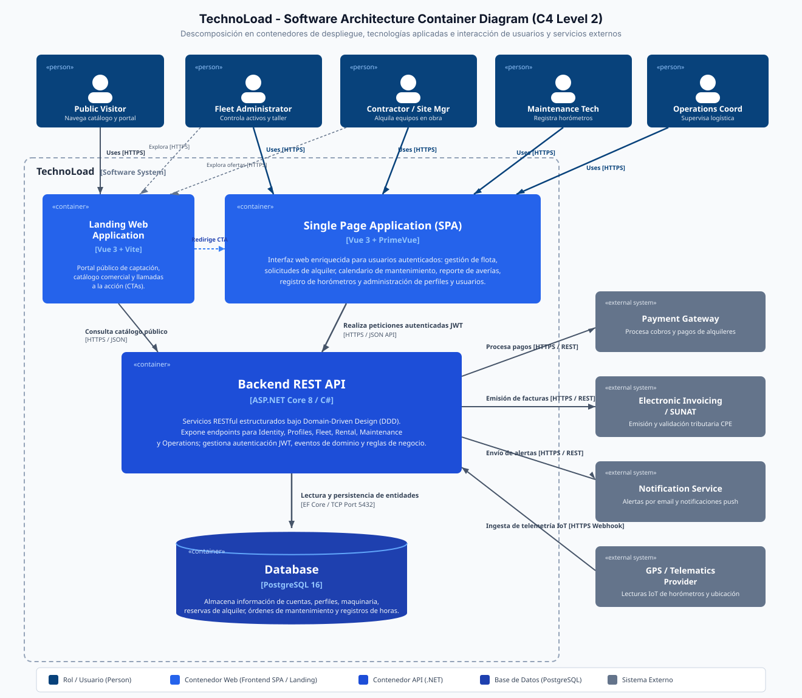

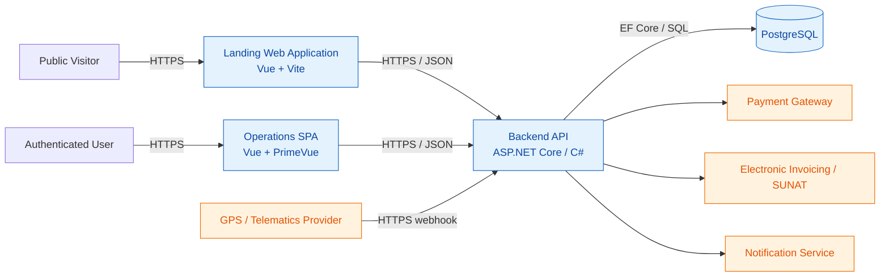
```mermaid
flowchart LR
  visitor["Public Visitor"] -->|HTTPS| landing["Landing Web Application<br/>Vue + Vite"]
  user["Authenticated User"] -->|HTTPS| spa["Operations SPA<br/>Vue + PrimeVue"]
  landing -->|HTTPS / JSON| api["Backend API<br/>ASP.NET Core / C#"]
  spa -->|HTTPS / JSON| api
  api -->|EF Core / SQL| database[("PostgreSQL")]
  api --> payments["Payment Gateway"]
  api --> sunat["Electronic Invoicing / SUNAT"]
  api --> notifications["Notification Service"]
  telemetry["GPS / Telematics Provider"] -->|HTTPS webhook| api
  classDef container fill:#E3F2FD,stroke:#1565C0,color:#0D47A1
  classDef external fill:#FFF3E0,stroke:#EF6C00,color:#E65100
  class landing,spa,api,database container
  class payments,sunat,notifications,telemetry external
```

### 4.6.4. Software Architecture Components Diagrams

En esta sección se presentan los Component Diagrams de TechnoLoad, los cuales permiten visualizar la descomposición interna del container correspondiente a la REST API.

En primer lugar, se muestra la organización general de los principales Bounded Contexts identificados durante el proceso de Domain-Driven Design. Posteriormente, se presenta el detalle interno de cada Bounded Context, mostrando sus principales capas y responsabilidades.

La estructura interna sigue una separación entre Interfaces Layer, Application Layer, Domain Layer e Infrastructure Layer, permitiendo mantener separadas las responsabilidades del dominio y los aspectos técnicos de la implementación.

---

#### **API Application Component Diagram**

El siguiente diagrama muestra la organización general de la REST API de TechnoLoad y los principales Bounded Contexts que forman parte de la solución: Identity & Access Management, Profiles Management, Fleet Management, Rental Management, Maintenance Management y Operations Management.

También se representan las principales relaciones entre los contextos, la Single Page Application y la base de datos.

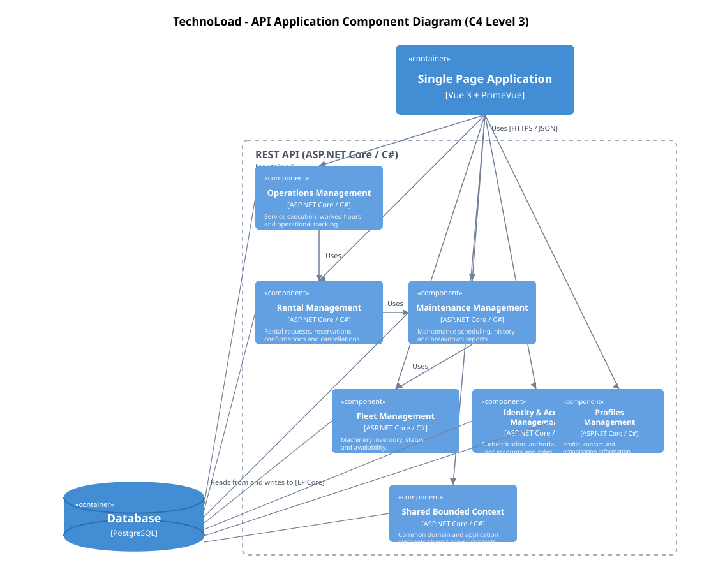

#### **Identity & Access Management Bounded Context Component Diagram**

Este diagrama representa la estructura interna del Identity & Access Management Bounded Context. Este contexto se encarga de la autenticación, autorización, gestión de cuentas, roles y credenciales de los usuarios de TechnoLoad.

La Domain Layer contiene el aggregate User Account y las reglas asociadas al control de identidad y acceso.

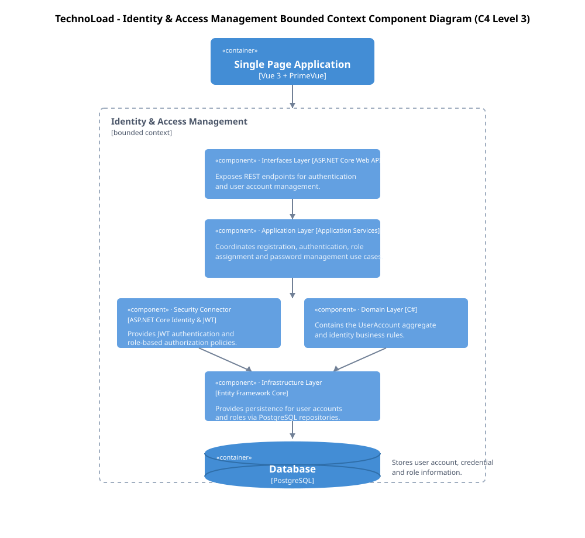

#### **Profiles Management Bounded Context Component Diagram**

Este diagrama muestra la estructura interna del Profiles Management Bounded Context, encargado de gestionar la información del perfil, datos de contacto e información de las organizaciones asociadas a los usuarios.

La Domain Layer contiene el aggregate Profile y sus reglas de negocio correspondientes.

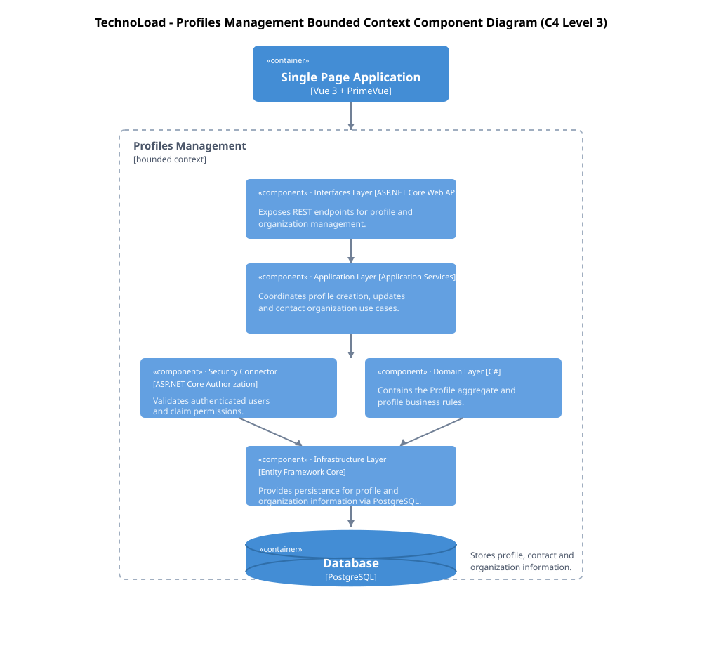  

#### Backend API Component Diagrams (maintainable source)

Los siguientes diagramas especifican la estructura de los contenedores principales. Cada controlador depende de un *application service*; los agregados y reglas permanecen en la capa de dominio, mientras que los repositorios e integraciones pertenecen a infraestructura.

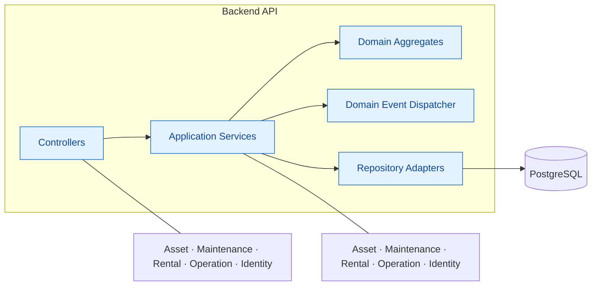
```mermaid
flowchart LR
  subgraph api["Backend API"]
    controllers["Controllers"] --> services["Application Services"]
    services --> domain["Domain Aggregates"]
    services --> dispatcher["Domain Event Dispatcher"]
    services --> repositories["Repository Adapters"]
  end
  controllers --- controllerTypes["Asset · Maintenance · Rental · Operation · Identity"]
  services --- serviceTypes["Asset · Maintenance · Rental · Operation · Identity"]
  repositories --> database[("PostgreSQL")]
  classDef layer fill:#E3F2FD,stroke:#1565C0,color:#0D47A1
  class controllers,services,domain,dispatcher,repositories layer
```

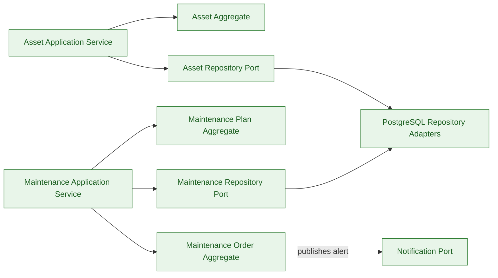
```mermaid
flowchart LR
  assetService["Asset Application Service"] --> asset["Asset Aggregate"]
  assetService --> assetRepository["Asset Repository Port"]
  maintenanceService["Maintenance Application Service"] --> maintenancePlan["Maintenance Plan Aggregate"]
  maintenanceService --> maintenanceOrder["Maintenance Order Aggregate"]
  maintenanceService --> maintenanceRepository["Maintenance Repository Port"]
  maintenanceOrder -->|publishes alert| notificationPort["Notification Port"]
  assetRepository --> adapters["PostgreSQL Repository Adapters"]
  maintenanceRepository --> adapters
  classDef component fill:#E8F5E9,stroke:#2E7D32,color:#1B5E20
  class assetService,asset,assetRepository,maintenanceService,maintenancePlan,maintenanceOrder,maintenanceRepository,notificationPort,adapters component
```

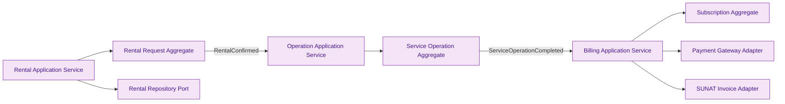
```mermaid
flowchart LR
  rentalService["Rental Application Service"] --> rental["Rental Request Aggregate"]
  rentalService --> rentalRepository["Rental Repository Port"]
  rental -->|RentalConfirmed| operationService["Operation Application Service"]
  operationService --> operation["Service Operation Aggregate"]
  operation -->|ServiceOperationCompleted| billingService["Billing Application Service"]
  billingService --> subscription["Subscription Aggregate"]
  billingService --> paymentAdapter["Payment Gateway Adapter"]
  billingService --> sunatAdapter["SUNAT Invoice Adapter"]
  classDef component fill:#F3E5F5,stroke:#7B1FA2,color:#4A148C
  class rentalService,rental,rentalRepository,operationService,operation,billingService,subscription,paymentAdapter,sunatAdapter component
```

## 4.7 Software Object-Oriented Design

El diseño orientado a objetos de TechnoLoad representa las principales clases, interfaces, enumeraciones, atributos, operaciones y relaciones que conforman cada Bounded Context. Los modelos mantienen los límites definidos mediante Domain-Driven Design y utilizan identificadores para referenciar agregados pertenecientes a otros contextos, evitando el acoplamiento directo entre ellos.

### 4.7.1 Class Diagrams

#### Canonical Domain Class Diagram

Este diagrama consolida las clases del alcance actual. Todos los nombres de tipos se expresan en inglés con `PascalCase`; atributos y operaciones utilizan `camelCase`. Los límites entre agregados se mantienen con identificadores (`UUID`) en lugar de referencias de objetos entre contextos.

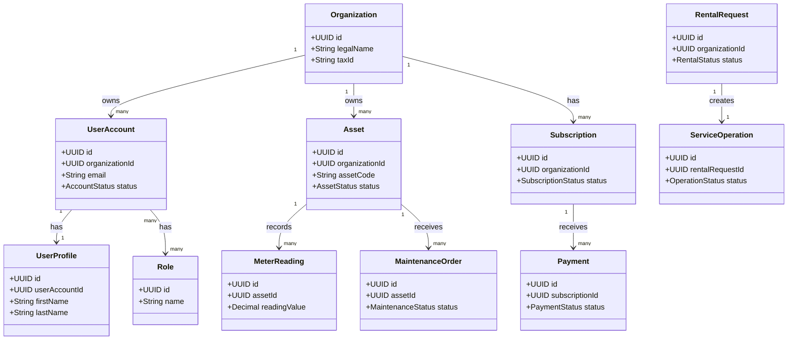
```mermaid
classDiagram
  class Organization {
    +UUID id
    +String legalName
    +String taxId
  }
  class UserAccount {
    +UUID id
    +UUID organizationId
    +String email
    +AccountStatus status
  }
  class UserProfile {
    +UUID id
    +UUID userAccountId
    +String firstName
    +String lastName
  }
  class Role {
    +UUID id
    +String name
  }
  class Asset {
    +UUID id
    +UUID organizationId
    +String assetCode
    +AssetStatus status
  }
  class MeterReading {
    +UUID id
    +UUID assetId
    +Decimal readingValue
  }
  class MaintenanceOrder {
    +UUID id
    +UUID assetId
    +MaintenanceStatus status
  }
  class RentalRequest {
    +UUID id
    +UUID organizationId
    +RentalStatus status
  }
  class ServiceOperation {
    +UUID id
    +UUID rentalRequestId
    +OperationStatus status
  }
  class Subscription {
    +UUID id
    +UUID organizationId
    +SubscriptionStatus status
  }
  class Payment {
    +UUID id
    +UUID subscriptionId
    +PaymentStatus status
  }
  Organization "1" --> "many" UserAccount : owns
  UserAccount "1" --> "1" UserProfile : has
  UserAccount "many" --> "many" Role : has
  Organization "1" --> "many" Asset : owns
  Asset "1" --> "many" MeterReading : records
  Asset "1" --> "many" MaintenanceOrder : receives
  RentalRequest "1" --> "1" ServiceOperation : creates
  Organization "1" --> "many" Subscription : has
  Subscription "1" --> "many" Payment : receives
```

#### Fleet Management Bounded Context Class Diagram

El diagrama de Fleet Management representa el agregado Machinery, responsable del registro, actualización, clasificación, ubicación, estado y disponibilidad de la maquinaria. También incluye el objeto de valor MachineryLocation, las enumeraciones correspondientes y los servicios e interfaces necesarios para coordinar y persistir las operaciones del contexto.

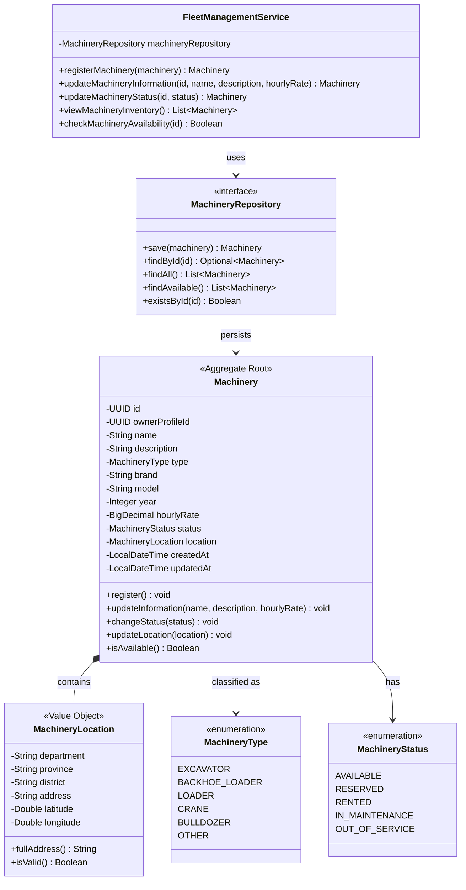
```mermaid
classDiagram
    class FleetManagementService {
        -MachineryRepository machineryRepository
        +registerMachinery(machinery) Machinery
        +updateMachineryInformation(id, name, description, hourlyRate) Machinery
        +updateMachineryStatus(id, status) Machinery
        +viewMachineryInventory() List~Machinery~
        +checkMachineryAvailability(id) Boolean
    }
    class MachineryRepository {
        <<interface>>
        +save(machinery) Machinery
        +findById(id) Optional~Machinery~
        +findAll() List~Machinery~
        +findAvailable() List~Machinery~
        +existsById(id) Boolean
    }
    class Machinery {
        <<Aggregate Root>>
        -UUID id
        -UUID ownerProfileId
        -String name
        -String description
        -MachineryType type
        -String brand
        -String model
        -Integer year
        -BigDecimal hourlyRate
        -MachineryStatus status
        -MachineryLocation location
        -LocalDateTime createdAt
        -LocalDateTime updatedAt
        +register() void
        +updateInformation(name, description, hourlyRate) void
        +changeStatus(status) void
        +updateLocation(location) void
        +isAvailable() Boolean
    }
    class MachineryLocation {
        <<Value Object>>
        -String department
        -String province
        -String district
        -String address
        -Double latitude
        -Double longitude
        +fullAddress() String
        +isValid() Boolean
    }
    class MachineryType {
        <<enumeration>>
        EXCAVATOR
        BACKHOE_LOADER
        LOADER
        CRANE
        BULLDOZER
        OTHER
    }
    class MachineryStatus {
        <<enumeration>>
        AVAILABLE
        RESERVED
        RENTED
        IN_MAINTENANCE
        OUT_OF_SERVICE
    }

    FleetManagementService --> MachineryRepository : uses
    MachineryRepository --> Machinery : persists
    Machinery *-- MachineryLocation : contains
    Machinery --> MachineryType : classified as
    Machinery --> MachineryStatus : has
```

#### Rental Management Bounded Context Class Diagram

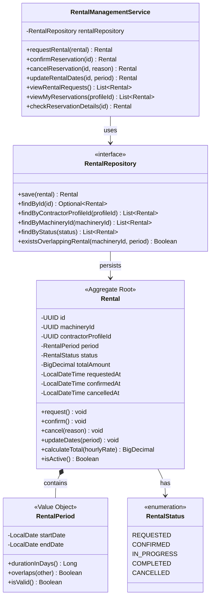
```mermaid
classDiagram
    class RentalManagementService {
        -RentalRepository rentalRepository
        +requestRental(rental) Rental
        +confirmReservation(id) Rental
        +cancelReservation(id, reason) Rental
        +updateRentalDates(id, period) Rental
        +viewRentalRequests() List~Rental~
        +viewMyReservations(profileId) List~Rental~
        +checkReservationDetails(id) Rental
    }
    class RentalRepository {
        <<interface>>
        +save(rental) Rental
        +findById(id) Optional~Rental~
        +findByContractorProfileId(profileId) List~Rental~
        +findByMachineryId(machineryId) List~Rental~
        +findByStatus(status) List~Rental~
        +existsOverlappingRental(machineryId, period) Boolean
    }
    class Rental {
        <<Aggregate Root>>
        -UUID id
        -UUID machineryId
        -UUID contractorProfileId
        -RentalPeriod period
        -RentalStatus status
        -BigDecimal totalAmount
        -LocalDateTime requestedAt
        -LocalDateTime confirmedAt
        -LocalDateTime cancelledAt
        +request() void
        +confirm() void
        +cancel(reason) void
        +updateDates(period) void
        +calculateTotal(hourlyRate) BigDecimal
        +isActive() Boolean
    }
    class RentalPeriod {
        <<Value Object>>
        -LocalDate startDate
        -LocalDate endDate
        +durationInDays() Long
        +overlaps(other) Boolean
        +isValid() Boolean
    }
    class RentalStatus {
        <<enumeration>>
        REQUESTED
        CONFIRMED
        IN_PROGRESS
        COMPLETED
        CANCELLED
    }

    RentalManagementService --> RentalRepository : uses
    RentalRepository --> Rental : persists
    Rental *-- RentalPeriod : contains
    Rental --> RentalStatus : has
```

#### Maintenance Management Bounded Context Class Diagram

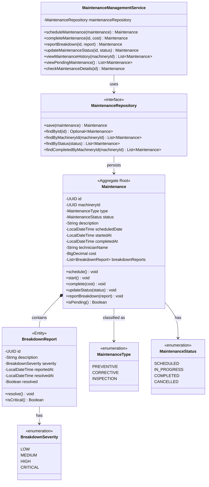
```mermaid
classDiagram
    class MaintenanceManagementService {
        -MaintenanceRepository maintenanceRepository
        +scheduleMaintenance(maintenance) Maintenance
        +completeMaintenance(id, cost) Maintenance
        +reportBreakdown(id, report) Maintenance
        +updateMaintenanceStatus(id, status) Maintenance
        +viewMaintenanceHistory(machineryId) List~Maintenance~
        +viewPendingMaintenance() List~Maintenance~
        +checkMaintenanceDetails(id) Maintenance
    }
    class MaintenanceRepository {
        <<interface>>
        +save(maintenance) Maintenance
        +findById(id) Optional~Maintenance~
        +findByMachineryId(machineryId) List~Maintenance~
        +findByStatus(status) List~Maintenance~
        +findCompletedByMachineryId(machineryId) List~Maintenance~
    }
    class Maintenance {
        <<Aggregate Root>>
        -UUID id
        -UUID machineryId
        -MaintenanceType type
        -MaintenanceStatus status
        -String description
        -LocalDateTime scheduledDate
        -LocalDateTime startedAt
        -LocalDateTime completedAt
        -String technicianName
        -BigDecimal cost
        -List~BreakdownReport~ breakdownReports
        +schedule() void
        +start() void
        +complete(cost) void
        +updateStatus(status) void
        +reportBreakdown(report) void
        +isPending() Boolean
    }
    class BreakdownReport {
        <<Entity>>
        -UUID id
        -String description
        -BreakdownSeverity severity
        -LocalDateTime reportedAt
        -LocalDateTime resolvedAt
        -Boolean resolved
        +resolve() void
        +isCritical() Boolean
    }
    class MaintenanceType {
        <<enumeration>>
        PREVENTIVE
        CORRECTIVE
        INSPECTION
    }
    class MaintenanceStatus {
        <<enumeration>>
        SCHEDULED
        IN_PROGRESS
        COMPLETED
        CANCELLED
    }
    class BreakdownSeverity {
        <<enumeration>>
        LOW
        MEDIUM
        HIGH
        CRITICAL
    }

    MaintenanceManagementService --> MaintenanceRepository : uses
    MaintenanceRepository --> Maintenance : persists
    Maintenance *-- BreakdownReport : contains
    Maintenance --> MaintenanceType : classified as
    Maintenance --> MaintenanceStatus : has
    BreakdownReport --> BreakdownSeverity : has
```

#### Operations Management Bounded Context Class Diagram

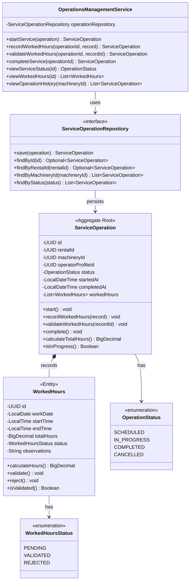
```mermaid
classDiagram
    class OperationsManagementService {
        -ServiceOperationRepository operationRepository
        +startService(operation) ServiceOperation
        +recordWorkedHours(operationId, record) ServiceOperation
        +validateWorkedHours(operationId, recordId) ServiceOperation
        +completeService(operationId) ServiceOperation
        +viewServiceStatus(id) OperationStatus
        +viewWorkedHours(id) List~WorkedHours~
        +viewOperationHistory(machineryId) List~ServiceOperation~
    }
    class ServiceOperationRepository {
        <<interface>>
        +save(operation) ServiceOperation
        +findById(id) Optional~ServiceOperation~
        +findByRentalId(rentalId) Optional~ServiceOperation~
        +findByMachineryId(machineryId) List~ServiceOperation~
        +findByStatus(status) List~ServiceOperation~
    }
    class ServiceOperation {
        <<Aggregate Root>>
        -UUID id
        -UUID rentalId
        -UUID machineryId
        -UUID operatorProfileId
        -OperationStatus status
        -LocalDateTime startedAt
        -LocalDateTime completedAt
        -List~WorkedHours~ workedHours
        +start() void
        +recordWorkedHours(record) void
        +validateWorkedHours(recordId) void
        +complete() void
        +calculateTotalHours() BigDecimal
        +isInProgress() Boolean
    }
    class WorkedHours {
        <<Entity>>
        -UUID id
        -LocalDate workDate
        -LocalTime startTime
        -LocalTime endTime
        -BigDecimal totalHours
        -WorkedHoursStatus status
        -String observations
        +calculateHours() BigDecimal
        +validate() void
        +reject() void
        +isValidated() Boolean
    }
    class OperationStatus {
        <<enumeration>>
        SCHEDULED
        IN_PROGRESS
        COMPLETED
        CANCELLED
    }
    class WorkedHoursStatus {
        <<enumeration>>
        PENDING
        VALIDATED
        REJECTED
    }

    OperationsManagementService --> ServiceOperationRepository : uses
    ServiceOperationRepository --> ServiceOperation : persists
    ServiceOperation *-- WorkedHours : records
    ServiceOperation --> OperationStatus : has
    WorkedHours --> WorkedHoursStatus : has
```

#### Identity & Access Management Bounded Context Class Diagram

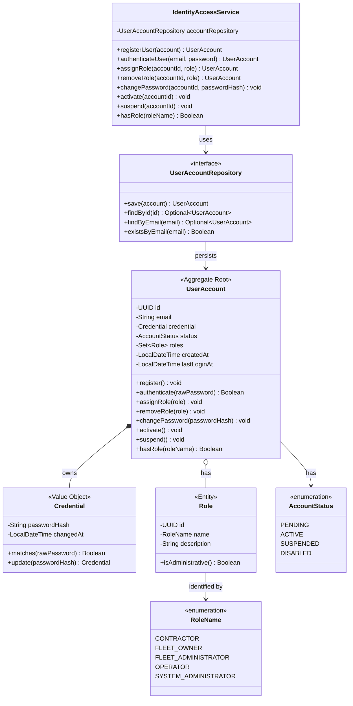
```mermaid
classDiagram
    class IdentityAccessService {
        -UserAccountRepository accountRepository
        +registerUser(account) UserAccount
        +authenticateUser(email, password) UserAccount
        +assignRole(accountId, role) UserAccount
        +removeRole(accountId, role) UserAccount
        +changePassword(accountId, passwordHash) void
        +activate(accountId) void
        +suspend(accountId) void
        +hasRole(roleName) Boolean
    }
    class UserAccountRepository {
        <<interface>>
        +save(account) UserAccount
        +findById(id) Optional~UserAccount~
        +findByEmail(email) Optional~UserAccount~
        +existsByEmail(email) Boolean
    }
    class UserAccount {
        <<Aggregate Root>>
        -UUID id
        -String email
        -Credential credential
        -AccountStatus status
        -Set~Role~ roles
        -LocalDateTime createdAt
        -LocalDateTime lastLoginAt
        +register() void
        +authenticate(rawPassword) Boolean
        +assignRole(role) void
        +removeRole(role) void
        +changePassword(passwordHash) void
        +activate() void
        +suspend() void
        +hasRole(roleName) Boolean
    }
    class Credential {
        <<Value Object>>
        -String passwordHash
        -LocalDateTime changedAt
        +matches(rawPassword) Boolean
        +update(passwordHash) Credential
    }
    class Role {
        <<Entity>>
        -UUID id
        -RoleName name
        -String description
        +isAdministrative() Boolean
    }
    class AccountStatus {
        <<enumeration>>
        PENDING
        ACTIVE
        SUSPENDED
        DISABLED
    }
    class RoleName {
        <<enumeration>>
        CONTRACTOR
        FLEET_OWNER
        FLEET_ADMINISTRATOR
        OPERATOR
        SYSTEM_ADMINISTRATOR
    }

    IdentityAccessService --> UserAccountRepository : uses
    UserAccountRepository --> UserAccount : persists
    UserAccount *-- Credential : owns
    UserAccount o-- Role : has
    UserAccount --> AccountStatus : has
    Role --> RoleName : identified by
```

#### Profiles Management Bounded Context Class Diagram

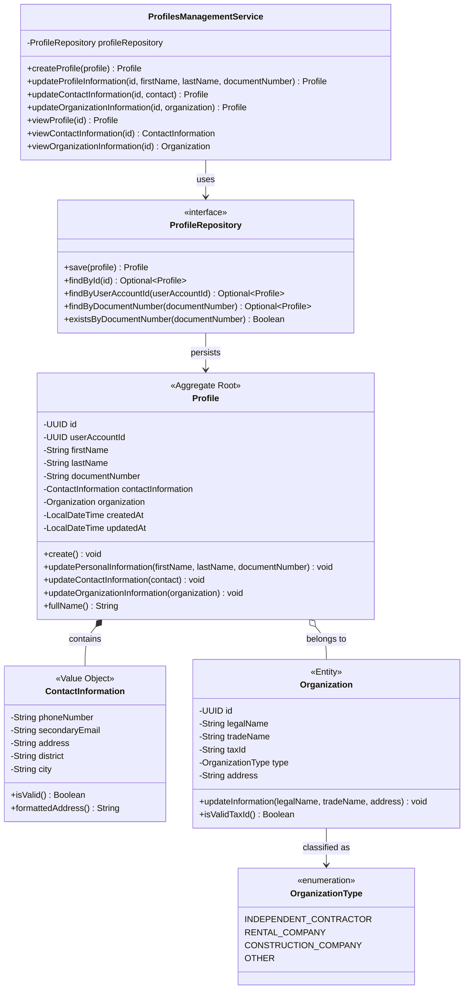
```mermaid
classDiagram
    class ProfilesManagementService {
        -ProfileRepository profileRepository
        +createProfile(profile) Profile
        +updateProfileInformation(id, firstName, lastName, documentNumber) Profile
        +updateContactInformation(id, contact) Profile
        +updateOrganizationInformation(id, organization) Profile
        +viewProfile(id) Profile
        +viewContactInformation(id) ContactInformation
        +viewOrganizationInformation(id) Organization
    }
    class ProfileRepository {
        <<interface>>
        +save(profile) Profile
        +findById(id) Optional~Profile~
        +findByUserAccountId(userAccountId) Optional~Profile~
        +findByDocumentNumber(documentNumber) Optional~Profile~
        +existsByDocumentNumber(documentNumber) Boolean
    }
    class Profile {
        <<Aggregate Root>>
        -UUID id
        -UUID userAccountId
        -String firstName
        -String lastName
        -String documentNumber
        -ContactInformation contactInformation
        -Organization organization
        -LocalDateTime createdAt
        -LocalDateTime updatedAt
        +create() void
        +updatePersonalInformation(firstName, lastName, documentNumber) void
        +updateContactInformation(contact) void
        +updateOrganizationInformation(organization) void
        +fullName() String
    }
    class ContactInformation {
        <<Value Object>>
        -String phoneNumber
        -String secondaryEmail
        -String address
        -String district
        -String city
        +isValid() Boolean
        +formattedAddress() String
    }
    class Organization {
        <<Entity>>
        -UUID id
        -String legalName
        -String tradeName
        -String taxId
        -OrganizationType type
        -String address
        +updateInformation(legalName, tradeName, address) void
        +isValidTaxId() Boolean
    }
    class OrganizationType {
        <<enumeration>>
        INDEPENDENT_CONTRACTOR
        RENTAL_COMPANY
        CONSTRUCTION_COMPANY
        OTHER
    }

    ProfilesManagementService --> ProfileRepository : uses
    ProfileRepository --> Profile : persists
    Profile *-- ContactInformation : contains
    Profile o-- Organization : belongs to
    Organization --> OrganizationType : classified as
```

## 4.8. Database Design

### 4.8.1. Database Diagrams

El modelo relacional usa nombres plurales en `snake_case`, atributos en `snake_case` y claves foráneas con el sufijo `_id`. Las relaciones preservan la trazabilidad de activos, lecturas, mantenimiento, alquileres, operaciones, suscripciones, pagos y facturación electrónica.

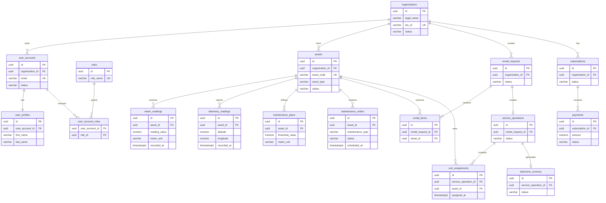
```mermaid
erDiagram
  organizations ||--o{ user_accounts : owns
  user_accounts ||--|| user_profiles : has
  user_accounts ||--o{ user_account_roles : receives
  roles ||--o{ user_account_roles : grants
  organizations ||--o{ assets : owns
  assets ||--o{ meter_readings : receives
  assets ||--o{ telemetry_readings : reports
  assets ||--o{ maintenance_plans : follows
  assets ||--o{ maintenance_orders : receives
  organizations ||--o{ rental_requests : creates
  rental_requests ||--|{ rental_items : contains
  assets ||--o{ rental_items : reserves
  rental_requests ||--o| service_operations : creates
  service_operations ||--o{ unit_assignments : contains
  assets ||--o{ unit_assignments : uses
  organizations ||--o{ subscriptions : has
  subscriptions ||--o{ payments : receives
  service_operations ||--o| electronic_invoices : generates
  organizations {
    uuid id PK
    varchar legal_name
    varchar tax_id UK
    varchar status
  }
  user_accounts {
    uuid id PK
    uuid organization_id FK
    varchar email UK
    varchar status
  }
  user_profiles {
    uuid id PK
    uuid user_account_id FK
    varchar first_name
    varchar last_name
  }
  roles {
    uuid id PK
    varchar role_name UK
  }
  user_account_roles {
    uuid user_account_id FK
    uuid role_id FK
  }
  assets {
    uuid id PK
    uuid organization_id FK
    varchar asset_code UK
    varchar asset_type
    varchar status
  }
  meter_readings {
    uuid id PK
    uuid asset_id FK
    numeric reading_value
    varchar meter_unit
    timestamptz recorded_at
  }
  telemetry_readings {
    uuid id PK
    uuid asset_id FK
    numeric latitude
    numeric longitude
    timestamptz recorded_at
  }
  maintenance_plans {
    uuid id PK
    uuid asset_id FK
    numeric threshold_value
    varchar meter_unit
  }
  maintenance_orders {
    uuid id PK
    uuid asset_id FK
    varchar maintenance_type
    varchar status
    timestamptz scheduled_at
  }
  rental_requests {
    uuid id PK
    uuid organization_id FK
    varchar status
  }
  rental_items {
    uuid id PK
    uuid rental_request_id FK
    uuid asset_id FK
  }
  service_operations {
    uuid id PK
    uuid rental_request_id FK
    varchar status
  }
  unit_assignments {
    uuid id PK
    uuid service_operation_id FK
    uuid asset_id FK
    timestamptz assigned_at
  }
  subscriptions {
    uuid id PK
    uuid organization_id FK
    varchar status
  }
  payments {
    uuid id PK
    uuid subscription_id FK
    numeric amount
    varchar status
  }
  electronic_invoices {
    uuid id PK
    uuid service_operation_id FK
    varchar status
  }
```

### 4.8.2. Script DDL

El script de creación completo, con restricciones e índices, se encuentra en [database/schema.sql](database/schema.sql).

# Capítulo V: Product Implementation, Validation & Deployment

## 5.1. Software Configuration Management

La gestión de configuración de software de TechnoLoad establece las herramientas, convenciones y procedimientos utilizados por el equipo para mantener consistencia y trazabilidad durante el ciclo de vida de los productos digitales.

Para ello, se utilizan herramientas de gestión de proyectos, diseño UX/UI, desarrollo de software, documentación, control de versiones y despliegue. Git y GitHub permiten registrar los cambios realizados por los integrantes del equipo, mientras que GitFlow, Conventional Commits y Semantic Versioning proporcionan un esquema organizado para la evolución del código fuente.

  ### 5.1.1. Software Development Environment Configuration
  
El desarrollo de TechnoLoad requiere diferentes herramientas que permiten cubrir las actividades de gestión del proyecto, especificación de requisitos, diseño UX/UI, implementación, documentación, control de versiones y despliegue.

Las principales herramientas utilizadas o previstas para el proyecto son las siguientes:

| Área | Herramienta / Tecnología | Propósito en TechnoLoad | Referencia |
|---|---|---|---|
| Project Management | [Trello / Jira / YouTrack - seleccionar el utilizado] | Organización del Product Backlog, Sprints, User Stories y tareas del equipo. | [COLOCAR URL DEL BOARD] |
| Requirements Management | GitHub + Markdown | Documentación colaborativa de requisitos, User Stories, Product Backlog y demás artefactos del informe. | https://github.com/TechnoLoad-TechFlow/TechFlow |
| UX Research | UXPressia | Elaboración de User Personas, Empathy Maps, User Journey Maps e Impact Maps. | https://uxpressia.com/ |
| UX/UI Design | Figma | Elaboración de Wireframes, Mock-ups y Prototipos de la experiencia web. | https://www.figma.com/ |
| Version Control | Git | Control distribuido de versiones del código fuente y documentación. | https://git-scm.com/ |
| Source Code Management | GitHub | Almacenamiento de repositorios, gestión de ramas, commits y colaboración del equipo. | https://github.com/ |
| Development Environment | JetBrains Rider | Edición, ejecución y depuración del código fuente. | https://www.jetbrains.com/rider/ |
| Frontend Runtime | Node.js | Entorno de ejecución utilizado para instalar y administrar las dependencias del Frontend Web Application. | https://nodejs.org/ |
| Frontend Framework | Vue | Framework utilizado para desarrollar la Frontend Web Application. | https://vuejs.org/ |
| Frontend Build Tool | Vite | Herramienta utilizada para gestionar el entorno de desarrollo y generar el build de producción del frontend. | https://vite.dev/ |
| UI Components | PrimeVue | Biblioteca de componentes basada en Material Design utilizada para construir la interfaz de usuario. | https://primevue.org/ |
| Backend Framework | ASP.NET Core | Framework utilizado para implementar los RESTful Web Services de TechnoLoad. | https://dotnet.microsoft.com/apps/aspnet |
| Programming Language | C# | Lenguaje utilizado para implementar la lógica del lado servidor. | https://learn.microsoft.com/dotnet/csharp/ |
| ORM | Entity Framework Core | Gestión de persistencia y acceso a datos desde los Web Services. | https://learn.microsoft.com/ef/core/ |
| DBMS | PostgreSQL | Sistema gestor de base de datos relacional utilizado para almacenar la información del dominio. | https://www.postgresql.org/ |
| API Documentation | OpenAPI / Swagger | Documentación e interacción con los endpoints de los RESTful Web Services. | https://swagger.io/ |
| Software Documentation | Markdown | Elaboración del Project Report y documentación técnica dentro de GitHub. | https://www.markdownguide.org/ |
| Software Deployment | GitHub Pages | Publicación del Landing Page y del prototipo de Frontend Web Application. | https://pages.github.com/ |

La combinación de estas herramientas permite mantener un entorno común entre los integrantes del equipo. El frontend es desarrollado con Vue y PrimeVue, mientras que los servicios del lado servidor se implementan mediante ASP.NET Core, Entity Framework Core y C#. PostgreSQL proporciona la persistencia relacional de la información correspondiente a activos, lecturas, mantenimientos y operaciones.

 ESTA MAL LLAMADOOO ACAAA ;)


  ### 5.1.2. Source Code Management
  
El código fuente y la documentación de TechnoLoad se administran mediante Git y GitHub. El uso de control de versiones permite mantener la trazabilidad de cada modificación realizada por el equipo, identificar la participación de los integrantes y recuperar versiones anteriores cuando sea necesario.

Los repositorios correspondientes a los productos de TechnoLoad son:

| Producto | Repositorio |
|---|---|
| Project Report | https://github.com/TechnoLoad-TechFlow/TechFlow |
| Landing Page | https://github.com/TechnoLoad-TechFlow/TechFlow |
| Frontend Web Application | https://github.com/TechnoLoad-TechFlow/TechFlow |

El repositorio correspondiente a los RESTful Web Services deberá incluir tanto el código fuente de la solución como los archivos correspondientes a las pruebas unitarias y de integración.

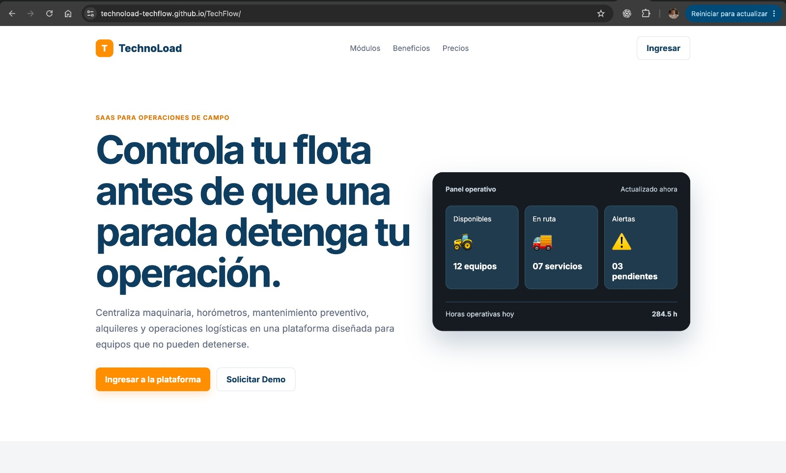

#### GitFlow Workflow

Para organizar el desarrollo se establece GitFlow como flujo de trabajo de control de versiones.

Las ramas principales consideradas son:

| Branch | Propósito |
|---|---|
| `main` | Contiene las versiones estables y preparadas para producción. |
| `develop` | Integra los cambios terminados correspondientes al desarrollo de la siguiente versión. |
| `feature/*` | Desarrollo de nuevas características o modificaciones específicas. |
| `release/*` | Preparación y estabilización de una nueva versión antes de integrarla en `main`. |
| `hotfix/*` | Correcciones urgentes sobre una versión publicada en producción. |

Los feature branches deben utilizar nombres descriptivos escritos en inglés y en formato kebab-case.

Ejemplos:

`feature/fleet-management`

`feature/maintenance-alerts`

`feature/asset-registration`

`feature/reservation-management`

`feature/landing-page`

Las ramas de release utilizarán Semantic Versioning:

`release/v1.0.0`

`release/v1.1.0`

Las correcciones urgentes seguirán el mismo esquema:

`hotfix/v1.0.1`

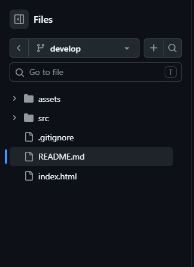

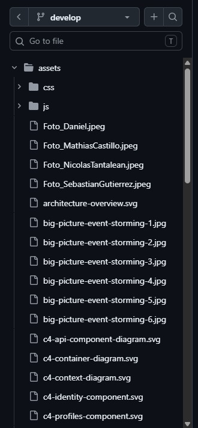

#### Semantic Versioning

Las versiones de TechnoLoad seguirán el esquema:

`MAJOR.MINOR.PATCH`

- `MAJOR`: cambios incompatibles con versiones anteriores.
- `MINOR`: nuevas funcionalidades compatibles con versiones anteriores.
- `PATCH`: correcciones de errores compatibles con versiones anteriores.

Ejemplos:

`v1.0.0`

`v1.1.0`

`v1.1.1`

#### Conventional Commits

Los mensajes de commit siguen la estructura:

`<type>(<scope>): <description>`

Los principales tipos utilizados son:

| Type | Uso |
|---|---|
| `feat` | Nueva funcionalidad. |
| `fix` | Corrección de un error. |
| `docs` | Cambios en documentación. |
| `style` | Cambios de formato que no modifican comportamiento. |
| `refactor` | Reestructuración interna del código. |
| `test` | Creación o modificación de pruebas. |
| `chore` | Tareas de mantenimiento o configuración. |

Ejemplos aplicados al proyecto:

`feat(fleet): add asset registration`

`feat(maintenance): add preventive maintenance alerts`

`feat(operations): add unit assignment`

`fix(reservations): prevent duplicate reservations`

`docs(readme): add needfinding artifacts`

`docs(chapter5): add software configuration management`

Con estas convenciones se busca facilitar la comprensión del historial de cambios y mantener consistencia entre los diferentes repositorios del proyecto.


  ### 5.1.3. Source Code Style Guide & Conventions
  
TechnoLoad adopta convenciones de programación para mantener un código consistente, legible y mantenible entre todos los integrantes del equipo.

Los nombres utilizados en código fuente deben escribirse en inglés, evitando abreviaturas ambiguas y manteniendo una terminología consistente con el Ubiquitous Language del proyecto.

#### HTML

Para HTML5 se aplican las siguientes convenciones:

- Utilizar elementos semánticos como `header`, `nav`, `main`, `section`, `article` y `footer`.
- Escribir etiquetas y atributos en minúsculas.
- Utilizar comillas dobles para atributos.
- Mantener una indentación consistente.
- Incluir el atributo `alt` en imágenes.
- Utilizar atributos ARIA cuando sea necesario para mejorar la accesibilidad.
- Evitar elementos HTML utilizados únicamente con fines visuales cuando exista una alternativa semántica.

#### CSS

Las clases CSS deben utilizar nombres descriptivos en inglés y formato kebab-case.

Ejemplos:

`.asset-card`

`.maintenance-alert`

`.fleet-dashboard`

`.primary-button`

`.reservation-form`

Se debe evitar el uso de nombres poco descriptivos como:

`.box1`

`.red-button`

`.section2`

Los estilos deben mantener coherencia con el Design System establecido en el Capítulo IV.

#### JavaScript

Para JavaScript se establecen las siguientes convenciones:

- Variables y funciones: `camelCase`.
- Clases y componentes: `PascalCase`.
- Constantes globales: `UPPER_SNAKE_CASE`.
- Utilizar `const` por defecto y `let` cuando el valor requiera modificación.
- Evitar `var`.
- Mantener funciones pequeñas y orientadas a una responsabilidad específica.

Ejemplos:

`assetList`

`getAvailableAssets()`

`MAX_RETRY_ATTEMPTS`

#### Vue

Los componentes Vue deben utilizar nombres descriptivos y mantener una responsabilidad claramente delimitada.

Ejemplos:

`AssetList.vue`

`AssetDetail.vue`

`MaintenanceBoard.vue`

`ReservationForm.vue`

`FleetDashboard.vue`

Los componentes reutilizables deben separarse de las vistas específicas del dominio y mantenerse organizados según el módulo al que pertenecen.

#### C#

Para C# se adoptan las convenciones recomendadas por Microsoft:

- Clases, interfaces, métodos y propiedades públicas: `PascalCase`.
- Variables locales y parámetros: `camelCase`.
- Interfaces con prefijo `I`.
- Namespaces escritos en PascalCase.
- Clases con una responsabilidad claramente definida.

Ejemplos:

`AssetController`

`MaintenanceService`

`ReservationRepository`

`IAssetRepository`

`GetAvailableAssetsAsync()`

#### RESTful Web Services

Los endpoints deben representar recursos mediante sustantivos escritos en inglés y mantener una estructura consistente.

Ejemplos:

`GET /api/v1/assets`

`POST /api/v1/assets`

`GET /api/v1/assets/{id}`

`GET /api/v1/maintenance-orders`

`POST /api/v1/reservations`

Se utilizarán correctamente los códigos de estado HTTP, entre ellos:

`200 OK`

`201 Created`

`400 Bad Request`

`401 Unauthorized`

`404 Not Found`

`409 Conflict`

`500 Internal Server Error`

#### Internationalization and Accessibility

La experiencia web deberá considerar internacionalización mediante los idiomas:

`en_US` — English

`es_419` — Latin American Spanish

El idioma predeterminado será inglés.

Asimismo, el Landing Page y la Frontend Web Application deberán considerar prácticas de accesibilidad como HTML semántico, atributos ARIA, navegación mediante teclado, texto alternativo en imágenes, contraste adecuado y feedback comprensible para las acciones del usuario.

---

  ### 5.1.4. Software Deployment Configuration
  
El proceso de despliegue de TechnoLoad comprende la publicación independiente de los tres productos principales que conforman la solución: Landing Page, Frontend Web Application y RESTful Web Services.

| Producto | Tecnología | Branch de producción | Plataforma |
|---|---|---|---|
| Landing Page | HTML5, CSS3 y JavaScript | `main` | GitHub Pages |
| Frontend Web Application | HTML5, CSS3 y JavaScript (Vanilla ES6) | `main` | GitHub Pages |
| RESTful Web Services | ASP.NET Core, Entity Framework Core y C# | `main` | [COLOCAR PLATAFORMA] |
| Database | PostgreSQL | — | [COLOCAR PLATAFORMA] |

#### Landing Page Deployment

El proceso de publicación del Landing Page seguirá el siguiente flujo:

`feature branch → develop → validation → main → build/publication → production`

Los archivos HTML, CSS, JavaScript y assets son obtenidos desde el repositorio correspondiente y publicados en la plataforma seleccionada.

**Production URL:**

[https://technoload-techflow.github.io/TechFlow/](https://technoload-techflow.github.io/TechFlow/)

#### Frontend Web Application Deployment

El Frontend Web Application será construido con Vue y Vite.

El flujo de despliegue será:

`feature branch → develop → validation → main → npm install → npm run build → deployment`

El resultado del build de producción será publicado en la plataforma seleccionada.

Las variables dependientes del entorno, especialmente la URL base de los RESTful Web Services, deberán configurarse mediante variables de entorno y no directamente en el código fuente.

**Production URL:**

[https://technoload-techflow.github.io/TechFlow/](https://technoload-techflow.github.io/TechFlow/)

#### RESTful Web Services Deployment

Los Web Services desarrollados con ASP.NET Core serán construidos y publicados desde el repositorio correspondiente.

El proceso considera:

1. Obtener la versión estable desde `main`.
2. Restaurar las dependencias del proyecto.
3. Ejecutar las pruebas correspondientes.
4. Generar el build de producción.
5. Configurar las variables de entorno.
6. Establecer la conexión con PostgreSQL.
7. Publicar el servicio en la plataforma seleccionada.
8. Verificar los endpoints mediante Swagger/OpenAPI.

Las credenciales, cadenas de conexión y demás información sensible no serán almacenadas directamente en el repositorio.

**RESTful API Base URL:**

[COLOCAR URL DEL WEB SERVICE]

**Swagger / OpenAPI URL:**

[COLOCAR URL DE SWAGGER]

#### Database Deployment

La base de datos PostgreSQL deberá estar configurada en un entorno accesible desde los RESTful Web Services.

La cadena de conexión será administrada mediante variables de entorno. Las migraciones generadas mediante Entity Framework Core permitirán mantener sincronizada la estructura de la base de datos entre los diferentes entornos.

---

## 5.2. Landing Page, Services & Applications Implementation

La entrega visible de TechnoLoad se compone de una Landing Page pública y una Web Application prototipo. La Landing Page comunica la propuesta de valor y conduce al visitante hacia las funcionalidades de gestión de flota, alquileres y mantenimiento. La Web Application implementa una demostración navegable con datos simulados y persistencia local en el navegador.

| Producto | URL / acceso | Estado |
|---|---|---|
| Landing Page | [https://technoload-techflow.github.io/TechFlow/](https://technoload-techflow.github.io/TechFlow/) | Publicada en GitHub Pages |
| Frontend Web Application (prototipo) | [index.html](index.html) | Disponible en el repositorio; se ejecuta directamente en un navegador |

La URL pública proporcionada corresponde a la Landing Page. El prototipo de la Web Application está contenido en el mismo repositorio en `index.html`, junto con sus estilos, módulos JavaScript y datos simulados. Una URL de producción independiente para este prototipo podrá agregarse cuando se publique en GitHub Pages u otra plataforma.

### 5.2.1. Sprint 1

### 5.2.1.1. Sprint Planning 1

El Sprint 1 comprendió el periodo del 8 al 19 de septiembre de 2026. Su objetivo principal fue implementar y publicar una primera versión funcional de la Landing Page de MaquiControl, además de consolidar los requisitos, artefactos UX/UI y decisiones de arquitectura requeridos para los siguientes incrementos del producto.

| Campo | Detalle |
|---|---|
| Sprint | Sprint 1 |
| Fecha de inicio | 08/09/2026 |
| Fecha de finalización | 19/09/2026 |
| Duración | 12 días |
| Objetivo | Definir y documentar la solución para la gestión de maquinaria pesada y transporte/logística, consolidando los requerimientos, los segmentos objetivo y la propuesta de valor del producto.|
| User Stories consideradas | US-013 Mostrar propuesta de valor y US-014 Mostrar información por segmento son referencias del documento de sprints original; confirmar si fueron las seleccionadas para TechFlow. El Product Backlog de TechnoLoad incluye también US-001 a US-045 y TS-001 a TS-008|
| Productos incluidos | Landing Page e informe técnico del proyecto. |
| Productos planificados para siguientes Sprints | Aplicación web, servicios/API y componentes de persistencia, según el alcance y la arquitectura finalmente aprobados. |

## 5.2.1.2. Aspect Leaders and Collaborators

La siguiente matriz conserva la estructura de la tabla original. Los integrantes se actualizaron con los nombres que aparecen en el informe de TechnoLoad. Como no se dispone de una matriz de responsabilidades ni de autores Git verificados para este sprint, los roles y usuarios se dejan pendientes de confirmación.
Se utiliza `L` para líder y `C` para colaborador.

| Team Member | GitHub Username / Git Author | Landing Page / Interfaz | UX/UI Design | Requirements & Report | Architecture & Database | SCM & Deployment |
|---|---|:---:|:---:|:---:|:---:|:---:|
| Tantalean Granda, Nicolas | [Confirmar usuario Git] | [ ] | [ ] | [ ] | [ ] | [ ] |
| Gutiérrez Lizarbe, Wilmer Sebastián | [Confirmar usuario Git] | [ ] | [ ] | [ ] | [ ] | [ ] |
| Castillo Guevara, Mathias Alejandro | [Confirmar usuario Git] | [ ] | [ ] | [ ] | [ ] | [ ] |
| Díaz Caruzo, Edgard Daniel | [Confirmar usuario Git] | [ ] | [ ] | [ ] | [ ] | [ ] |

#### 5.2.1.3. Sprint Backlog 1

El Product Backlog del informe TechnoLoad define historias de usuario relacionadas con la gestión de maquinaria y disponibilidad, reservas, consulta de catálogo, control de horas, facturación, página de presentación, autenticación, mantenimiento, suscripciones y servicios de API. La tabla siguiente mantiene el formato de la tabla de sprints original y adapta las tareas al dominio del proyecto. Las estimaciones, responsables y estados deben contrastarse con el tablero real, ya que el informe general no permite verificar qué tareas fueron asignadas y completadas específicamente en el Sprint 1.

| Sprint | Story ID | Story Title | Task ID | Task Title | Task Description | Estimation (Hours) | Assigned To | Status |
|---|---|---|---|---|---|---:|---|---|
| Sprint 1 | US-013 | Mostrar propuesta de valor | S1-T01 | Definir propuesta de valor del producto | Documentar la propuesta de valor para empresas de alquiler de maquinaria pesada y empresas de transporte y logística. | [Confirmar] | [Confirmar] | [Confirmar] |
| Sprint 1 | US-014 | Mostrar información por segmento | S1-T02 | Organizar contenido por segmento | Estructurar la información para los segmentos objetivo identificados en el informe: empresas de alquiler de maquinaria pesada y empresas de transporte y logística. | [Confirmar] | [Confirmar] | [Confirmar] |
| Sprint 1 | US-001 | Registrar maquinaria | S1-T03 | Definir datos de maquinaria | Especificar los datos necesarios para registrar una maquinaria y mantener actualizado el inventario. | [Confirmar] | [Confirmar] | [Confirmar] |
| Sprint 1 | US-002 | Consultar disponibilidad | S1-T04 | Definir reglas de disponibilidad | Documentar cómo se consultará la disponibilidad por fecha y cómo se distinguirán los estados de disponibilidad, reserva y mantenimiento. | [Confirmar] | [Confirmar] | [Confirmar] |
| Sprint 1 | US-003 | Gestionar mantenimiento | S1-T05 | Definir estados de mantenimiento | Establecer reglas para impedir nuevas reservas cuando una maquinaria no se encuentre operativa. | [Confirmar] | [Confirmar] | [Confirmar] |
| Sprint 1 | US-004 | Crear una reserva | S1-T06 | Documentar el flujo de reserva | Definir el flujo para que un contratista solicite una maquinaria disponible durante un periodo determinado. | [Confirmar] | [Confirmar] | [Confirmar] |
| Sprint 1 | — | Documentación técnica | S1-T07 | Consolidar documentación del proyecto | Organizar investigación, requerimientos, UX/UI, arquitectura, diseño orientado a objetos y diseño de datos que figuran en el informe del proyecto. | [Confirmar] | Equipo TechFlow | [Confirmar] |

Durante el Sprint 1, la trazabilidad debe documentarse con el tablero de trabajo, las ramas, los commits y las revisiones que realmente se hayan utilizado. No se cuenta con evidencia suficiente para afirmar que existió o no un tablero público de GitHub Projects durante este sprint.

- [Repositorio del proyecto](https://github.com/TechnoLoad-TechFlow/TechFlow)
- [Página de presentación, si corresponde al despliegue actual](https://technoload-techflow.github.io/TechFlow/)

#### 5.2.1.4. Development Evidence for Sprint Review

La siguiente tabla conserva las columnas de la evidencia de desarrollo del documento original. El material compartido no contiene el historial de commits del repositorio de TechFlow por sprint, por lo que no se sustituyen los identificadores por commits inventados. Se dejan filas preparadas para registrar las evidencias reales.

| Repository | Branch | Commit ID | Commit Message | Commit Message Body | Committed on |
|---|---|---|---|---|---|
| `TechnoLoad-TechFlow/TechFlow` | [Confirmar] | [Agregar commit real] | [Agregar mensaje real] | [Agregar body o indicar que no existe] | [Fecha real] |
| `TechnoLoad-TechFlow/TechFlow` | [Confirmar] | [Agregar commit real] | [Agregar mensaje real] | [Agregar body o indicar que no existe] | [Fecha real] |
| `TechnoLoad-TechFlow/TechFlow` | [Confirmar] | [Agregar commit real] | [Agregar mensaje real] | [Agregar body o indicar que no existe] | [Fecha real] |
| `TechnoLoad-TechFlow/TechFlow` | [Confirmar] | [Agregar commit real] | [Agregar mensaje real] | [Agregar body o indicar que no existe] | [Fecha real] |
| `TechnoLoad-TechFlow/TechFlow` | [Confirmar] | [Agregar commit real] | [Agregar mensaje real] | [Agregar body o indicar que no existe] | [Fecha real] |
| `TechnoLoad-TechFlow/TechFlow` | [Confirmar] | [Agregar commit real] | [Agregar mensaje real] | [Agregar body o indicar que no existe] | [Fecha real] |

Las evidencias de desarrollo que conviene incluir son los cambios en la documentación de requerimientos, los artefactos UX/UI, la definición de arquitectura y los archivos de la aplicación que hayan sido efectivamente modificados en el sprint. Deben agregarse enlaces a los commits verificables y no únicamente descripciones generales.

#### 5.2.1.5. Execution Evidence for Sprint Review

La evidencia de ejecución debe mostrar el resultado que puede comprobarse al revisar el incremento del Sprint 1. El informe de TechnoLoad describe la problemática y las necesidades de los segmentos objetivo, así como historias de usuario para registrar maquinaria, consultar disponibilidad, gestionar mantenimiento y crear reservas. Estas definiciones no demuestran por sí solas que todas esas funcionalidades estén implementadas.

- **URL de ejecución:** [Agregar la URL exacta del incremento de TechFlow, si existe].
- **Tecnologías:** completar con las tecnologías efectivamente utilizadas en la versión ejecutable del sprint.
- **Resultado de verificación:** [Registrar el resultado real de la prueba o revisión].


La imagen anterior conserva el espacio de evidencia de la plantilla original. Sustituir la ruta por una captura existente del proyecto o agregar la captura al repositorio. No debe dejarse una imagen de otro proyecto como evidencia de TechFlow.

#### 5.2.1.6. Services Documentation Evidence for Sprint Review

En el informe de TechnoLoad se incluyen historias técnicas para consultar maquinarias mediante API (`TS-001`), registrar reservas mediante API (`TS-002`), validar conflictos de reservas (`TS-003`), validar datos (`TS-004`), autenticar endpoints con JWT (`TS-005`), registrar horómetros por lotes (`TS-006`), integrar facturación fiscal (`TS-007`) y notificar eventos de reserva mediante webhooks (`TS-008`). Estas historias forman parte del backlog y no prueban que los endpoints ya estén implementados.

| Elemento | Evidencia para completar |
|---|---|
| API o servicio disponible | [Indicar servicio y estado real] |
| URL base | [Agregar URL si el servicio está desplegado] |
| Documentación OpenAPI/Swagger | [Agregar enlace o indicar que todavía no aplica] |
| Endpoints implementados | [Listar únicamente los endpoints comprobados] |
| Pruebas de servicios | [Agregar resultados o capturas] |

Si durante el Sprint 1 solo se definieron los requerimientos y la arquitectura, debe indicarse que la documentación de servicios no aplica todavía al incremento, sin afirmar que existen servicios desplegados.

#### 5.2.1.7. Software Deployment Evidence for Sprint Review

La página de presentación del proyecto aparece referenciada en el material de TechFlow mediante la siguiente dirección. Debe verificarse que corresponda a la versión y al repositorio que se presentarán como evidencia del Sprint 1. La publicación de una página de presentación no demuestra por sí sola el despliegue de una API o de una base de datos.

| Elemento | Detalle |
|---|---|
| Producto desplegado | Página de presentación de TechFlow, sujeto a confirmar el nombre oficial del producto |
| Plataforma | GitHub Pages, si se mantiene la configuración actual |
| Repositorio | [TechnoLoad-TechFlow/TechFlow](https://github.com/TechnoLoad-TechFlow/TechFlow) |
| URL pública | [https://technoload-techflow.github.io/TechFlow/](https://technoload-techflow.github.io/TechFlow/) |
| Protocolo | HTTPS |
| Estado verificado | [Comprobar antes de entregar] |
| Última versión identificada | [Agregar etiqueta o versión real] |


La captura debe mostrar la URL y la versión efectivamente desplegada. Si la ruta de la imagen no existe en el repositorio de TechFlow, reemplazarla por una captura real o actualizar el nombre del archivo.

El informe de TechnoLoad identifica como integrantes a Nicolas Tantalean Granda, Wilmer Sebastián Gutiérrez Lizarbe, Mathias Alejandro Castillo Guevara y Edgard Daniel Díaz Caruzo. Para completar el análisis de colaboración del Sprint 1, se deben revisar los commits y normalizar las identidades que pertenezcan a una misma persona. No se deben trasladar al equipo TechFlow los nombres, usuarios ni conteos de commits que aparecían en el documento de MaquiControl.

| Integrante / Identidad Git | Commits en el informe | Commits en la aplicación | Commits en otros repositorios | Total identificado |
|---|---:|---:|---:|---:|
| Nicolas Tantalean Granda | [Contar] | [Contar] | [Contar] | [Calcular] |
| Wilmer Sebastián Gutiérrez Lizarbe | [Contar] | [Contar] | [Contar] | [Calcular] |
| Mathias Alejandro Castillo Guevara | [Contar] | [Contar] | [Contar] | [Calcular] |
| Edgard Daniel Díaz Caruzo | [Contar] | [Contar] | [Contar] | [Calcular] |

Las cantidades deben obtenerse del historial real del repositorio y no constituyen por sí solas una medición completa de la calidad o complejidad de las contribuciones. También deben considerarse reuniones, coordinación, elaboración de artefactos visuales, revisión de contenidos y demás actividades realizadas fuera del repositorio.


---


## 5.3. Validation Interviews
## 5.4. Video About-the-Product

# Conclusiones


1. **Validación del dominio y modelo Lean UX:**  
   A través de la formulación del *Lean UX Canvas*, los *Problem Statements* y los *Assumptions*, se logró alinear los objetivos del negocio con las necesidades críticas de los segmentos objetivo (empresas de alquiler de maquinaria pesada y transporte de carga). La investigación cualitativa evidenció que la falta de centralización operativa genera tiempos de inactividad de hasta 32% en sobrecostos por mantenimiento reactivo, validando nuestra hipótesis central de que una plataforma SaaS accesible y basada en control de horómetros/kilometraje resuelve una fricción operativa determinante en el mercado peruano.
2. **Elicitación y especificación de requisitos:**  
   El proceso de *Needfinding*, soportado por entrevistas a profundidad y artefactos como *User Personas*, *Empathy Maps* y *User Journey Maps*, permitió estructurar un *Product Backlog* priorizado por valor de negocio. La descomposición de necesidades en historias de usuario (*User Stories*) con criterios de aceptación en sintaxis Gherkin garantiza una trazabilidad comprobable entre los dolores del usuario y las funcionalidades del sistema, asegurando además la correcta delimitación de historias para el sitio web estático (Landing Page) y la API RESTful.
3. **Consistencia de diseño y arquitectura de software:**  
   La definición temprana de las *Style Guidelines* y la *Information Architecture* permitió diseñar interfaces web responsivas e intuitivas tanto en escritorio como en dispositivos móviles (wireframes y mock-ups en Figma). A nivel arquitectural, la aplicación de *Domain-Driven Design (DDD)* mediante *EventStorming* y el modelo de diagramado *C4* (Contexto, Contenedor y Componentes) sienta una base escalable y desacoplada para el desarrollo de la solución con Vue.js (PrimeVue), ASP.NET Core (C#) y PostgreSQL.

# Bibliografía

* Adzic, G. (2012). *Impact Mapping: Making a big impact with software products and projects*. Provoking Thoughts.
* Brandolini, A. (2021). *Introducing EventStorming: An act of deliberate collective learning*. Leanpub.
* Brown, S. (2018). *The C4 model for visualising software architecture*. Leanpub. https://c4model.com/
* Cohn, M. (2004). *User stories applied: For agile software development*. Addison-Wesley Professional.
* Driessen, V. (2010). *A successful Git branching model*. nvie.com. https://nvie.com/posts/a-successful-git-branching-model/
* Evans, E. (2003). *Domain-Driven Design: Tackling complexity in the heart of software*. Addison-Wesley.
* Gothelf, J., & Seiden, J. (2021). *Lean UX: Designing great products with Agile teams* (3rd ed.). O'Reilly Media.
* Microsoft. (2023). *C# coding conventions and engineering guidelines*. Microsoft Learn. https://learn.microsoft.com/dotnet/csharp/fundamentals/coding-style/coding-conventions
* Microsoft. (2023). *ASP.NET Core documentation*. Microsoft Learn. https://learn.microsoft.com/aspnet/core/
* Nielsen, J. (1994). *Usability engineering*. Morgan Kaufmann / Nielsen Norman Group.
* PrimeTek Informatics. (2023). *PrimeVue - The Next Gen UI Component Suite for Vue.js*. https://primevue.org/
* Rosenfeld, L., Morville, P., & Arango, J. (2015). *Information Architecture: For the web and beyond* (4th ed.). O'Reilly Media.
* Schwaber, K., & Sutherland, J. (2020). *The Scrum Guide: The definitive guide to Scrum: The rules of the game*. Scrum.org. https://scrumguides.org/
* SmartBear Software. (2023). *OpenAPI Specification 3.0*. Swagger. https://swagger.io/specification/
* SpecFlow. (2022). *Gherkin conventions for readable specifications*. https://specflow.org/gherkin/gherkin-conventions-for-readable-specifications/
* The Linux Foundation. (2021). *Semantic Versioning 2.0.0*. SemVer.org. https://semver.org/
* Torvalds, L., & Chacon, S. (2020). *Pro Git* (2nd ed.). Apress.
* Vue.js Team. (2023). *Vue.js Style Guide & Documentation*. https://vuejs.org/style-guide/
* World Wide Web Consortium (W3C). (2018). *Web Content Accessibility Guidelines (WCAG) 2.1*. https://www.w3.org/TR/WCAG21/

# Anexos

## Anexo: Videos de Exposiciones

En esta sección se consolidan los enlaces a los videos de exposición grabados por el equipo para cada entrega del proyecto en Microsoft Stream:

| Entrega | Hito | Enlace al Video (Microsoft Stream) | Duración |
| :---: | :---: | :--- | :---: |
| **Semana 4** | AV1 – Sprint Review | [Ver Video de Exposición AV1 - TechnoLoad](https://web.microsoftstream.com/) | [MM:SS] |
